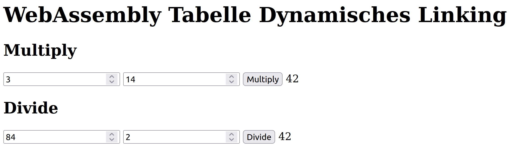

# WebAssembly Table, Dynamic Linking
One topic from the article [WebAssembly Module](https://medium.com/webassembly/webassembly-module-146783e725d9) is still missing. This concerns the `Table` section, which is responsible for dynamic linking.

With the approach of dynamic linking, a module can be linked at runtime. For example, a centralized library module can be created, which is included and used by various other modules. This allows the properties of the centralized module to be adjusted without the need to recompile the other modules. This helps in avoiding code duplications, reducing memory usage, and improving maintainability.

## Table
[`Table`](https://webassembly.github.io/spec/core/syntax/modules.html#syntax-table) has similar characteristics to [`Memory`](https://webassembly.github.io/spec/core/syntax/modules.html#memories) from my old article [WebAssembly Memory](https://medium.com/webassembly/webassembly-memory-32bbe210112c). A table contains only references, which can be set and read/used. The reference itself is thus protected and can only be modified by the exporting module.

Currently, only the [reftype](https://webassembly.github.io/spec/core/syntax/types.html#table-types) type is allowed, primarily corresponding to function references. Just like the restriction of only one `Table` or `Memory` per module, these specifications will likely be expanded in future WebAssembly versions.

### Example
A very simple implementation of a mathematics module is created, which exports its functions (Multiplication, Division) through the `Table`.

```wat
(module
    (func $mul (param $a i32) (param $b i32) (result i32)
        (i32.mul (local.get $a) (local.get $b))
    )

    (func $div (param $a i32) (param $b i32) (result i32)
        (i32.div_s (local.get $a) (local.get $b))
    )

    (table (export "math_tbl") 2 funcref)
    (elem (i32.const 0) $mul $div)
)
```

Brief description:
* Function definitions as usual.
* The `table` contains an array of size two with the type `funcref`.
* This table is exported with the name `math_tbl`.
* `elem` initializes the table with the functions `mul` and `div`. The start index and the order of functions are important for later invocation.

Compile: `wat2wasm math.wat`

Analysis: `wasm-objdump -x math.wasm`

```bash
$ wasm-objdump -x math.wasm 

math.wasm:      file format wasm 0x1

Section Details:

Type[1]:
 - type[0] (i32, i32) -> i32
Function[2]:
 - func[0] sig=0
 - func[1] sig=0
Table[1]:
 - table[0] type=funcref initial=2
Export[1]:
 - table[0] -> "math_tbl"
Elem[1]:
 - segment[0] flags=0 table=0 count=2 - init i32=0
  - elem[0] = func[0]
  - elem[1] = func[1]
Code[2]:
 - func[0] size=7
 - func[1] size=7
```

This can now be used in a web application.

```html
<!DOCTYPE html>
<html lang="en">

<head>
    <meta charset="utf-8" />
    <title>WebAssembly Table, Dynamic Linking</title>
</head>

<body>
    <h1>WebAssembly Table, Dynamic Linking</h1>
    <h2>Multiply</h2>
    <form id="mul">
        <input type="number" name="a" value="3">
        <input type="number" name="b" value="14">
        <button type="submit">Multiply</button>
        <output name="output"></output>
    </form>

    <h2>Divide</h2>
    <form id="div">
        <input type="number" name="a" value="84">
        <input type="number" name="b" value="2">
        <button type="submit">Divide</button>
        <output name="output"></output>
    </form>
    <script>
        function fetchAndInstantiate(url, importObject) {
            return fetch(url)
                .then(response => response.arrayBuffer())
                .then(bytes => WebAssembly.instantiate(bytes, importObject))
                .then(results => results.instance);
        }

        document.addEventListener('DOMContentLoaded', function () {
            const formMul = document.querySelector('form#mul');
            const formDiv = document.querySelector('form#div');

            formMul.addEventListener('submit', function (event) {
                event.preventDefault();
                const form = event.target;
                const formData = new FormData(form);

                const a = formData.get('a');
                const b = formData.get('b');

                fetchAndInstantiate('math.wasm')
                    .then(instance => {
                        const mathTbl = instance.exports.math_tbl;

                        //table index 0 is multiply as elem initialized it
                        form.output.value = mathTbl.get(0)(a, b);
                    });
            });

            formDiv.addEventListener('submit', function (event) {
                event.preventDefault();
                const form = event.target;
                const formData = new FormData(form);

                const a = formData.get('a');
                const b = formData.get('b');

                fetchAndInstantiate('math.wasm')
                    .then(instance => {
                        const mathTbl = instance.exports.math_tbl;

                        //table index 1 is division as elem initialized it
                        form.output.value = mathTbl.get(1)(a, b);
                    });
            });
        });
    </script>
</body>

</html>
```

Start the application with `python3 -m http.server`.

Analyze in the browser at `http://localhost:8000`.



## Dynamic Linking
In the following example, two modules are created. One module provides mathematical functions, and the other module uses them. In contrast to the previous example, the table instance is now provided by the host system and imported into the modules.

### Mathematics Module
```wat
(module
    (import "env" "math_tbl" (table 2 funcref))

    (func $mul (param $a i32) (param $b i32) (result i32)
        (i32.mul (local.get $a) (local.get $b))
    )

    (func $div (param $a i32) (param $b i32) (result i32)
        (i32.div_s (local.get $a) (local.get $b))
    )

    (elem (i32.const 0) $mul)
    (elem (i32.const 1) $div)
)
```

Brief description:
* `import` imports the table from the host system with a size of 2 and the type `funcref`.
* `elem`, in contrast to before, is now executed individually with different start indices. The references to the functions are initialized in the provided table.
* In the module, export is now only indirect. The functions can only be called through the table.

Compile: `wat2wasm math_ext.wat`

Analyze: `wasm-objdump -x math_ext.wasm`

```bash
$ wasm-objdump -x math_ext.wasm

math_ext.wasm:  file format wasm 0x1

Section Details:

Type[1]:
 - type[0] (i32, i32) -> i32
Import[1]:
 - table[0] type=funcref initial=2 <- env.math_tbl
Function[2]:
 - func[0] sig=0
 - func[1] sig=0
Elem[2]:
 - segment[0] flags=0 table=0 count=1 - init i32=0
  - elem[0] = func[0]
 - segment[1] flags=0 table=0 count=1 - init i32=1
  - elem[1] = func[1]
Code[2]:
 - func[0] size=7
 - func[1] size=7
 ```
 
 ### Application Module
```wat
(module
    (import "env" "math_tbl" (table 2 funcref))

    (type $t0 (func (param $a i32) (param $b i32) (result i32)))

    (func $mul_cust (export "mul_cust") (param $a i32) (param $b i32) (result i32)
        (call_indirect (type $t0) (local.get $a) (local.get $b) (i32.const 0))
    )

    (func $div_cust (export "div_cust") (param $a i32) (param $b i32) (result i32)
        (call_indirect (type $t0) (local.get $a) (local.get $b) (i32.const 1))
    )
)
```

Brief description:
* `import` imports the table from the host system with a size of 2 and the type `funcref`.
* `type` defines the type `t0` with parameters `a` and `b` of type `i32` and the result as `i32`. It is used as a type definition for the expected functions from the table.
* `func` defines and exports the functions `mul_cust` and `div_cust`. These functions each call the references from the provided table using `call_indirect`, the type `t0`, the input parameters, and the respective table index.
* The functions `mul_cust` and `div_cust` are thus exported directly.

Compile: `wat2wasm math_custom.wat`

Analyze: `wasm-objdump -x math_custom.wasm`

```bash
$ wasm-objdump -x math_custom.wasm 

math_custom.wasm:       file format wasm 0x1

Section Details:

Type[1]:
 - type[0] (i32, i32) -> i32
Import[1]:
 - table[0] type=funcref initial=2 <- env.math_tbl
Function[2]:
 - func[0] sig=0 <mul_cust>
 - func[1] sig=0 <div_cust>
Export[2]:
 - func[0] <mul_cust> -> "mul_cust"
 - func[1] <div_cust> -> "div_cust"
Code[2]:
 - func[0] size=11 <mul_cust>
 - func[1] size=11 <div_cust>
 ```

### Web Application
```html
<!DOCTYPE html>
<html lang="en">

<head>
    <meta charset="utf-8" />
    <title>WebAssembly Table, Dynamic Linking</title>
</head>

<body>
    <h1>WebAssembly Table, Dynamic Linking</h1>
    <h2>Multiply</h2>
    <form id="mul">
        <input type="number" name="a" value="3">
        <input type="number" name="b" value="14">
        <button type="submit">Multiply</button>
        <output name="output"></output>
    </form>

    <h2>Divide</h2>
    <form id="div">
        <input type="number" name="a" value="84">
        <input type="number" name="b" value="2">
        <button type="submit">Divide</button>
        <output name="output"></output>
    </form>
    <script>
        function fetchAndInstantiate(url, importObject) {
            return fetch(url)
                .then(response => response.arrayBuffer())
                .then(bytes => WebAssembly.instantiate(bytes, importObject))
                .then(results => results.instance);
        }

        //table where the two function references are saved and shared
        const mathTbl = new WebAssembly.Table({
            initial: 2,
            element: 'anyfunc'
        });

        const importObject = {
            env: {
                math_tbl: mathTbl
            }
        };

        document.addEventListener('DOMContentLoaded', function () {
            const formMul = document.querySelector('form#mul');
            const formDiv = document.querySelector('form#div');

            formMul.addEventListener('submit', function (event) {
                event.preventDefault();
                const form = event.target;
                const formData = new FormData(form);

                const a = formData.get('a');
                const b = formData.get('b');

                Promise.all([
                    fetchAndInstantiate('math_ext.wasm', importObject),
                    fetchAndInstantiate('math_custom.wasm', importObject)
                ]).then(instances => {
                    //index 1 ist the math_custom.wasm instance
                    form.output.value = instances[1].exports.mul_cust(a, b);
                });
            });

            formDiv.addEventListener('submit', function (event) {
                event.preventDefault();
                const form = event.target;
                const formData = new FormData(form);

                const a = formData.get('a');
                const b = formData.get('b');

                Promise.all([
                    fetchAndInstantiate('math_ext.wasm', importObject),
                    fetchAndInstantiate('math_custom.wasm', importObject)
                ]).then(instances => {
                    //index 1 ist the math_custom.wasm instance
                    form.output.value = instances[1].exports.div_cust(a, b);
                });
            });
        });
    </script>
</body>

</html>
```

    Start the application with `python3 -m http.server`.

    Analyze in the browser at `http://localhost:8000/index_custom.html`.

    The result looks the same as in the previous example. However, now the table is provided by the host system ([WebAssembly API](https://developer.mozilla.org/en-US/docs/WebAssembly/JavaScript_interface/Table)), and it needs to be ensured with `Promise.all` that the mathematics module is loaded and initialized when using the application module.

## Further Resources
* [Source Code](https://github.com/marcokuoni/public_doc/tree/main/essays/10_webassembly_table_dynamic_linking)
* [Deutsche Version](https://github.com/marcokuoni/public_doc/tree/main/essays/10_webassembly_table_dynamic_linking/README.de.md)
* [mdn: Defining a table in Wasm](https://developer.mozilla.org/en-US/docs/WebAssembly/Understanding_the_text_format#webassembly_tables)

I am open to refining, expanding, or correcting the article. Feel free to provide a feedback or get in touch with me.

Created by [Marco Kuoni, November 2023](https://marcokuoni.ch)
