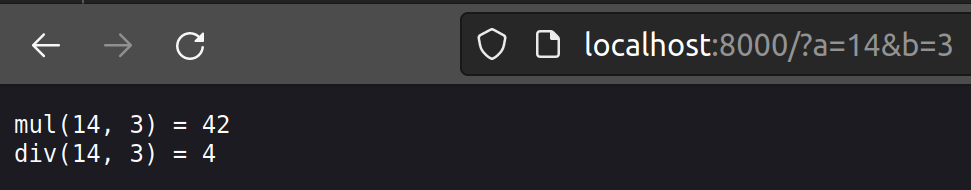

# Von C über Emscripten zur Deno Serverapplikation
[WebAssembly für Node.js](https://nodejs.org/en/learn/getting-started/nodejs-with-webassembly) ist fast gleich lange unterwegs wie die Implementierung im Webbrowser. Dabei ist es interessant die [C/C++ Addons](https://nodejs.org/dist/latest-v20.x/docs/api/addons.html) durch WebAssembly Module zu ersetzen. Diese C/C++ Addons werden über den [node-gyp](https://github.com/nodejs/node-gyp) in spezifischen Maschinencode kompiliert, was die Portabilität des Addons erschwert und daher eine WebAssembly Umsetzung attraktiv macht. Im speziellen wenn man zum Beispiel über [Wasmtime](https://docs.wasmtime.dev/) mit [WASI](https://wasi.dev/) (WebAssembly System Interface) auch auf die Systemfunktionen zugreifen kann. Zudem ermöglichen WebAssembly Module den Einsatz von diversen alternativen Programmiersprachen wie [Rust](https://www.rust-lang.org/), [Go](https://golang.org/) oder [AssemblyScript](https://www.assemblyscript.org/).

Um zu zeigen, dass der neuere und by default sichere Bruder [Deno ebenfalls WebAssembly](https://docs.deno.com/runtime/manual/runtime/webassembly#using-webassembly) Module unterstützt, wird hier eine kleine Beispielapplikation gezeigt. Dabei wird ein C Programm über Emscripten in ein WebAssembly Modul kompiliert und in Deno in einer Serverapplikation ausgeführt.

Kurz ein Hinweis zu [Supply Chain Attacks](https://www.fortinet.com/resources/cyberglossary/supply-chain-attacks) beim Verwenden von nicht selbst erstellten externen Modulen ist immer Vorsicht geboten.

## WebAssembly Math-Modul
```c
#include <emscripten.h>

EMSCRIPTEN_KEEPALIVE
int mul(int a, int b) {
    return a * b;
}

EMSCRIPTEN_KEEPALIVE
int div(int a, int b) {
    return a / b;
}
```

Komplilieren des C Programms mit Emscripten: `emcc math.c`

Dies erstellt zwei Dateien `a.out.js` und `a.out.wasm`. Wobei hier nun nur das WebAssembly Modul benötigt wird. Die JavaScript Datei könnte als alternative direkt verwendet werden. Was zum Beispiel in anderen Artikeln wie [Porting Third Party to WebAssembly](https://medium.com/webassembly/porting-third-party-to-webassembly-46c2e4eb8cbe) zu finden ist.

Analyse in WebAssembly Text Format: `wasm2wat a.out.wasm > a.out.wat`

Oder über:

```bash
$ wasm-objdump -x a.out.wasm

a.out.wasm:     file format wasm 0x1

Section Details:

Type[7]:
 - type[0] () -> i32
 - type[1] () -> nil
 - type[2] (i32) -> nil
 - type[3] (i32, i32) -> i32
 - type[4] (i32) -> i32
 - type[5] (i32, i32, i32) -> i32
 - type[6] (i32, i64, i32) -> i64
Function[16]:
 - func[0] sig=1 <__wasm_call_ctors>
 - func[1] sig=3 <mul>
 - func[2] sig=3 <div>
 - func[3] sig=0 <stackSave>
 - func[4] sig=2 <stackRestore>
 - func[5] sig=4 <stackAlloc>
 - func[6] sig=1 <emscripten_stack_init>
 - func[7] sig=0 <emscripten_stack_get_free>
 - func[8] sig=0 <emscripten_stack_get_base>
 - func[9] sig=0 <emscripten_stack_get_end>
 - func[10] sig=2
 - func[11] sig=0
 - func[12] sig=4
 - func[13] sig=1 <__stdio_exit>
 - func[14] sig=2
 - func[15] sig=0 <__errno_location>
Table[1]:
 - table[0] type=funcref initial=1 max=1
Memory[1]:
 - memory[0] pages: initial=256 max=256
Global[3]:
 - global[0] i32 mutable=1 - init i32=5243920
 - global[1] i32 mutable=1 - init i32=0
 - global[2] i32 mutable=1 - init i32=0
Export[14]:
 - memory[0] -> "memory"
 - func[0] <__wasm_call_ctors> -> "__wasm_call_ctors"
 - func[1] <mul> -> "mul"
 - func[2] <div> -> "div"
 - table[0] -> "__indirect_function_table"
 - func[15] <__errno_location> -> "__errno_location"
 - func[13] <__stdio_exit> -> "__stdio_exit"
 - func[6] <emscripten_stack_init> -> "emscripten_stack_init"
 - func[7] <emscripten_stack_get_free> -> "emscripten_stack_get_free"
 - func[8] <emscripten_stack_get_base> -> "emscripten_stack_get_base"
 - func[9] <emscripten_stack_get_end> -> "emscripten_stack_get_end"
 - func[3] <stackSave> -> "stackSave"
 - func[4] <stackRestore> -> "stackRestore"
 - func[5] <stackAlloc> -> "stackAlloc"
Code[16]:
 - func[0] size=4 <__wasm_call_ctors>
 - func[1] size=57 <mul>
 - func[2] size=57 <div>
 - func[3] size=4 <stackSave>
 - func[4] size=6 <stackRestore>
 - func[5] size=18 <stackAlloc>
 - func[6] size=20 <emscripten_stack_init>
 - func[7] size=7 <emscripten_stack_get_free>
 - func[8] size=4 <emscripten_stack_get_base>
 - func[9] size=4 <emscripten_stack_get_end>
 - func[10] size=2
 - func[11] size=10
 - func[12] size=4
 - func[13] size=57 <__stdio_exit>
 - func[14] size=97
 - func[15] size=5 <__errno_location>
 ```

Interessant an dieser Stelle sind die Bezeichnungen `mul` und `div` der exportierten Funktionen unter `Export[14]`. Diese werden nun in der Deno Serverapplikation verwendet.

## Deno Serverapplikation
```typescript
import { serve } from "https://deno.land/std/http/server.ts";
import { join } from "https://deno.land/std/path/mod.ts";

const wasmPath = join(Deno.cwd(), "a.out.wasm");
const wasmCode = await Deno.readFile(wasmPath);
const wasmModule = new WebAssembly.Module(wasmCode);
const wasmInstance = new WebAssembly.Instance(wasmModule);
const wasmExports = wasmInstance.exports;
const mul = wasmExports.mul as (a: number, b: number) => number;
const div = wasmExports.div as (a: number, b: number) => number;

function requestHandler(request: Request): Response {
    const searchParams = new URL(request.url).searchParams;
    const a = parseInt(searchParams.get('a') || '14')
    const b = parseInt(searchParams.get('b') || '3')

    const result = `mul(${a}, ${b}) = ${mul(a, b)}\ndiv(${a}, ${b}) = ${div(a, b)}`;

    return new Response(result);
}

const server = serve(requestHandler, { port: 8000 });
```

Server starten:
```bash
$ deno run --allow-read --allow-net server.ts
Listening on http://localhost:8000/
```

Aufruf des Servers: `http://localhost:8000/?a=14&b=3`



Kurzerklärung:
* Zuerst wird das WebAssembly Modul vom Filesystem geladen und instanziert.
* Die exportieren Funktionen werden dann den Typescript Variablen zugewiesen.
* Ein Server auf Port 8000 wird gestartet und die Funktion `requestHandler` als Handler übergeben.
* Im Handler wird versucht die Suchparameter a und b aus der URL zu lesen und in Integer zu konvertieren.
* Die Integers werden den WebAssembly Funktionen übergeben.
* Das Resultat der beiden WebAssembly Funktionen wird am Schluss als String im Body als `Response` zurückgegeben.
* Deno wird zudem mit den Flags `--allow-read` und `--allow-net` gestartet, damit der Server auf das Filesystem und das Netzwerk zugreifen darf und somit kann.

## Weiterführend
* [Source Code](https://github.com/marcokuoni/public_doc/tree/main/essays/11_from_c_through_emscripten_to_a_deno_server_application)
* [English Version](https://github.com/marcokuoni/public_doc/tree/main/essays/11_from_c_through_emscripten_to_a_deno_server_application/README.md)
* [Connect to SQLite with the WASM-Optimized Module in Deno](https://docs.deno.com/runtime/manual/basics/connecting_to_databases#connect-to-sqlite-with-the-wasm-optimized-module)

Kleiner Hinweis auf die experimentelle Implementierung von [ES6 WebAssembly Modulen](https://nodejs.org/api/esm.html#wasm-modules). Dies ermöglicht in Node.js eine elegante verwendung von WebAssembly Modulen

```javascript
import * as M from './module.wasm';
console.log(M);
```

Ich bin gerne bereit den Artikel zu präzisieren, erweitern oder zu korrigieren. Schreibt ein Feedback oder meldet euch direkt bei mir.

Erstellt von [Marco Kuoni, November 2023](https://marcokuoni.ch)
