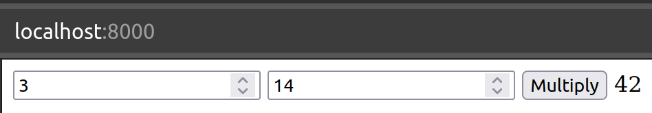

# Ein einfaches Rust Programm in WebAssembly
Es wird hier nicht auf die Details von Rust oder dessen Installation eingegangen. Weil Rust LLVM basiert ist, braucht es theoretisch nur ein Backend für WebAssembly. Das Backend ist in der Rust Standardbibliothek enthalten.

---

Falls LLVM neu ist oder noch mehr Interesse am Thema besteht, empfehle ich meine älteren Beiträge zu konsultieren:
* [Simple C Program in WebAssembly](https://medium.com/webassembly/simple-c-program-in-webassembly-1a7b148293c2) gibt unter anderem eine Einführung in LLVM
* [First Experiences with WebAssembly](https://medium.com/webassembly/first-experiences-with-webassembly-dafb2cf2ab52) benutzt bereits wasm3 im Repl-Stil

---

```bash
$ rustup target list | grep installed
wasm32-unknown-unknown (installed)
wasm32-wasi (installed)
x86_64-unknown-linux-gnu (installed)
```

Die Rust Backends sind in der Regel nach folgendem Schema angeschrieben: Instruction Set Architecture (ISA) - Anbieter - Operating System (OS).

## Multiplizieren in Rust
Wie schon in den vorherigen Artikel wird eine Multiplikationsfunktion als Beispiel verwendet.

```rust
#[no_mangle]
pub extern "C" fn multiply(a: i32, b: i32) -> i32 {
    a * b
}

fn main() {
    println!("2 * 21 = {}", multiply(2, 21));
}
```

Die `#[no_mangle]`-Annotation verhindert, dass der Name der Funktion von Rust verändert wird.

## Komplilieren
### Für das Hostsystem
Um das Programm mit dem default Backend zu kompilieren und auszuführen, werden folgende Befehle verwendet:

```bash
$ rustc multiply.rs
$ ./multiply
2 * 21 = 42
```

### Für WebAssembly
Um die Quelldatei nun in eine WebAssembly-Datei zu kompilieren, wird folgender Befehl verwendet:

```bash
rustc -A dead_code --target wasm32-unknown-unknown -O --crate-type=cdylib multiply.rs -o multiply.wasm
```

Wobei `-A dead_code` die Warnung für nicht verwendete Funktionen unterdrückt. `-O` aktiviert die Optimierungen. `--crate-type=cdylib` gibt an, dass eine dynamische Bibliothek erstellt werden soll. `-o multiply.wasm` gibt den Namen der Ausgabedatei an.

Das Resultat kann nun mit `wasm3` ausgeführt werden:

```bash
$ wasm3 --func multiply multiply.wasm 2 21
Result: 42
```

Analysieren:

```bash
$ wasm-objdump -x multiply.wasm

multiply.wasm:  file format wasm 0x1

Section Details:

Type[1]:
 - type[0] (i32, i32) -> i32
Function[1]:
 - func[0] sig=0 <multiply>
Table[1]:
 - table[0] type=funcref initial=1 max=1
Memory[1]:
 - memory[0] pages: initial=16
Global[3]:
 - global[0] i32 mutable=1 <__stack_pointer> - init i32=1048576
 - global[1] i32 mutable=0 <__data_end> - init i32=1048576
 - global[2] i32 mutable=0 <__heap_base> - init i32=1048576
Export[4]:
 - memory[0] -> "memory"
 - func[0] <multiply> -> "multiply"
 - global[1] -> "__data_end"
 - global[2] -> "__heap_base"
Code[1]:
 - func[0] size=7 <multiply>
Custom:
 - name: ".debug_info"
Custom:
 - name: ".debug_pubtypes"
Custom:
 - name: ".debug_ranges"
Custom:
 - name: ".debug_abbrev"
Custom:
 - name: ".debug_line"
Custom:
 - name: ".debug_str"
Custom:
 - name: ".debug_pubnames"
Custom:
 - name: "name"
 - func[0] <multiply>
 - global[0] <__stack_pointer>
Custom:
 - name: "producers"
Custom:
 - name: "target_features"
  - [+] mutable-globals
  - [+] sign-ext
```

#### Gebrauch in einer Webanwendung

```html
<!DOCTYPE html>
<html lang="en">

<head>
    <meta charset="utf-8" />
    <title>Simple Rust Program in WebAssembly</title>
</head>

<body>
    <form>
        <input type="number" name="a" value="3" />
        <input type="number" name="b" value ="14" />
        <button type="submit">Multiply</button>
        <output name="output">
    </form>
    <script>
        function fetchAndInstantiate(url, importObject) {
            return fetch(url)
                .then(response => response.arrayBuffer())
                .then(bytes => WebAssembly.instantiate(bytes, importObject))
                .then(results => results.instance);
        }

        document.addEventListener('DOMContentLoaded', function () {
            const form = document.querySelector('form');

            form.addEventListener('submit', function (event) {
                event.preventDefault();
                const formData = new FormData(form);

                const a = formData.get('a');
                const b = formData.get('b');

                fetchAndInstantiate('multiply.wasm')
                    .then(instance => {
                        const result = instance.exports.multiply(a, b);
                        form.output.value = result;
                    });
            });
        });
    </script>
</body>

</html>
```

Anwendung starten `python3 -m http.server`.

Analysieren im Browser `http://localhost:8000`.



## Weiterführend
* [Source Code](https://github.com/marcokuoni/public_doc/tree/main/essays/12_simple_rust_program_in_webassembly)
* [English Version](https://github.com/marcokuoni/public_doc/tree/main/essays/12_simple_rust_program_in_webassembly/README.md)

Ich bin gerne bereit den Artikel zu präzisieren, erweitern oder zu korrigieren. Schreibt ein Feedback oder meldet euch direkt bei mir.

Erstellt von [Marco Kuoni, März 2024](https://marcokuoni.ch)
