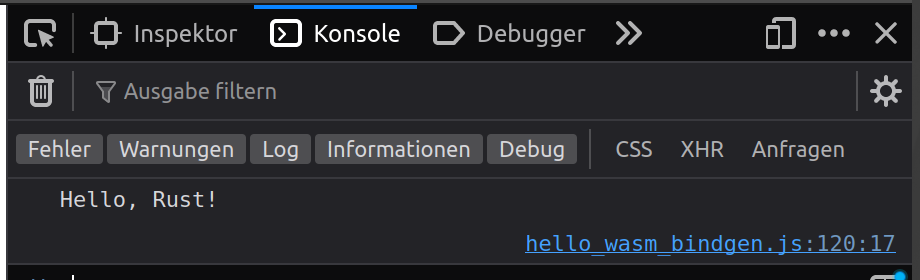

# Hallo wasm-bindgen
Wasm-bindgen ist ein Werkzeug, das die Kommunikation zwischen Rust und JavaScript vereinfacht. Es ermöglicht das Aufrufen von JavaScript-Funktionen aus Rust und umgekehrt und vereinfacht die Übergabe von Daten zwischen diesen Sprachen. Eigentlich ist es nicht nur für Rust gedacht, aber es ist die Sprache, die am besten mit wasm-bindgen funktioniert.

## "Hello, Rust!" Beispiel
Wie bereits erwähnt, ermöglicht uns wasm-bindgen alle Funktionen vom Browser aus dem Rust Code aufzurufen. Zudem können in Rust definierte Funktionen auch im Javascript Code verwendet werden.

Erstellen eines neuen Projekts:

```bash
$ cargo new --lib hello-wasm-bindgen
     Created library `hello-wasm-bindgen` package
```

Installieren von Rust: `curl --proto '=https' --tlsv1.2 -sSf https://sh.rustup.rs | sh`

Nun wird das `src/lib.rs` File angepasst:

```rust
use wasm_bindgen::prelude::*;

#[wasm_bindgen]
extern {
    #[wasm_bindgen(js_namespace = console)]
    fn log(s: &str);
}

#[wasm_bindgen]
pub fn greet(name: &str) {
    log(&format!("Hello, {}!", name));
}
```

Kurzerklärung:
* `wasm_bindgen::prelude::*` importiert alle notwendigen Funktionen und Traits um unsere Funktionen mit JavaScript zu verbinden.
* `#[wasm_bindgen]` definiert zusammen mit `extern`, dass eine Funktion von JavaScript in Rust verwendet wird. In diesem Fall ist es die `console.log` Funktion. `#[wasm_bindgen(js_namespace = console)]` definiert, dass die Funktion im JavaScript Namespace `console` zu finden ist.
* `#[wasm_bindgen]` definiert zusammen mit `pub`, dass die Funktion `greet` für JavaScript exportiert werden soll. Sie ruft die `log` Funktion auf und gibt den Text "Hello, {name}!" aus.

Bevor dies nun für das Web kompiliert wird, muss die `Cargo.toml` Datei angepasst werden:

```toml
[package]
name = "hello-wasm-bindgen"
version = "0.1.0"
edition = "2021"

[lib]
crate-type = ["cdylib"]

[dependencies]
wasm-bindgen = "0.2.92"
```

Kurzerklärung:
* `create-type = ["cdylib"]` definiert, dass eine dynamische C Bibliothek erstellt wird.
* `wasm-bindgen = "0.2.92"` definiert die Version von wasm-bindgen.

Nun kann das Projekt fürs Web kompiliert werden. Alternativen wären Webpack, Node.js oder Deno:

```bash
$ wasm-pack build --target web
[INFO]: 🎯  Checking for the Wasm target...
[INFO]: 🌀  Compiling to Wasm...
   Compiling proc-macro2 v1.0.79
   Compiling unicode-ident v1.0.12
   Compiling wasm-bindgen-shared v0.2.92
   Compiling once_cell v1.19.0
   Compiling bumpalo v3.15.4
   Compiling log v0.4.21
   Compiling wasm-bindgen v0.2.92
   Compiling cfg-if v1.0.0
   Compiling quote v1.0.35
   Compiling syn v2.0.55
   Compiling wasm-bindgen-backend v0.2.92
   Compiling wasm-bindgen-macro-support v0.2.92
   Compiling wasm-bindgen-macro v0.2.92
   Compiling hello-wasm-bindgen v0.1.0 (.../hello-wasm-bindgen)
    Finished release [optimized] target(s) in 4.42s
[INFO]: ⬇️  Installing wasm-bindgen...
[INFO]: found wasm-opt at "/usr/bin/wasm-opt"
[INFO]: Optimizing wasm binaries with `wasm-opt`...
[INFO]: Optional fields missing from Cargo.toml: 'description', 'repository', and 'license'. These are not necessary, but recommended
[INFO]: ✨   Done in 7.77s
[INFO]: 📦   Your wasm pkg is ready to publish at .../hello-wasm-bindgen/pkg.
```

Installieren von wasm-pack: `curl https://rustwasm.github.io/wasm-pack/installer/init.sh -sSf | sh`

Dies hat uns ein `pkg` Verzeichnis erstellt, in dem sich eine package.json Datei für die Projektdefinition, die WebAssembly Datei, die JavaScript Datei und Typendefinitionen für Typescript befinden.

Analysieren:

```bash
$ wasm-objdump -x hello_wasm_bindgen_bg.wasm

hello_wasm_bindgen_bg.wasm:     file format wasm 0x1

Section Details:

Type[10]:
 - type[0] (i32, i32) -> i32
 - type[1] (i32, i32) -> nil
 - type[2] (i32, i32, i32) -> i32
 - type[3] (i32) -> nil
 - type[4] (i32, i32, i32, i32) -> i32
 - type[5] (i32, i32, i32, i32) -> nil
 - type[6] (i32, i32, i32) -> nil
 - type[7] (i32) -> i32
 - type[8] (i32, i32, i32, i32, i32, i32) -> nil
 - type[9] () -> nil
Import[1]:
 - func[0] sig=1 <wbg.__wbg_log_641153c3c7e8b3d9> <- wbg.__wbg_log_641153c3c7e8b3d9
Function[45]:
 - func[1] sig=7
 - ...
Table[1]:
 - table[0] type=funcref initial=29 max=29
Memory[1]:
 - memory[0] pages: initial=17
Global[1]:
 - global[0] i32 mutable=1 - init i32=1048576
Export[4]:
 - memory[0] -> "memory"
 - func[16] <greet> -> "greet"
 - func[22] <__wbindgen_malloc> -> "__wbindgen_malloc"
 - func[26] <__wbindgen_realloc> -> "__wbindgen_realloc"
Elem[1]:
 - segment[0] flags=0 table=0 count=28 - init i32=1
  - ...
Code[45]:
 - func[1] size=4675
 - ...
Data[1]:
 - segment[0] memory=0 size=764 - init i32=1048576
  - ...
Custom:
 - name: "producers"
Custom:
 - name: "target_features"
  - [+] mutable-globals
  - [+] sign-ext
```

Kurzerkärung:
* Beim Import ist schön zu sehen, dass die `log` Funktion von JavaScript importiert wird.
* Die `greet` Funktion wird exportiert und kann daher dann von JavaScript aufgerufen werden.
* Die `__wbindgen_malloc` und `__wbindgen_realloc` Funktionen werden für die Speicherverwaltung verwendet.

### Gebrauch in einer Webanwendung
```html
<!DOCTYPE html>
<html lang="en">

<head>
    <meta charset="utf-8" />
    <title>Hello wasm-bindgen</title>
</head>

<body>
    <script type="module">
        import init, { greet } from './hello-wasm-bindgen/pkg/hello_wasm_bindgen.js';
        init().then(() => {
            greet('Rust');
        });
    </script>
</body>

</html>
```

Anwendung starten `python3 -m http.server`.

Analysieren im Browser `http://localhost:8000`.



## Weiterführend
* [Source Code](https://github.com/marcokuoni/public_doc/tree/main/essays/13_hello_wasm_bindgen)
* [English Version](https://github.com/marcokuoni/public_doc/tree/main/essays/13_hello_wasm_bindgen/README.md)
* [Rust installieren](https://www.rust-lang.org/tools/install)
* [wasm-pack installieren](https://rustwasm.github.io/wasm-pack/installer/)
* [wasm-bindgen Dokumentation](https://rustwasm.github.io/docs/wasm-bindgen/)
* [wasm-bindgen Source Code](https://github.com/rustwasm/wasm-bindgen)

Ich bin gerne bereit den Artikel zu präzisieren, erweitern oder zu korrigieren. Schreibt ein Feedback oder meldet euch direkt bei mir.

Erstellt von [Marco Kuoni, März 2024](https://marcokuoni.ch)
