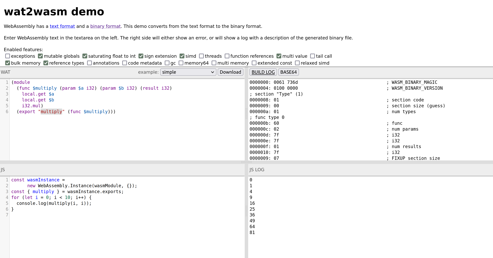

# First Experiences with WebAssembly

## Basic Idea and First Steps
1. We have any existing programming language (e.g., Rust, C, C++, etc.).
2. This language is translated into a binary format (*.wasm).
3. This binary format is executed on a standardised stack machine.
4. The implementation of the stack machine exists for various target systems.

This idea abstracts the programming language from the target platform. But this is only one advantage of the solution. Among other things, this allows to combine different programming languages, to increase security and efficiency and much more.

> Thought experiment: You start a browser, which loads an application. This application is again a browser, which loads another application. This application is a shell, and an operating system runs in this shell. In the operating system...

The development process for WebAssembly is managed by a community group of the W3C.
* [WebAssembly Official](https://webassembly.org/)
* [WebAssembly Community Group](https://www.w3.org/community/webassembly/)
* [WebAssembly Design](https://github.com/WebAssembly/design/tree/main)
* [WebAssembly Specification](https://webassembly.github.io/spec/core/)
* [WebAssembly Proposal](https://github.com/WebAssembly/proposals)

## WebAssembly Text Format (WAT, *.wat)
* [WebAssembly Text Format (WAT) Specification](https://webassembly.github.io/spec/core/text/index.html)
* [WebAssembly Text Format (WAT)](https://developer.mozilla.org/en-US/docs/WebAssembly/Understanding_the_text_format)

The binary format *.wasm is optimised for the machine. There is a direct translation into a text format *.wat, which is readable by humans.

The format consists of modules, which in turn consist of functions. A function is a collection of instructions for the stack machine. The instructions are defined in the [WebAssembly Specification](https://webassembly.github.io/spec/core/binary/instructions.html).

Here's an example of a function that multiplies two numbers:
```wat
(module
  (func $multiply (param $a i32) (param $b i32) (result i32)
    local.get $a
    local.get $b
    i32.mul)
  (export "multiply" (func $multiply)))
```

> Explanation: Internal functions start with $. The input values are placed on the stack to process them using local.get. The i32.mul function multiplies the top two elements of the stack and puts the result back on the stack.

Currently available types in the specification are:
* `i32` 32-bit signed integer
* `i64` 64-bit signed integer
* `f32` 32-bit floating point number
* `f64` 64-bit floating point number

## WebAssembly Binary Format (WASM, *.wasm)
* [WebAssembly Binary Format (WASM) Specification](https://webassembly.github.io/spec/core/binary/index.html)

To compile from the text format to the binary format, various tools can be used. The most well-known ones are:

The online [wat2wasm](https://webassembly.github.io/wabt/demo/wat2wasm/) compiler, which displays the following information in four areas:
* WAT: The input WAT code
* Build Log: The compiler's build log (Hex Dump)
* JavaScript: The JavaScript code that executes the WASM code
* JS Log: The result from the JavaScript code



Or the WebAssembly Binary Toolkit (WABT, pronounced wabbit), which also offers additional tools. To perform the translation, you can enter `wat2wasm multiply.wat` in the terminal. This reduced the size from 155 bytes (WAT) to 46 bytes (WASM) (29.67% of the WAT size).

## Stack Machine
wasm3 could be a potential interpreter for WASM, written in C and capable of running on various platforms. This allows executing WASM code in a REPL-style within the command line.
```bash
> wasm3 --repl hello.wasm
wasm3> multiply 3 14
Result: 42
wasm3> ^C
```

## Implementation on the Web
From the WAT code, the following WASM code (Build Log) was generated and saved in the file `multiply.wasm`:
```wasm
0000000: 0061 736d                                 ; WASM_BINARY_MAGIC
0000004: 0100 0000                                 ; WASM_BINARY_VERSION
; section "Type" (1)
0000008: 01                                        ; section code
0000009: 00                                        ; section size (guess)
000000a: 01                                        ; num types
; func type 0
000000b: 60                                        ; func
000000c: 02                                        ; num params
000000d: 7f                                        ; i32
000000e: 7f                                        ; i32
000000f: 01                                        ; num results
0000010: 7f                                        ; i32
0000009: 07                                        ; FIXUP section size
; section "Function" (3)
0000011: 03                                        ; section code
0000012: 00                                        ; section size (guess)
0000013: 01                                        ; num functions
0000014: 00                                        ; function 0 signature index
0000012: 02                                        ; FIXUP section size
; section "Export" (7)
0000015: 07                                        ; section code
0000016: 00                                        ; section size (guess)
0000017: 01                                        ; num exports
0000018: 08                                        ; string length
0000019: 6d75 6c74 6970 6c79                      multiply  ; export name
0000021: 00                                        ; export kind
0000022: 00                                        ; export func index
0000016: 0c                                        ; FIXUP section size
; section "Code" (10)
0000023: 0a                                        ; section code
0000024: 00                                        ; section size (guess)
0000025: 01                                        ; num functions
; function body 0
0000026: 00                                        ; func body size (guess)
0000027: 00                                        ; local decl count
0000028: 20                                        ; local.get
0000029: 00                                        ; local index
000002a: 20                                        ; local.get
000002b: 01                                        ; local index
000002c: 6c                                        ; i32.mul
000002d: 0b                                        ; end
0000026: 07                                        ; FIXUP func body size
0000024: 09                                        ; FIXUP section size
; section "name"
000002e: 00                                        ; section code
000002f: 00                                        ; section size (guess)
0000030: 04                                        ; string length
0000031: 6e61 6d65                                name  ; custom section name
0000035: 01                                        ; name subsection type
0000036: 00                                        ; subsection size (guess)
0000037: 01                                        ; num names
0000038: 00                                        ; elem index
0000039: 08                                        ; string length
000003a: 6d75 6c74 6970 6c79                      multiply  ; elem name 0
0000036: 0b                                        ; FIXUP subsection size
0000042: 02                                        ; local name type
0000043: 00                                        ; subsection size (guess)
0000044: 01                                        ; num functions
0000045: 00                                        ; function index
0000046: 02                                        ; num locals
0000047: 00                                        ; local index
0000048: 01                                        ; string length
0000049: 61                                       a  ; local name 0
000004a: 01                                        ; local index
000004b: 01                                        ; string length
000004c: 62                                       b  ; local name 1
0000043: 09                                        ; FIXUP subsection size
000002f: 1d                                        ; FIXUP section size
```

This can now be loaded, instantiated, and executed with a fetch in JavaScript:

```html
<!DOCTYPE html>
<html lang="en">

<head>
    <meta charset="utf-8" />
    <title>First experiences with WebAssembly</title>
</head>

<body>
    <form>
        <input type="number" name="a" value="3" />
        <input type="number" name="b" value ="14" />
        <button type="submit">Multiply</button>
        <output name="output">
    </form>
    <script>
        function fetchAndInstantiate(url, importObject) {
            return fetch(url)
                .then(response => response.arrayBuffer())
                .then(bytes => WebAssembly.instantiate(bytes, importObject))
                .then(results => results.instance);
        }

        document.addEventListener('DOMContentLoaded', function () {
            const form = document.querySelector('form');

            form.addEventListener('submit', function (event) {
                event.preventDefault();
                const formData = new FormData(form);

                const a = formData.get('a');
                const b = formData.get('b');

                fetchAndInstantiate('multiply.wasm')
                    .then(instance => {
                        const result = instance.exports.multiply(a, b);
                        form.output.value = result;
                    });
            });
        });
    </script>
</body>

</html>
```
> Note: This is not the preferred way to load WASM unless the browser supports the [instantiate streaming function](https://developer.mozilla.org/en-US/docs/WebAssembly/JavaScript_interface/instantiateStreaming).

To allow the WASM file to be loaded via fetch, a web server must be started. This can be accomplished, for example, using the Python module `http.server`: `python3 -m http.server`. The example can now be accessed in the browser at `http://localhost:8000`.


## Further Information
* [Source Code](https://github.com/marcokuoni/public_doc/tree/main/essays/first_experiences_with_webassembly)
* [Deutsche Version](https://github.com/marcokuoni/public_doc/tree/main/essays/first_experiences_with_webassembly/README.de.md)
* Lin Clark: [A cartoon intro to WebAssembly](https://hacks.mozilla.org/2017/02/a-cartoon-intro-to-webassembly/)


I am open to refining, expanding, or correcting the content. Feel free to provide feedback or get in touch.

Created by [Marco Kuoni, August 2023](https://marcokuoni.ch)