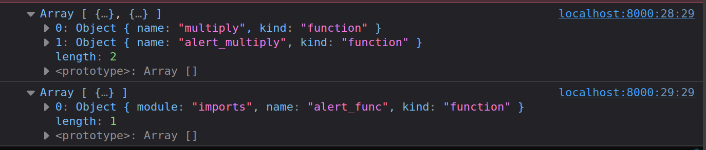

# WebAssebmly Module
WebAssembly-Programme sind in Modulen organisiert, die die Einheit zum Veröffentlichen, Laden und Kompilierung darstellen. Ein Modul sammelt Definitionen für Typen, Funktionen, Tabellen, Speicher und globale Variablen. Darüber hinaus kann es Importe und Exporte deklarieren, Initialisierungen für Daten- und Elementsegmente oder einer Startfunktion bereitstellen.

Aufbau des Beitrags:
1. Theorie
2. Analyse
3. Praxis

## Theorie: Modul Struktur
* [WebAssembly Module Sections](https://webassembly.github.io/spec/core/binary/modules.html)

Dateiformate werden oft mit einer sogenannten «magic number» identifiziert. Bei WebAssembly ist dies die Zahl 0x6d736100 («\0asm» in ASCII) gefolgt von der Versionsnummer 0x00000001.
Auf die Identifikation folgen die verschiedenen Modul Abschnitte (Sections). Jeder Abschnitt beginnt mit einem Byte, welches den Abschnittstypen definiert. Danach folgt die Länge des Abschnitts in Bytes als [Leb128](https://en.wikipedia.org/wiki/LEB128) kodiert und der Inhalt des Abschnitts.

ID | Name | Beschreibung
---|------|------------
0 | Custom | Benutzerdefinierter Bereich, der für Debugging, Metadaten oder Erweiterungen von Drittanbietern verwendet werden kann. Wird von der WebAssembly Sprache ignoriert
1 | Type | Definiert alle Funktionstypen im Modul
2 | Import | Importiert Funktionen, globale Variablen, Tabellen und Speicher in das Modul
3 | Function | Definiert alle Funktionssignaturen im Modul (Referenziert dazu andere Abschnitte)
4 | Table | Definiert alle [Tabellen](https://webassembly.github.io/spec/core/syntax/modules.html#tables) im Modul (Vektor von indirekten, schreibgeschützten Referenzen). Initialisiert durch den Element-Abschnitt
5 | Memory | Definiert allen [Speicher](https://webassembly.github.io/spec/core/syntax/modules.html#memories) im Modul (Vektor von linearem Speicher). Initialisiert durch den Data-Abschnitt
6 | Global | Definiert alle [Globalen](https://webassembly.github.io/spec/core/syntax/modules.html#globals) im Modul (Vektor von globalen Variablen)
7 | Export | Exportiert Funktionen, globale Variablen, Tabellen und Speicher vom Modul
8 | Start | Eine optionale Startfunktion vom Modul. Wird bei Initialisierung des Moduls ausgeführt, sobald die Tabellen und der Speicher initialisiert sind. Das Modul selbst und seine Exports sind erst nach dieser Ausführung von Aussen nutzbar.
9 | Element | Definiert die [Elemente](https://webassembly.github.io/spec/core/syntax/modules.html#syntax-elem) im Modul. Tabellen sind standardmässig nicht initialisiert, Teilbereiche von Tabellen können durch Vektoren an statischen Elementen initialisiert werden
10 | Code | Definiert die Funktions-Body/Codes im Modul
11 | Data | Definiert die [Daten](https://webassembly.github.io/spec/core/syntax/modules.html#syntax-data) im Modul. Der Speicher wird standardmässig mit 0x00 initialisiert, Teilbereiche vom Speicher können durch Vektoren an statischen Bytes initialisiert werden.
12 | Data Count | Anzahl an Daten im Modul (Optional)

## Analyse
Beispiel eines WebAssembly Moduls:
```wat
(module
  (func $alert (import "imports" "alert_func") (param i32))

  (func $multiply (param $a i32) (param $b i32) (result i32)
    local.get $a
    local.get $b
    i32.mul
  )

  (func $alert_multiply (param $a i32) (param $b i32)
    local.get $a
    local.get $b
    call $multiply
    call $alert
  )

  (export "multiply" (func $multiply))
  (export "alert_multiply" (func $alert_multiply))
)
```

Dies wird übersetzt in WASM inklusive den Debugging Informationen `wat2wasm multiply.wat -o multiply.wasm --debug-names`. Das Resultat kann nun per `wasm-objdump -x multiply.wasm` analysiert werden.
```bash
$ wasm-objdump -x multiply.wasm

multiply.wasm:  file format wasm 0x1

Section Details:

Type[3]:
 - type[0] (i32) -> nil
 - type[1] (i32, i32) -> i32
 - type[2] (i32, i32) -> nil
Import[1]:
 - func[0] sig=0 <alert> <- imports.alert_func
Function[2]:
 - func[1] sig=1 <multiply>
 - func[2] sig=2 <alert_multiply>
Export[2]:
 - func[1] <multiply> -> "multiply"
 - func[2] <alert_multiply> -> "alert_multiply"
Code[2]:
 - func[1] size=7 <multiply>
 - func[2] size=10 <alert_multiply>
Custom:
 - name: "name"
 - func[0] <alert>
 - func[1] <multiply>
 - func[2] <alert_multiply>
 - func[1] local[0] <a>
 - func[1] local[1] <b>
 - func[2] local[0] <a>
 - func[2] local[1] <b>
```

 Alternativ dazu gibt es die Möglichkeit das Modul in einem [WebAssembly Code Explorer](https://wasdk.github.io/wasmcodeexplorer/) zu darzustellen.


> Durch die Farbmarkierungen und das Klicken bzw. Überfahren der Bytes können die verschiedenen Abschnitte identifiziert werden.


## Praxis
Wir benutzen nun das gleiche Modul in einer Webanwendung. Importieren die JavaScript API Funktion `window.alert` in das Modul und rufen die exportierte Funktion `alert_multiply` auf.

```html
<!DOCTYPE html>
<html lang="en">

<head>
    <meta charset="utf-8" />
    <title>WebAssembly Module</title>
</head>

<body>
    <form>
        <input type="number" name="a" value="3" />
        <input type="number" name="b" value="14" />
        <button type="submit">Multiply</button>
        <output name="output">
    </form>
    <script>
        function fetchAndInstantiate(url, importObject) {
            return fetch(url)
                .then(response => response.arrayBuffer())
                .then(bytes => WebAssembly.instantiate(bytes, importObject))
                .then(results => results.instance);
        }

        document.addEventListener('DOMContentLoaded', function () {
            const form = document.querySelector('form');

            // --> Extension 1
            WebAssembly.compileStreaming(fetch('multiply.wasm'))
                .then(module => {
                    console.log(WebAssembly.Module.exports(module));
                    console.log(WebAssembly.Module.imports(module));
                });
            // <-- Extension 1

            form.addEventListener('submit', function (event) {
                event.preventDefault();
                const formData = new FormData(form);

                const a = formData.get('a');
                const b = formData.get('b');

                const importObject = {
                    imports: {
                        alert_func: function (arg) {
                            window.alert(arg);
                        }
                    }
                };

                fetchAndInstantiate('multiply.wasm', importObject)
                    .then(instance => {
                        instance.exports.alert_multiply(a, b);
                    });

                // --> Extension 2
                (async () => {
                    const fetchPromise = fetch('multiply.wasm');
                    const { instance } = await WebAssembly.instantiateStreaming(fetchPromise, importObject);
                    const result = instance.exports.multiply(a, b);
                    form.output.value = result;
                })();
                // <-- Extension 2
            });
        });
    </script>
</body>

</html>
```

Um die Anwendung zu testen verwenden wir `python3 -m http.server`, somit kann das Beispiel unter `http://localhost:8000` auf dem Browser aufgerufen werden.


> Es gilt zu beachten, dass das Hostprogramm dem WebAssembly Modul die benötigten Funktionen zur Verfügung stellen muss, damit es mit der Aussenwelt kommunizieren kann. Das gleiche gilt auch für die Speicherbereiche, welche vom Modul verwendet werden.

### Erweiterung 1
Um zu sehen was ein WebAssembly Modul importiert bzw. exportiert kann mit der JavaScript API dies ausgegeben werden.

```js
WebAssembly.compileStreaming(fetch('multiply.wasm'))
    .then(module => {
        console.log(WebAssembly.Module.exports(module));
        console.log(WebAssembly.Module.imports(module));
    });
```



### Erweiterung 2
Der Weg über den ArrayBuffer ist nicht der effiziente Weg um mit WebAssembly zu arbeiten. Dadurch müssen zuerst alle Daten über das Netzwerk geladen werden bevor wir diese kompilieren können.
Auch wenn das für kleinere Module ein möglicher Weg ist, gibt es die bessere Lösung über einen Stream.

```js
(async () => {
    const fetchPromise = fetch('multiply.wasm');
    const { instance } = await WebAssembly.instantiateStreaming(fetchPromise, importObject);
    const result = instance.exports.multiply(a, b);
    form.output.value = result;
})();
```

Damit ist der Code nach dem Herunterladen direkt validiert und bereit.
Leider gibt es aktuell noch keinen Standard um WebAssembly Module auch zu cachen. Dies wird aber die Startzeit dann nochmals verbessern und vermeidet unnötiges mehrfaches Herunterladen.

Zudem kann man an dieser Stelle ein in Bearbeitung befindendes Proposal für eine ECMAScript Modul Integration erwähnen.
* Proposal: [ECMAScript Module Integration](https://webassembly.github.io/esm-integration/js-api/index.html#esm-integration)
* Lin Clark: [WebAssembly ES module integration](https://www.youtube.com/watch?v=qR_b5gajwug&themeRefresh=1)

Dies würde erlauben, WebAssembly Module wie folgt in JavaScript zu werden.

```js
import { multiply } from './multiply.wasm';

const result = multiply(3, 14);
```

## Weiterführend
* [Source Code](https://github.com/marcokuoni/public_doc/tree/main/essays/2_webassembly_modules_import_export)
* [English Version](https://github.com/marcokuoni/public_doc/tree/main/essays/2_webassembly_modules_import_export/README.md)


Ich bin gerne bereit den Beitrag noch zu präzisieren, erweitern oder zu korrigieren. Schreibt Feedback oder meldet euch bei mir.

Erstellt von [Marco Kuoni, August 2023](https://marcokuoni.ch)
