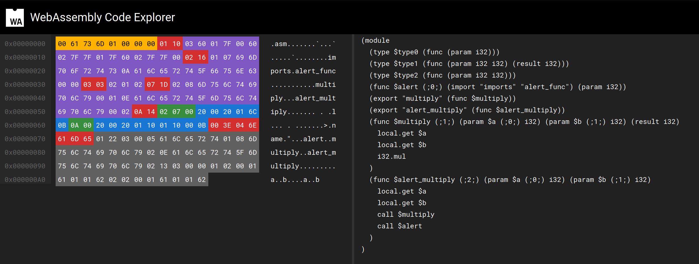

# WebAssembly Module
WebAssembly programs are organized into modules, which represent the unit for publishing, loading, and compilation. A module gathers definitions for types, functions, tables, memory, and global variables. Furthermore, it can declare imports and exports, provide initializations for data and element segments, or a startup function.

Structure of the Article:
1. Theory
2. Analysis
3. Practice

## Theory: Module Structure
* [WebAssembly Module Sections](https://webassembly.github.io/spec/core/binary/modules.html)

File formats are often identified using a so-called "magic number". In WebAssembly, this number is `0x6d736100` ("`\\0asm`" in ASCII), followed by the version number `0x00000001`.

After the identification, various module sections follow. Each section begins with a byte that defines the section type. Subsequently, the section's length in bytes is encoded as [Leb128](https://en.wikipedia.org/wiki/LEB128), followed by the content of the section.

| ID  | Name      | Description                                                                                                  |
| --- | --------- | ------------------------------------------------------------------------------------------------------------ |
| 0   | Custom    | Custom section defined to be used for debugging, metadata or third-party extension. It is ignored by WebAssembly semantics                                      |
| 1   | Type      | Defines all function types in the module                                                                    |
| 2   | Import    | Imports functions, global variables, tables, and memory into the module                                   |
| 3   | Function  | Defines all function signatures in the module (referencing other sections)                                 |
| 4   | Table     | Defines all [tables](https://webassembly.github.io/spec/core/syntax/modules.html#tables) in the module     |
| 5   | Memory    | Defines all [memories](https://webassembly.github.io/spec/core/syntax/modules.html#memories) in the module |
| 6   | Global    | Defines all [globals](https://webassembly.github.io/spec/core/syntax/modules.html#globals) in the module  |
| 7   | Export    | Exports functions, global variables, tables, and memory from the module                                    |
| 8   | Start     | An optional startup function in the module. Executed during module initialization, after tables and memory are initialized. The module itself and its exports are usable from the outside after this is executed. |
| 9   | Element   | Defines [elements](https://webassembly.github.io/spec/core/syntax/modules.html#syntax-elem) in the module. Tables are not initialized by default; subranges of tables can be initialized using vectors of static elements. |
| 10  | Code      | Defines functions body/code in the module                                                                |
| 11  | Data      | Defines [data](https://webassembly.github.io/spec/core/syntax/modules.html#syntax-data) in the module. Memory is initialized with 0x00 by default; subranges of memory can be initialized using vectors of static bytes. |
| 12  | Data Count| Number of data segments in the module (optional)                                                           |

## Analysis
Example of a WebAssembly module:

```wat
(module
  (func $alert (import "imports" "alert_func") (param i32))

  (func $multiply (param $a i32) (param $b i32) (result i32)
    local.get $a
    local.get $b
    i32.mul
  )

  (func $alert_multiply (param $a i32) (param $b i32)
    local.get $a
    local.get $b
    call $multiply
    call $alert
  )

  (export "multiply" (func $multiply))
  (export "alert_multiply" (func $alert_multiply))
)
```

This is translated into WASM along with debugging information using the following command: 
`wat2wasm multiply.wat -o multiply.wasm --debug-names`. 

The result can now be analyzed using the following command: 
```bash
$ wasm-objdump -x multiply.wasm

multiply.wasm:  file format wasm 0x1

Section Details:

Type[3]:
 - type[0] (i32) -> nil
 - type[1] (i32, i32) -> i32
 - type[2] (i32, i32) -> nil
Import[1]:
 - func[0] sig=0 <alert> <- imports.alert_func
Function[2]:
 - func[1] sig=1 <multiply>
 - func[2] sig=2 <alert_multiply>
Export[2]:
 - func[1] <multiply> -> "multiply"
 - func[2] <alert_multiply> -> "alert_multiply"
Code[2]:
 - func[1] size=7 <multiply>
 - func[2] size=10 <alert_multiply>
Custom:
 - name: "name"
 - func[0] <alert>
 - func[1] <multiply>
 - func[2] <alert_multiply>
 - func[1] local[0] <a>
 - func[1] local[1] <b>
 - func[2] local[0] <a>
 - func[2] local[1] <b>
```

 Alternatively, you can visualize the module in a [WebAssembly Code Explorer](https://wasdk.github.io/wasmcodeexplorer/). 


> The color markings and interactions with the bytes can help you identify the different sections.

## Practice

Now we'll use the same module in a web application. We will import the JavaScript API function `window.alert` into the module and call the exported function `alert_multiply`.


```html
<!DOCTYPE html>
<html lang="en">

<head>
    <meta charset="utf-8" />
    <title>First experiences with WebAssembly</title>
</head>

<body>
    <form>
        <input type="number" name="a" value="3" />
        <input type="number" name="b" value="14" />
        <button type="submit">Multiply</button>
        <output name="output">
    </form>
    <script>
        function fetchAndInstantiate(url, importObject) {
            return fetch(url)
                .then(response => response.arrayBuffer())
                .then(bytes => WebAssembly.instantiate(bytes, importObject))
                .then(results => results.instance);
        }

        document.addEventListener('DOMContentLoaded', function () {
            const form = document.querySelector('form');

            // --> Extension 1
            WebAssembly.compileStreaming(fetch('multiply.wasm'))
                .then(module => {
                    console.log(WebAssembly.Module.exports(module));
                    console.log(WebAssembly.Module.imports(module));
                });
            // <-- Extension 1

            form.addEventListener('submit', function (event) {
                event.preventDefault();
                const formData = new FormData(form);

                const a = formData.get('a');
                const b = formData.get('b');

                const importObject = {
                    imports: {
                        alert_func: function (arg) {
                            window.alert(arg);
                        }
                    }
                };

                fetchAndInstantiate('multiply.wasm', importObject)
                    .then(instance => {
                        instance.exports.alert_multiply(a, b);
                    });

                // --> Extension 2
                (async () => {
                    const fetchPromise = fetch('multiply.wasm');
                    const { instance } = await WebAssembly.instantiateStreaming(fetchPromise, importObject);
                    const result = instance.exports.multiply(a, b);
                    form.output.value = result;
                })();
                // <-- Extension 2
            });
        });
    </script>
</body>

</html>
```

To test the application, you can use the command `python3 -m http.server`. This will allow you to access the example by opening your browser and navigating to `http://localhost:8000`.


> It's important to note that the host program must provide the necessary functions to the WebAssembly module to been able to interact with the outer world. The same applies to memory areas used by the module.

### Extension 1
To see what a WebAssembly module imports and exports, you can use the JavaScript API to output this information.

```js
WebAssembly.compileStreaming(fetch('multiply.wasm'))
    .then(module => {
        console.log(WebAssembly.Module.exports(module));
        console.log(WebAssembly.Module.imports(module));
    });
```


### Extension 2
Using the ArrayBuffer approach is not the most efficient way to work with WebAssembly. This method requires loading all the data over the network before we can compile it. 
While this might be a viable approach for smaller modules, a better solution is available through streaming.

```js
(async () => {
    const fetchPromise = fetch('multiply.wasm');
    const { instance } = await WebAssembly.instantiateStreaming(fetchPromise, importObject);
    const result = instance.exports.multiply(a, b);
    form.output.value = result;
})();
```

This way, the code is validated and ready for execution as soon as it's downloaded. 
Unfortunately, there isn't a standardized way to cache WebAssembly modules at the moment. However, implementing such caching mechanisms in the future will further improve startup times and prevent unnecessary repeated downloads.

Additionally, it's worth mentioning an ongoing proposal for ECMAScript module integration, which aims to enhance the integration of WebAssembly modules into JavaScript applications.

* Proposal: [ECMAScript Module Integration](https://webassembly.github.io/esm-integration/js-api/index.html#esm-integration)
* Lin Clark's presentation: [WebAssembly ES module integration](https://www.youtube.com/watch?v=qR_b5gajwug&themeRefresh=1)

This integration would allow you to work with WebAssembly modules in JavaScript as follows:
```js
import { multiply } from './multiply.wasm';

const result = multiply(3, 14);
```

## Further Resources
- [Source Code](https://github.com/marcokuoni/public_doc/tree/main/essays/webassembly_modules_import_export)
- [Deutsche Version](https://github.com/marcokuoni/public_doc/tree/main/essays/webassembly_modules_import_export/README.de.md)

I am open to refining, expanding, or correcting the article. Feel free to provide feedback or get in touch with me.

Created by [Marco Kuoni, August 2023](https://marcokuoni.ch)
