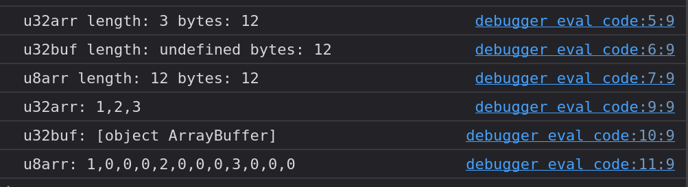

# JavaScript und Bytes
## Kommunizieren mit der Aussenwelt. Kontrolle über den Speicher und die Datentypen
JavaScript abstrahiert den Speicher und die Datentypen. Wenn wir zum Beispiel den Standard Array-Typ nehmen, so können die einzelnen Elemente beliebige Datentypen besitzen und deren Abbildung im Speicher ist nicht definiert. Dies gilt nicht nur für die komplexen Datentypen, sondern auch für die Einfachen wie zum Beispiel `number`. Will man nun aber über gewisse APIs kommunizieren (Filesystem, Webworker, WebAssembly...),  so muss die Byte-Anordnung beim Austausch sicher gestellt werden. Damit die Daten von beiden Parteien wieder korrekt interpretiert werden können. Daher hat das WebGL-Komittee die typisierten Arrays entwickelt.


Um ein Maximum an Flexibilität und Effizienz zu erreichen, wurde die Implementierung in einen Buffer und Views (Ansichten) aufgeteilt. 
Ein Buffer (implementiert durch das `ArrayBuffer`-Objekt) ist ein Objekt, das einen Datenblock definierter Grösse darstellt. Er hat kein Format (Interpretierung) und bietet keinen Mechanismus für einen Zugriff auf seinen Inhalt. 
Um auf den Speicherinhalt eines Buffers zuzugreifen, muss eine Ansicht verwenden werden. Eine Ansicht bietet einen Kontext - das heißt, einen Datentyp, einen Startoffset und eine Anzahl von Elementen - der die Daten in ein tatsächliches typisiertes Array umwandelt.

## Array Buffer
* [Array Buffer](https://developer.mozilla.org/en-US/docs/Web/JavaScript/Reference/Global_Objects/ArrayBuffer)

Der `ArrayBuffer` ist ein Datentyp, der einen generischen, binären Datenbereich definierter Grösse darstellt. Der Inhalt eines `ArrayBuffer`s kann nicht direkt manipuliert werden. Stattdessen erstellt man eine Ansicht eines typisierten Arrays oder eine `DataView`, die den Datenbereich in einem bestimmten Format repräsentiert (interpretiert) und so die Manipulation des Inhalts ermöglicht.

Der `ArrayBuffer` hat spezielle Mechanismen um seine Grösse zu beeinflussen oder seinen Inhalt zu transferieren. Bei einem Transfer wird der Eigentum des Speichers mitübertragen und die original Kopie wird unbrauchbar.

## Typed Arrays View (typisierte Arrays)
* [Typed Arrays](https://developer.mozilla.org/en-US/docs/Web/JavaScript/Reference/Global_Objects/TypedArray)
* [Typed Arrays](https://developer.mozilla.org/en-US/docs/Web/JavaScript/Guide/Typed_arrays)

Diese ermöglichen einen Weg um die Rohdaten im Speicher (welche in Form vom `ArrayBuffer` repräsentiert werden) zu interpretieren und zu manipulieren. 
Folgende Typen sind verfügbar:
* `Int8Array` 8-bit signed integer
* `Uint8Array` 8-bit unsigned integer
* `Uint8ClampedArray` 8-bit unsigned integer (clamped)
* `Int16Array` 16-bit signed integer
* `Uint16Array` 16-bit unsigned integer
* `Int32Array` 32-bit signed integer
* `Uint32Array` 32-bit unsigned integer
* `Float32Array` 32-bit floating point number
* `Float64Array` 64-bit floating point number
* `BigInt64Array` 64-bit signed integer
* `BigUint64Array` 64-bit unsigned integer

### Beispiele
```javascript
const u32arr = new Uint32Array([1, 2, 3]);
const u32buf = u32arr.buffer;
const u8arr = new Uint8Array(u32buf);

console.log(`u32arr length: ${u32arr.length} bytes: ${u32arr.byteLength}`);
console.log(`u32buf length: ${u32buf.length} bytes: ${u32buf.byteLength}`);
console.log(`u8arr length: ${u8arr.length} bytes: ${u8arr.byteLength}`);

console.log(`u32arr: ${u32arr}`);
console.log(`u32buf: ${u32buf}`);
console.log(`u8arr: ${u8arr}`);
```



## Data View
* [Data View](https://developer.mozilla.org/en-US/docs/Web/JavaScript/Reference/Global_Objects/DataView)

Die `DataView` stellt ein einfaches getter/setter Interface zur Verfügung. Mit welchem in einem `ArrayBuffer` Bereiche unabhängig von der Endianness und des Zahlentyps gelesen oder geschrieben werden können.

### Endianness
```
Register:
MSB      LSB
0A 0B 0C 0D

Memory:
Big-endien
a  : OA
a+1: 0B
a+2: 0C
a+3: 0D

Little-endien
a  : 0D
a+1: OC
a+2: 0B
a+3: 0A
```

### Beispiele
```javascript
const buffer = new ArrayBuffer(21);
const view = new DataView(buffer);

view.setUint8(0, 4);
view.setUint16(1, 1);
view.setUint16(3, 1);
view.setFloat32(5, 0x80);
view.setFloat32(9, 0x80);
view.setFloat32(13, 0x80);
view.setFloat32(17, 0x80);

console.log(`Buffer:`, buffer);

const dv = new DataView(buffer);
const vector_length = dv.getUint8(0);
const width = dv.getUint16(1);
const height = dv.getUint16(3); // 0+uint8+uint16 = 3 bytes offset
let littleEndianVectors = new Float32Array(width*height*vector_length);
let vectors = new Float32Array(width*height*vector_length);
for (let i=0, off=5; i<vectors.length; i++, off+=4) {
  littleEndianVectors[i] = dv.getFloat32(off, true);
  vectors[i] = dv.getFloat32(off, false);
}

console.log(`vector_length: ${vector_length}`);
console.log(`width: ${width}`);
console.log(`height: ${height}`);
console.log(`little endian vectors:`, littleEndianVectors);
console.log(`vectors:`, vectors);
```


## Weiterführend
* [Source Code](https://github.com/marcokuoni/public_doc/tree/main/essays/3_javascript_and_bytes)
* [English Version](https://github.com/marcokuoni/public_doc/tree/main/essays/3_javascript_and_bytes/README.md)

Ich bin gerne bereit den Beitrag noch zu präzisieren, erweitern oder zu korrigieren. Schreibt ein Feedback oder meldet euch direkt bei mir.

Erstellt von [Marco Kuoni, August 2023](https://marcokuoni.ch)