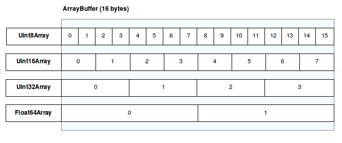
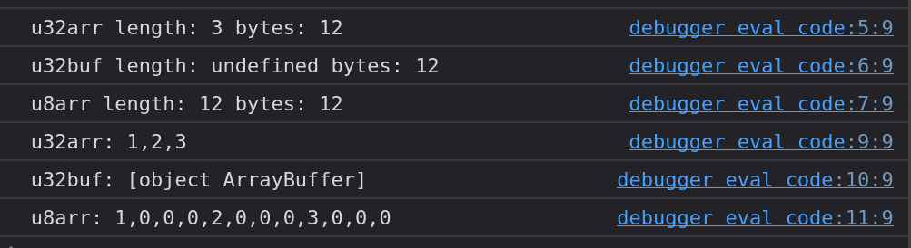
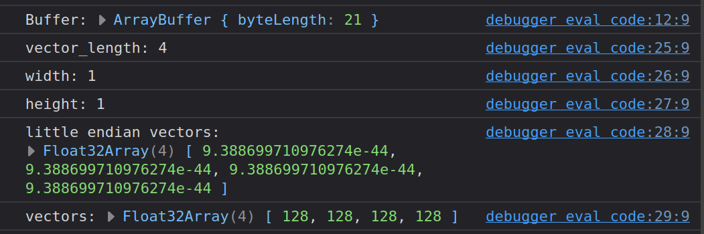

# JavaScript and Bytes
## Communication with the outer world. To have control over memory and data types

JavaScript abstracts the memory and the data types. For instance, if we take the standard array type, its individual elements can possess various data types, and their representation in memory is not defined. This applies not only to complex data types but also to simple ones like `number`. However, when communicating through certain APIs (filesystem, web workers, WebAssembly, etc.), the byte arrangement must be guaranteed during data exchange. This is to ensure that the data can be correctly interpreted by both parties. Therefore, the WebGL committee developed typed arrays.



To achieve a maximum level of flexibility and efficiency, the implementation was divided into a buffer and views.
A buffer (implemented through the `ArrayBuffer` object) is an object that represents a data block of a defined size. It doesn't have a format (interpretation) and doesn't provide a mechanism to access its content directly.
To access the memory content of a buffer, a view must be used. A view provides context – that is, a data type, a starting offset, and a number of elements – that converts the data into an actual typed array.

## Array Buffer
* [Array Buffer](https://developer.mozilla.org/en-US/docs/Web/JavaScript/Reference/Global_Objects/ArrayBuffer)

The `ArrayBuffer` is a data type that represents a generic, fixed-size binary data area. The content of an `ArrayBuffer` cannot be directly manipulated. Instead, you create a view of a typed array or a `DataView`, which represents (interprets) the data area in a specific format, allowing manipulation of the content.

The `ArrayBuffer` has special mechanisms to influence its size or transfer its content. During a transfer, the ownership of the memory is transferred along with it and the original copy gets detached.

## Typed Arrays View
* [Typed Arrays](https://developer.mozilla.org/en-US/docs/Web/JavaScript/Reference/Global_Objects/TypedArray)
* [Typed Arrays](https://developer.mozilla.org/en-US/docs/Web/JavaScript/Guide/Typed_arrays)

These provide a way to interpret and manipulate raw data in memory (which is represented in the form of an `ArrayBuffer`).
The following types are available:
* `Int8Array` 8-bit signed integer
* `Uint8Array` 8-bit unsigned integer
* `Uint8ClampedArray` 8-bit unsigned integer (clamped)
* `Int16Array` 16-bit signed integer
* `Uint16Array` 16-bit unsigned integer
* `Int32Array` 32-bit signed integer
* `Uint32Array` 32-bit unsigned integer
* `Float32Array` 32-bit floating point number
* `Float64Array` 64-bit floating point number
* `BigInt64Array` 64-bit signed integer
* `BigUint64Array` 64-bit unsigned integer

### Examples
```javascript
const u32arr = new Uint32Array([1, 2, 3]);
const u32buf = u32arr.buffer;
const u8arr = new Uint8Array(u32buf);

console.log(`u32arr length: ${u32arr.length} bytes: ${u32arr.byteLength}`);
console.log(`u32buf length: ${u32buf.length} bytes: ${u32buf.byteLength}`);
console.log(`u8arr length: ${u8arr.length} bytes: ${u8arr.byteLength}`);

console.log(`u32arr: ${u32arr}`);
console.log(`u32buf: ${u32buf}`);
console.log(`u8arr: ${u8arr}`);
```



## Data View
* [Data View](https://developer.mozilla.org/en-US/docs/Web/JavaScript/Reference/Global_Objects/DataView)

The `DataView` provides a simple getter/setter interface through which ranges in an `ArrayBuffer` can be read or written independently of the endianness and the type.

### Endianness
```
Register:
MSB      LSB
0A 0B 0C 0D

Memory:
Big-endien
a  : OA
a+1: 0B
a+2: 0C
a+3: 0D

Little-endien
a  : 0D
a+1: OC
a+2: 0B
a+3: 0A
```

### Examples
```javascript
const buffer = new ArrayBuffer(21);
const view = new DataView(buffer);

view.setUint8(0, 4);
view.setUint16(1, 1);
view.setUint16(3, 1);
view.setFloat32(5, 0x80);
view.setFloat32(9, 0x80);
view.setFloat32(13, 0x80);
view.setFloat32(17, 0x80);

console.log(`Buffer:`, buffer);

const dv = new DataView(buffer);
const vector_length = dv.getUint8(0);
const width = dv.getUint16(1);
const height = dv.getUint16(3); // 0+uint8+uint16 = 3 bytes offset
let littleEndianVectors = new Float32Array(width*height*vector_length);
let vectors = new Float32Array(width*height*vector_length);
for (let i=0, off=5; i<vectors.length; i++, off+=4) {
  littleEndianVectors[i] = dv.getFloat32(off, true);
  vectors[i] = dv.getFloat32(off, false);
}

console.log(`vector_length: ${vector_length}`);
console.log(`width: ${width}`);
console.log(`height: ${height}`);
console.log(`little endian vectors:`, littleEndianVectors);
console.log(`vectors:`, vectors);
```



## Further Resources
* [Source Code](https://github.com/marcokuoni/public_doc/tree/main/essays/3_javascript_and_bytes)
* [Deutsche Version](https://github.com/marcokuoni/public_doc/tree/main/essays/3_javascript_and_bytes/README.de.md)

I am open to refining, expanding, or correcting the article. Feel free to provide a feedback or get in touch with me.

Created by [Marco Kuoni, August 2023](https://marcokuoni.ch)
