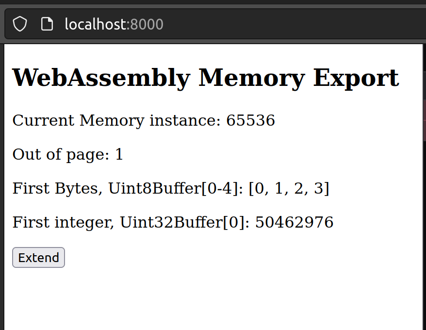
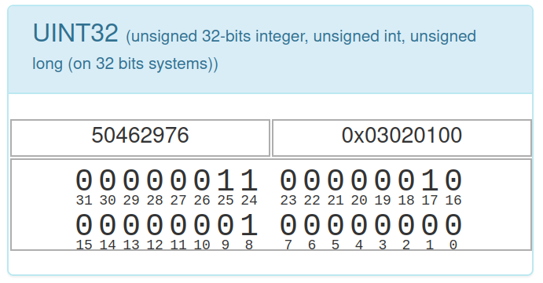
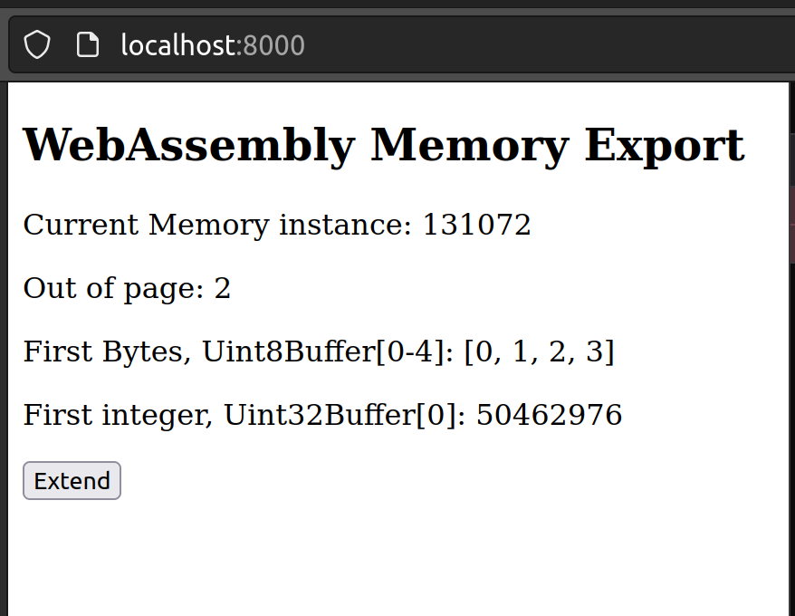
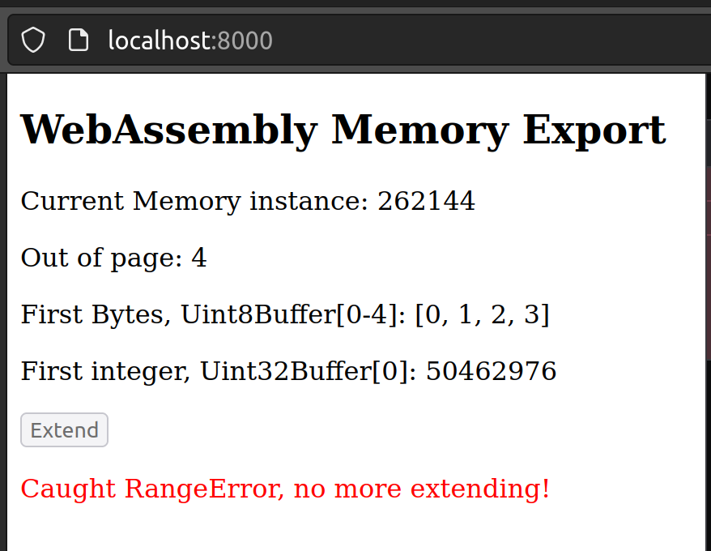
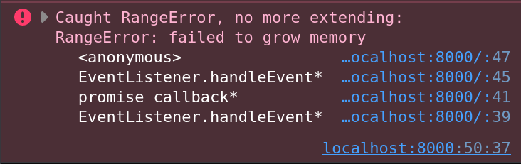

# WebAssembly Memory
Zu einem WebAssembly Modul wird ein `ArrayBuffer` (bzw. `SharedArrayBuffer`) verknüpft, der als WebAssembly Speicher dient. Die Speicherinstanz wird entweder vom Modul selbst erstellt oder durch das Gästesystem zur Verfügung gestellt. Diese Instanzen werden gleich wie Funktionen vom Modul importiert oder exportiert. Jede Instanz besteht aus einem linearen Speicherbereich aufgeteilt in 64 KiloByte grosse Seiten (`Pages`).
> Aktuell ist ein Modul auf eine Speicherinstanz beschränkt. Es ist anzunehmen, dass dies in naher Zukunft angepasst wird.

## Speicher exportieren
Ein WebAssembly Modul kann Speicher exportieren und instanzieren, dies hier demonstriert an einem Beispiel.

```wat
(module
  (memory (export "mem") 1 4)
  (data (i32.const 0x1) "\01\02\03")
)
```

Kompilieren `wat2wasm export.wat -o export.wasm`
Analysieren `wasm-objdump -x export.wasm`

```bash
$ wasm-objdump -x export.wasm

export.wasm:    file format wasm 0x1

Section Details:

Memory[1]:
 - memory[0] pages: initial=1 max=4
Export[1]:
 - memory[0] -> "mem"
Data[1]:
 - segment[0] memory=0 size=3 - init i32=1
  - 0000001: 0102 03   
```

Kurzbeschreibung der Abschnitte:
* `Memory[1]` definiert eine Speicherinstanz mit einer Seite (`Page` von 64 KiloByte) initial und einer Obergrenze von maximal vier Seiten (`Pages`).
* `Export[1]` exportiert die Speicherinstanz mit dem Namen `mem`.
* `Data[1]` initialisiert den Speicher ab der Adresse `0x1` mit den Bytes `0x01`, `0x02` und `0x03`.

### Gebrauch in einer Webanwendung
```html
<!DOCTYPE html>
<html lang="en">

<head>
    <meta charset="utf-8" />
    <title>WebAssembly Memory Export</title>
</head>

<body>
    <article>
        <h1>WebAssembly Memory Export</h1>
        <p>Current Memory instance: <span id="mem"></span></p>
        <p>Out of page: <span id="pages"></span></p>
        <p>First Bytes, Uint8Buffer[0-4]: <span id="firstbytes"></span></p>
        <p>First integer, Uint32Buffer[0]: <span id="firstint"></span></p>
        <button type="button" id="extend">Extend</button>
        <p style="color: red" id="error"></p>
    </article>
    <script>
        function fetchAndInstantiate(url, importObject) {
            return fetch(url)
                .then(response => response.arrayBuffer())
                .then(bytes => WebAssembly.instantiate(bytes, importObject))
                .then(results => results.instance);
        }

        function presentMemory(mem) {
            const buf = mem.buffer;
            const firstBytes = new Uint8Array(buf);
            const firstInt = new Uint32Array(buf);
            const byteLength = buf.byteLength;
            const pages = byteLength / (64 * 1024);
            document.getElementById('mem').textContent = byteLength;
            document.getElementById('pages').textContent = pages;
            document.getElementById('firstbytes').textContent = `[${firstBytes[0]}, ${firstBytes[1]}, ${firstBytes[2]}, ${firstBytes[3]}]`;
            document.getElementById('firstint').textContent = firstInt[0];
        }

        document.addEventListener('DOMContentLoaded', function () {
            fetchAndInstantiate('export.wasm')
                .then(instance => {
                    const mem = instance.exports.mem;

                    const extendButton = document.getElementById('extend');
                    extendButton.addEventListener('click', () => {
                        try {
                            mem.grow(1);
                            presentMemory(mem);
                        } catch (rangeError) {
                            console.error(`Caught RangeError, no more extending:`, rangeError);
                            document.getElementById('error').textContent = 'Caught RangeError, no more extending!';
                            extendButton.disabled = true;
                        }
                    });
                    presentMemory(mem);
                });
        });
    </script>
</body>

</html>
```

Anwendung starten `python3 -m http.server`
Analysieren im Browser `http://localhost:8000`

Falls diese Schritte neu waren, empfehle ich meine älteren Beiträge zu konsultieren:
* [Erste Erfahrungen mit WebAssembly](https://medium.com/webassembly/first-experiences-with-webassembly-dafb2cf2ab52) gibt eine Einführung und beschreibt den Werkzeugkasten für WebAssembly
* [WebAssebmly Module](https://medium.com/webassembly/webassembly-module-146783e725d9) erklärt die Module und deren Aufbau (Abschnitte [Sections])
* [JavaScript und Bytes](https://medium.com/@marcokuoni/javascript-and-bytes-44a70871986) zeigt wie man in JavaScript mit Bytes arbeiten kann (`ArrayBuffer`, `DataView`)

Beim Aufstarten der Anwendung




Nach dem Klick auf den Button `Extend` wird der Speicherbereich um eine Seite (`Page`) erweitert. Das heisst der `ArrayBuffer` wird ungültig (detached) und der Inhalt in einen neuen grösseren `ArrayBuffer` kopiert.
* [Detachment upon growing](https://developer.mozilla.org/en-US/docs/WebAssembly/JavaScript_interface/Memory/grow#detachment_upon_growing)
* [Alternative: SharedArrayBuffer](https://developer.mozilla.org/en-US/docs/Web/JavaScript/Reference/Global_Objects/SharedArrayBuffer#webassembly_shared_memory)


Nach dem vierten Klick auf den Button `Extend` läuft man in einen Bereichsfehler (`RangeError`). Dies gemäss der definierten Obergrenze im WAT von vier Seiten (`Pages`).



## Speicher importieren
```wat
(module
    (memory (import "js" "mem") 1)
    (func (export "fibonacci") (param $n i32)
        (local $index i32)
        (local $ptr i32)    

        (i32.store (i32.const 0) (i32.const 0))
        (i32.store (i32.const 4) (i32.const 1))

        (set_local $index (i32.const 2))
        (set_local $ptr (i32.const 8))

        (block $break
            (loop $loop
                (i32.store
                    (get_local $ptr)
                    (i32.add
                        (i32.load (i32.sub (get_local $ptr) (i32.const 4)))
                        (i32.load (i32.sub (get_local $ptr) (i32.const 8)))
                    )
                )
                (set_local $index (i32.add (get_local $index) (i32.const 1)))
                (set_local $ptr (i32.add (get_local $ptr) (i32.const 4)))
                (br_if $break (i32.ge_u (get_local $index) (get_local $n)))
                (br $loop)
            )
        )
    )
)
```

## Das gleiche mit Strings

## Fibonacci Umsetzung im Stackautomaten
Es ist beinahe möglich den Fibonacci Algorithmus für den Stackautomaten 1:1 in JavaScript zu übersetzen. Ein paar Anmerkung:
* Es wird kein Import benutzt sondern der importierte Speicher mit einem `ArrayBuffer` simuliert. Was grunsätzlich auch im Hintergrund vom WebAssembly verwendet wird.
* Es können in JavaScript keine GoTo-Anweisungen eingesetzt werden. Um trotzdem etwas aufzuzeigen, wie der Stackautomat funktioniert, wird ein `while(true)` mit einem `break` und `continue` verwendet.
* Die Positionen im Kommentar werden unten für die Darstellung der Entwicklung des Speichers verwendet.

```javascript
// import memory js.mem
// here we simulate it by an array buffer
const buffer = new ArrayBuffer(10 * 64 * 1024);
const mem = new DataView(buffer);

function fibonacci(n) {
    let index, ptr;

    mem.setUint32(0, 0);
    mem.setUint32(4, 1);

    index = 2;
    ptr = 8;

    //position 1
    start: while(true) {
        mem.setUint32(ptr, mem.getUint32(ptr - 4) + mem.getUint32(ptr - 8));

        index += 1;
        ptr += 4;

        if(index >= n) {
            break; 
        }
        //position 2
        continue start;
    }
}

fibonacci(10);

for(let i = 0; i < 10; i++) {
    console.log(`Fibonacci[${i}]: ${mem.getUint32(i * 4)}`);
}
```


Dabei entwickelt sich der lineare Speicher pro Iteration wie folgt

```
Byte Nummer
Inhalt als Dezimalzahl

Position 1:
0 1 2 3 | 4 5 6 7 | 8 9 10 11 | 12 13 14 15 | 16 17 18 19 | 20 21 22 23 | 24 25 26 27 | 28 29 30 31 | 32
0 0 0 0 | 0 0 0 1 | 0 0 0  0  | 0  0  0  0  | 0  0  0  0  | 0  0  0  0  | 0  0  0  0  | 0  0  0  0  | 0

Position 2:
0 1 2 3 | 4 5 6 7 | 8 9 10 11 | 12 13 14 15 | 16 17 18 19 | 20 21 22 23 | 24 25 26 27 | 28 29 30 31 | 32
0 0 0 0 | 0 0 0 1 | 0 0 0  1  | 0  0  0  0  | 0  0  0  0  | 0  0  0  0  | 0  0  0  0  | 0  0  0  0  | 0

Position 2:
0 1 2 3 | 4 5 6 7 | 8 9 10 11 | 12 13 14 15 | 16 17 18 19 | 20 21 22 23 | 24 25 26 27 | 28 29 30 31 | 32
0 0 0 0 | 0 0 0 1 | 0 0 0  1  | 0  0  0  2  | 0  0  0  0  | 0  0  0  0  | 0  0  0  0  | 0  0  0  0  | 0

Position 2:
0 1 2 3 | 4 5 6 7 | 8 9 10 11 | 12 13 14 15 | 16 17 18 19 | 20 21 22 23 | 24 25 26 27 | 28 29 30 31 | 32
0 0 0 0 | 0 0 0 1 | 0 0 0  1  | 0  0  0  2  | 0  0  0  3  | 0  0  0  0  | 0  0  0  0  | 0  0  0  0  | 0

Position 2:
0 1 2 3 | 4 5 6 7 | 8 9 10 11 | 12 13 14 15 | 16 17 18 19 | 20 21 22 23 | 24 25 26 27 | 28 29 30 31 | 32
0 0 0 0 | 0 0 0 1 | 0 0 0  1  | 0  0  0  2  | 0  0  0  3  | 0  0  0  5  | 0  0  0  0  | 0  0  0  0  | 0

Position 2:
0 1 2 3 | 4 5 6 7 | 8 9 10 11 | 12 13 14 15 | 16 17 18 19 | 20 21 22 23 | 24 25 26 27 | 28 29 30 31 | 32
0 0 0 0 | 0 0 0 1 | 0 0 0  1  | 0  0  0  2  | 0  0  0  3  | 0  0  0  5  | 0  0  0  8  | 0  0  0  0  | 0

Position 2:
0 1 2 3 | 4 5 6 7 | 8 9 10 11 | 12 13 14 15 | 16 17 18 19 | 20 21 22 23 | 24 25 26 27 | 28 29 30 31 | 32
0 0 0 0 | 0 0 0 1 | 0 0 0  1  | 0  0  0  2  | 0  0  0  3  | 0  0  0  5  | 0  0  0  8  | 0  0  0  13 | 0

.
.
.
```

## Weiterführend
* [Source Code](https://github.com/marcokuoni/public_doc/tree/main/essays/3_javascript_and_bytes)
* [English Version](https://github.com/marcokuoni/public_doc/tree/main/essays/3_javascript_and_bytes/README.md)

Ich bin gerne bereit den Beitrag noch zu präzisieren, erweitern oder zu korrigieren. Schreibt ein Feedback oder meldet euch direkt bei mir.

Erstellt von [Marco Kuoni, August 2023](https://marcokuoni.ch)