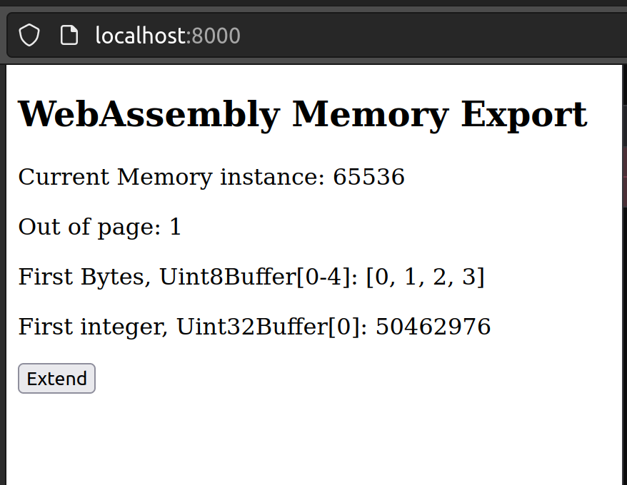
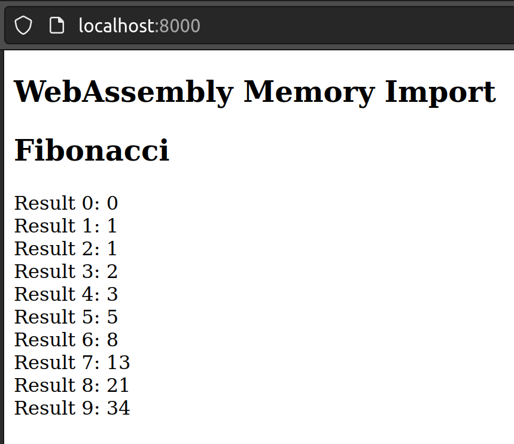
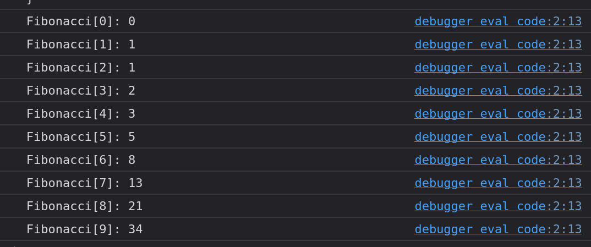

# WebAssembly Memory
Zu einem WebAssembly Modul wird ein `ArrayBuffer` (bzw. `SharedArrayBuffer`) verknüpft, der als WebAssembly Speicher dient. Die Speicherinstanz wird entweder vom Modul selbst erstellt oder durch das Gästesystem zur Verfügung gestellt. Diese Instanzen werden gleich wie Funktionen vom Modul importiert oder exportiert. Jede Instanz besteht aus einem linearen Speicherbereich aufgeteilt in 64 KiloByte grosse Seiten (`Pages`).
> Aktuell ist ein WebAssembly Modul auf eine Speicherinstanz beschränkt. Es ist anzunehmen, dass dies in naher Zukunft angepasst wird.

## Speicher exportieren
Ein WebAssembly Modul kann Speicher exportieren und instanziieren. Was nachfolgend an einem Beispiel demonstriert wird.

```wat
(module
  (memory (export "mem") 1 4)
  (data (i32.const 0x1) "\01\02\03")
)
```

Kompilieren `wat2wasm export.wat -o export.wasm`

Analysieren `wasm-objdump -x export.wasm`

```bash
$ wasm-objdump -x export.wasm

export.wasm:    file format wasm 0x1

Section Details:

Memory[1]:
 - memory[0] pages: initial=1 max=4
Export[1]:
 - memory[0] -> "mem"
Data[1]:
 - segment[0] memory=0 size=3 - init i32=1
  - 0000001: 0102 03   
```

Kurzbeschreibung der Abschnitte:
* `Memory[1]` definiert eine Speicherinstanz mit einer Seite (`Page` von 64 KiloByte) initial und einer Obergrenze von maximal vier Seiten (`Pages`).
* `Export[1]` exportiert die Speicherinstanz mit dem Namen `mem`.
* `Data[1]` initialisiert den Speicher ab der Adresse `0x1` mit den Bytes `0x01`, `0x02` und `0x03`.

### Gebrauch in einer Webanwendung
```html
<!DOCTYPE html>
<html lang="en">

<head>
    <meta charset="utf-8" />
    <title>WebAssembly Memory Export</title>
</head>

<body>
    <article>
        <h1>WebAssembly Memory Export</h1>
        <p>Current Memory instance: <span id="mem"></span></p>
        <p>Out of page/s: <span id="pages"></span></p>
        <p>First Bytes, Uint8Buffer[0-4]: <span id="firstbytes"></span></p>
        <p>First integer, Uint32Buffer[0]: <span id="firstint"></span></p>
        <button type="button" id="extend">Extend</button>
        <p style="color: red" id="error"></p>
    </article>
    <script>
        function fetchAndInstantiate(url, importObject) {
            return fetch(url)
                .then(response => response.arrayBuffer())
                .then(bytes => WebAssembly.instantiate(bytes, importObject))
                .then(results => results.instance);
        }

        function presentMemory(mem) {
            const buf = mem.buffer;
            const firstBytes = new Uint8Array(buf);
            const firstInt = new Uint32Array(buf);
            const byteLength = buf.byteLength;
            const pages = byteLength / (64 * 1024);
            document.getElementById('mem').textContent = byteLength;
            document.getElementById('pages').textContent = pages;
            document.getElementById('firstbytes').textContent = `[${firstBytes[0]}, ${firstBytes[1]}, ${firstBytes[2]}, ${firstBytes[3]}]`;
            document.getElementById('firstint').textContent = firstInt[0];
        }

        document.addEventListener('DOMContentLoaded', function () {
            fetchAndInstantiate('export.wasm')
                .then(instance => {
                    const mem = instance.exports.mem;

                    const extendButton = document.getElementById('extend');
                    extendButton.addEventListener('click', () => {
                        try {
                            mem.grow(1);
                            presentMemory(mem);
                        } catch (rangeError) {
                            console.error(`Caught RangeError, no more extending:`, rangeError);
                            document.getElementById('error').textContent = 'Caught RangeError, no more extending!';
                            extendButton.disabled = true;
                        }
                    });
                    presentMemory(mem);
                });
        });
    </script>
</body>

</html>
```

Anwendung starten `python3 -m http.server`

Analysieren im Browser `http://localhost:8000`

---

Falls diese Schritte neu waren, empfehle ich meine älteren Beiträge zu konsultieren:
* [Erste Erfahrungen mit WebAssembly](https://medium.com/webassembly/first-experiences-with-webassembly-dafb2cf2ab52) gibt eine Einführung und beschreibt den Werkzeugkasten für WebAssembly
* [WebAssebmly Module](https://medium.com/webassembly/webassembly-module-146783e725d9) erklärt den Aufbau des WebAssembly Moduls
* [JavaScript und Bytes](https://medium.com/@marcokuoni/javascript-and-bytes-44a70871986) zeigt wie man in JavaScript mit Bytes arbeiten kann (`ArrayBuffer`, `DataView`)

---

Beim Starten der Anwendung



Nach dem Klick auf den Button `Extend` wird der Speicherbereich um eine Seite (`Page`) erweitert. Das heisst der `ArrayBuffer` wird ungültig (detached) und der Inhalt in einen neuen grösseren `ArrayBuffer` kopiert.
* [Detachment upon growing](https://developer.mozilla.org/en-US/docs/WebAssembly/JavaScript_interface/Memory/grow#detachment_upon_growing)
* [Alternative: SharedArrayBuffer](https://developer.mozilla.org/en-US/docs/Web/JavaScript/Reference/Global_Objects/SharedArrayBuffer#webassembly_shared_memory)


Nach dem vierten Klick auf den Button `Extend` läuft man in einen Bereichsfehler (`RangeError`). Dies gemäss der definierten Obergrenze im WAT von vier Seiten (`Pages`).


## Speicher importieren
Von der JavaScript Seite kann *ein* Speicher (`Memory`) dem WebAssembly Modul zur Verfügung gestellt werden (importiert). Was mit dem folgenden WAT Programm eines Fibonacci Algorithmus demonstriert wird. Die Interpretierung des Fibonacci Stackautomaten Algorithmus ist im letzten Abschnitt dieses Artikels beschrieben.


```wat
(module
    (memory (import "env" "mem") 1)
    (func (export "fibonacci") (param $n i32)
        (local $index i32)
        (local $ptr i32)    

        (i32.store (i32.const 0) (i32.const 0))
        (i32.store (i32.const 4) (i32.const 1))

        (local.set $index (i32.const 2))
        (local.set $ptr (i32.const 8))

        (block $break
            (loop $loop
                (i32.store
                    (local.get $ptr)
                    (i32.add
                        (i32.load (i32.sub (local.get $ptr) (i32.const 4)))
                        (i32.load (i32.sub (local.get $ptr) (i32.const 8)))
                    )
                )
                (local.set $index (i32.add (local.get $index) (i32.const 1)))
                (local.set $ptr (i32.add (local.get $ptr) (i32.const 4)))
                (br_if $break (i32.ge_u (local.get $index) (local.get $n)))
                (br $loop)
            )
        )
    )
)
```

Kompilieren `wat2wasm fibonacci.wat -o fibonacci.wasm`

Analysieren `wasm-objdump -x fibonacci.wasm`

```bash
$ wasm-objdump -x fibonacci.wasm

fibonacci.wasm: file format wasm 0x1

Section Details:

Type[1]:
 - type[0] (i32) -> nil
Import[1]:
 - memory[0] pages: initial=1 <- env.mem
Function[1]:
 - func[0] sig=0 <fibonacci>
Export[1]:
 - func[0] <fibonacci> -> "fibonacci"
Code[1]:
 - func[0] size=77 <fibonacci>
```

Kurzbeschreibung der Abschnitte:
* `Type[1]` definiert unseren Funktionstyp mit einem Input-Parameter vom Typ `i32` und ohne Rückgabewert.
* `Import[1]` importiert eine Speicherinstanz aus dem Namensbereich `env.mem`.
* `Function[1]` definiert eine Funktion mit dem Typ (`signature`) `0` (siehe oben unter `Type[1]`) und dem Namen `fibonacci`.
* `Export[1]` exportiert die Funktion `fibonacci` mit dem Namen `fibonacci`.
* `Code[1]` definiert den Code der Funktion `fibonacci` mit einer Grösse von 77 Bytes.

### Gebrauch in einer Webanwendung
```html
<!DOCTYPE html>
<html lang="en">

<head>
    <meta charset="utf-8" />
    <title>WebAssembly Memory Import</title>
</head>

<body>
    <article>
        <h1>WebAssembly Memory Import</h1>
        <h2>Fibonacci</h2>
        <p id="fibonacci-output"></p>
    </article>
    <script>
        function fetchAndInstantiate(url, importObject) {
            return fetch(url)
                .then(response => response.arrayBuffer())
                .then(bytes => WebAssembly.instantiate(bytes, importObject))
                .then(results => results.instance);
        }

        function presentFibonacci(result, n) {
            const fibonacciOutput = document.getElementById('fibonacci-output');

            console.log('Memory', result)

            for (let i = 0; i < n; i++) {
                fibonacciOutput.innerText += `Result ${i}: ${result[i]}\n`;
            }
        }

        document.addEventListener('DOMContentLoaded', function () {
            const memory = new WebAssembly.Memory({ initial: 1, maximum: 2});

            const importObject = {
                env: {
                    mem: memory
                }
            };

            fetchAndInstantiate('fibonacci.wasm', importObject)
                .then(instance => {
                    const n = 10;
                    instance.exports.fibonacci(n);
                    const result = new Uint32Array(memory.buffer);
                    presentFibonacci(result, n);
                });
        });
    </script>
</body>

</html>
```

Anwendung starten `python3 -m http.server`
Analysieren im Browser `http://localhost:8000`




> Es gilt zu beachten, dass das Fibonacci Programm hier nicht wirklich sicher ist und nur zur Demonstration dient. Es wird zum Beispiel nicht geprüft, ob der Speicherbereich überhaupt existiert und ob die Speicherbereiche nicht überschrieben werden.

## Das gleiche mit Strings
Wie kann mit Srings gearbeitet werden im Speicher.

```wat
(module
    (memory (export "memory") 1)
    (data (i32.const 0) "Hello, World! 😀")
)
```

Kompilieren `wat2wasm string.wat -o string.wasm`

Analysieren `wasm-objdump -x string.wasm`

```bash
$ wasm-objdump -x string.wasm

string.wasm:    file format wasm 0x1

Section Details:

Memory[1]:
 - memory[0] pages: initial=1
Export[1]:
 - memory[0] -> "memory"
Data[1]:
 - segment[0] memory=0 size=18 - init i32=0
  - 0000000: 4865 6c6c 6f2c 2057 6f72 6c64 2120 f09f  Hello, World! ..
  - 0000010: 9880 
```

Kurzbeschreibung der Abschnitte:
* `Memory[1]` definiert eine Speicherinstanz mit einer Seite (`Page` von 64 KiloByte).
* `Export[1]` exportiert die Speicherinstanz mit dem Namen `memory`.
* `Data[1]` initialisiert den Speicher ab der Adresse `0x0` mit den Bytes `0x48`, `0x65`, `0x6c`, `0x6c`, `0x6f`, `0x2c`, `0x20`, `0x57`, `0x6f`, `0x72`, `0x6c`, `0x64`, `0x21`, `0x20`, `0xf0`, `0x9f`, `0x98`, `0x80`.
* Die Zeichenkette `Hello, World! 😀` wird als UTF-8 interpretiert und in den Speicher geschrieben. Dies erlaubt daher einen erweiterten Zeichensatz zu ASCII und somit zum Beispiel Emojis zu verwenden.

Offsetberechnung für die Zeichenkette `Hello, World! 😀`:
* `0x0` bis `0xd` für `Hello, World! ` -> 14 Zeichen an 1 Byte (Gemäss ASCII Zeichensatz)
* `0xe` bis `0x11` für `😀` -> und 1 Zeichen ([Emoji 0xf0 9f 98 80](https://apps.timwhitlock.info/emoji/tables/unicode)) an 4 Bytes

### Gebrauch in einer Webanwendung
```html
<!DOCTYPE html>
<html lang="en">

<head>
    <meta charset="utf-8" />
    <title>WebAssembly Memory String Export</title>
</head>

<body>
    <article>
        <h1>WebAssembly Memory String Export</h1>
        <p id="hello-world"></p>
        <p id="emoji"></p>
    </article>
    <script>
        function fetchAndInstantiate(url, importObject) {
            return fetch(url)
                .then(response => response.arrayBuffer())
                .then(bytes => WebAssembly.instantiate(bytes, importObject))
                .then(results => results.instance);
        }

        function presentString(mem) {
            const helloWorld = document.getElementById('hello-world');
            const emoji = document.getElementById('emoji');

            const helloWorldBytes = new Uint8Array(mem.buffer, 0, 14);
            const emojiBytes = new Uint8Array(mem.buffer, 14, 4);

            const helloWorldString = new TextDecoder('utf8').decode(helloWorldBytes);
            const emojiString = new TextDecoder('utf8').decode(emojiBytes);

            helloWorld.innerText = helloWorldString;
            emoji.innerText = emojiString + ' ' + emojiString;
        }

        document.addEventListener('DOMContentLoaded', function () {
            fetchAndInstantiate('string.wasm')
                .then(instance => {
                    const mem = instance.exports.memory;
                    presentString(mem);
                });
        });
    </script>
</body>

</html>
```

Anwendung starten `python3 -m http.server`

Analysieren im Browser `http://localhost:8000`


## Fibonacci Umsetzung im Stackautomaten
Hier den Versuch einer Simulation des Stackautomaten Fibonacci Algorithmus in JavaScript zu implementieren. Ein paar Anmerkung:
* Es wird kein Import benutzt sondern der importierte Speicher mit einem `ArrayBuffer` simuliert. Was auch im Hintergrund vom WebAssembly verwendet wird.
* Es können in JavaScript keine GoTo-Anweisungen eingesetzt werden. Um trotzdem etwas aufzuzeigen, wie die Schlaufe im Stackautomaten funktioniert, wird ein `while(true)` mit einem `break` und `continue` verwendet.
* Die Positionen in den Kommentaren werden unten für die Darstellung zur Entwicklung des Speichers verwendet.
* Die Hilfsvariable `index` wird zur Zählung der Iterationen verwendet. 
* Die Hilfsvariable `ptr` wird verwendet um die Position im Speicher zu halten.
* Die jeweiligen Integer Resultate (4 Bytes) werden linear im Speicher abgelegt und das Programm selbst muss die Positionen dazu wissen und berechnen.

> Beachte: WASM wird in einem virtuellen Stackautomaten ausgeführt. Daher müssen die Werte immer zuerst auf den Stack gelegt werden, bevor sie gelesen, verarbeitet und vom Stack entfernt werden. Das Resultat der Verarbeitung wird anschliessen wieder auf den Stack gelegt und kann direkt als Eingabe für den nächsten Schritt dienen. Diese Abläufe sind im WAT-Code durch die Klammerungen erkennbar, was hier in der JavaScript Simulation verloren geht.

```javascript
// import memory env.mem
// here we simulate it by an array buffer
const buffer = new ArrayBuffer(10 * 64 * 1024);
const mem = new DataView(buffer);

function fibonacci(n) {
    let index, ptr;

    mem.setUint32(0, 0);
    mem.setUint32(4, 1);

    index = 2;
    ptr = 8;

    //position 1
    start: while(true) {
        mem.setUint32(ptr, mem.getUint32(ptr - 4) + mem.getUint32(ptr - 8));

        index += 1;
        ptr += 4;

        if(index >= n) {
            break; 
        }
        //position 2
        continue start;
    }
}

fibonacci(10);

for(let i = 0; i < 10; i++) {
    console.log(`Fibonacci[${i}]: ${mem.getUint32(i * 4)}`);
}
```



Dabei entwickelt sich der lineare Speicher pro Iteration wie folgt

```
Byte Nummer
Inhalt als Dezimalzahl

Position 1:
0 1 2 3 | 4 5 6 7 | 8 9 10 11 | 12 13 14 15 | 16 17 18 19 | 20 21 22 23 | 24 25 26 27 | 28 29 30 31 | 32
0 0 0 0 | 0 0 0 1 | 0 0 0  0  | 0  0  0  0  | 0  0  0  0  | 0  0  0  0  | 0  0  0  0  | 0  0  0  0  | 0

Position 2:
0 1 2 3 | 4 5 6 7 | 8 9 10 11 | 12 13 14 15 | 16 17 18 19 | 20 21 22 23 | 24 25 26 27 | 28 29 30 31 | 32
0 0 0 0 | 0 0 0 1 | 0 0 0  1  | 0  0  0  0  | 0  0  0  0  | 0  0  0  0  | 0  0  0  0  | 0  0  0  0  | 0

Position 2:
0 1 2 3 | 4 5 6 7 | 8 9 10 11 | 12 13 14 15 | 16 17 18 19 | 20 21 22 23 | 24 25 26 27 | 28 29 30 31 | 32
0 0 0 0 | 0 0 0 1 | 0 0 0  1  | 0  0  0  2  | 0  0  0  0  | 0  0  0  0  | 0  0  0  0  | 0  0  0  0  | 0

Position 2:
0 1 2 3 | 4 5 6 7 | 8 9 10 11 | 12 13 14 15 | 16 17 18 19 | 20 21 22 23 | 24 25 26 27 | 28 29 30 31 | 32
0 0 0 0 | 0 0 0 1 | 0 0 0  1  | 0  0  0  2  | 0  0  0  3  | 0  0  0  0  | 0  0  0  0  | 0  0  0  0  | 0

Position 2:
0 1 2 3 | 4 5 6 7 | 8 9 10 11 | 12 13 14 15 | 16 17 18 19 | 20 21 22 23 | 24 25 26 27 | 28 29 30 31 | 32
0 0 0 0 | 0 0 0 1 | 0 0 0  1  | 0  0  0  2  | 0  0  0  3  | 0  0  0  5  | 0  0  0  0  | 0  0  0  0  | 0

Position 2:
0 1 2 3 | 4 5 6 7 | 8 9 10 11 | 12 13 14 15 | 16 17 18 19 | 20 21 22 23 | 24 25 26 27 | 28 29 30 31 | 32
0 0 0 0 | 0 0 0 1 | 0 0 0  1  | 0  0  0  2  | 0  0  0  3  | 0  0  0  5  | 0  0  0  8  | 0  0  0  0  | 0

Position 2:
0 1 2 3 | 4 5 6 7 | 8 9 10 11 | 12 13 14 15 | 16 17 18 19 | 20 21 22 23 | 24 25 26 27 | 28 29 30 31 | 32
0 0 0 0 | 0 0 0 1 | 0 0 0  1  | 0  0  0  2  | 0  0  0  3  | 0  0  0  5  | 0  0  0  8  | 0  0  0  13 | 0

.
.
.
```

## Weiterführend
* [Source Code](https://github.com/marcokuoni/public_doc/tree/main/essays/4_webassembly_memory)
* [English Version](https://github.com/marcokuoni/public_doc/tree/main/essays/4_webassembly_memory/README.md)

Ich bin gerne bereit den Beitrag noch zu präzisieren, erweitern oder zu korrigieren. Schreibt ein Feedback oder meldet euch direkt bei mir.

Erstellt von [Marco Kuoni, September 2023](https://marcokuoni.ch)