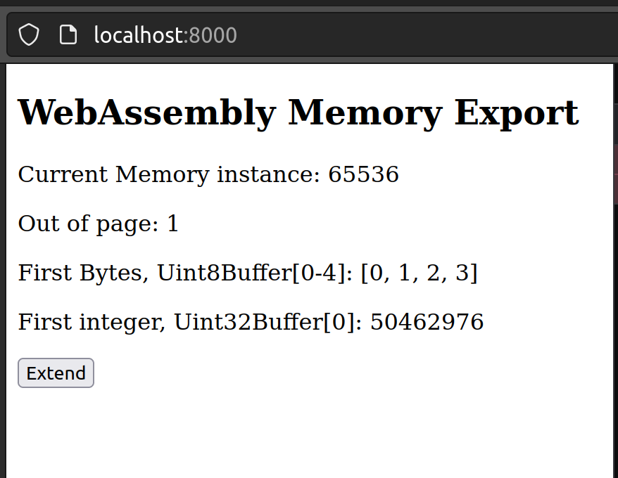
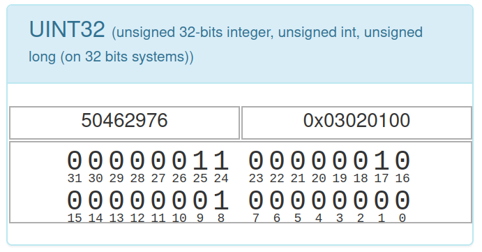
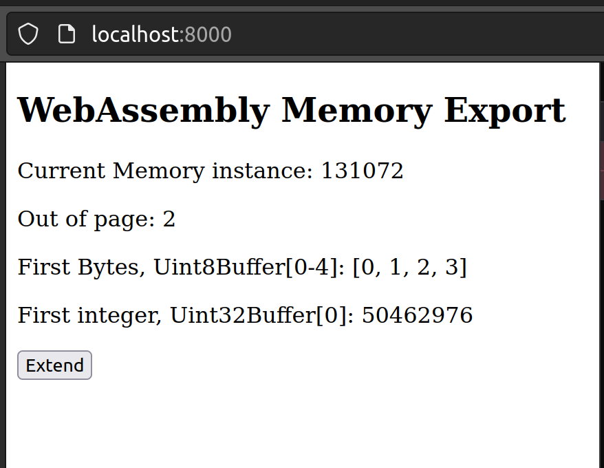
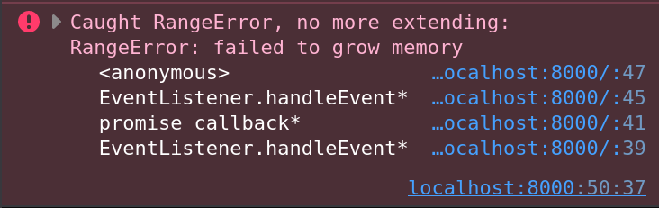
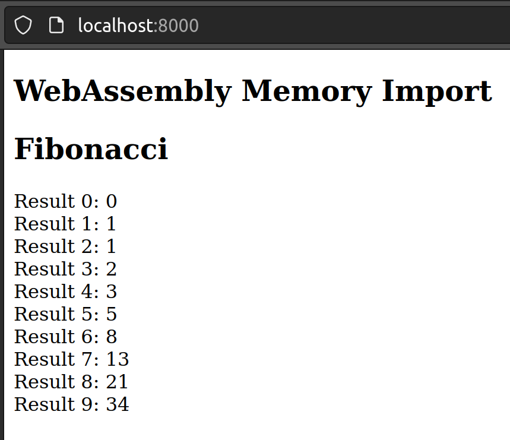
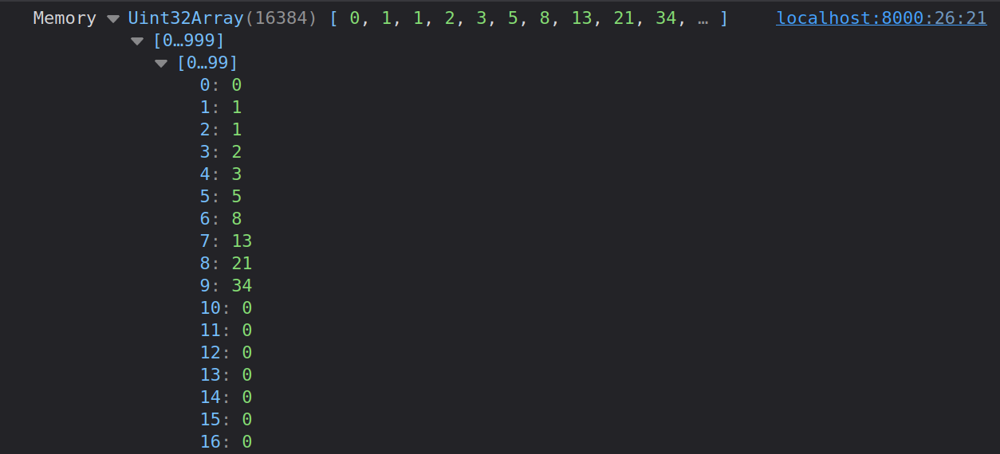
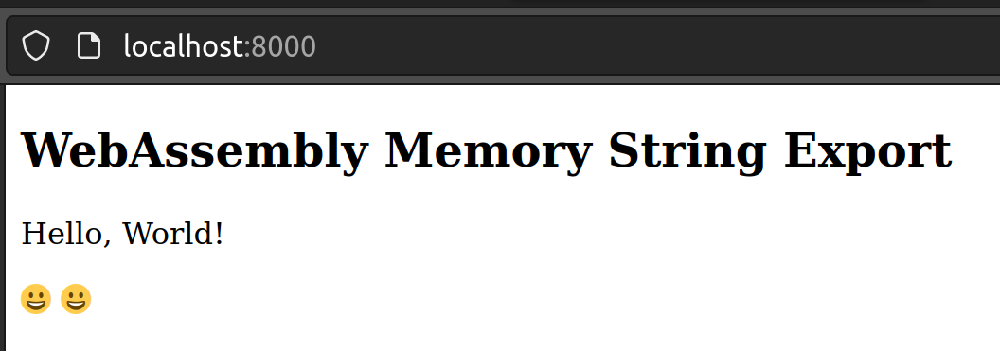
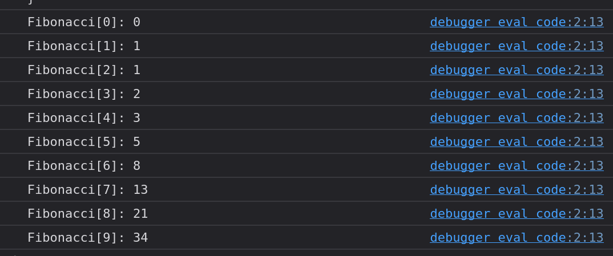

# WebAssembly Memory
An `ArrayBuffer` (or `SharedArrayBuffer`) is associated with a WebAssembly module, which serves as WebAssembly memory. The memory instance is either created by the module itself or provided by the host system. These instances are imported or exported by the module just like functions. Each instance consists of a linear memory divided into 64 kilobyte-sized pages.
> Currently, a WebAssembly module is limited to one memory instance only. It is expected that this will be adjusted in the near future.

## Exporting Memory
A WebAssembly module can export and instantiate memory, as demonstrated in the following example.

```wat
(module
  (memory (export "mem") 1 4)
  (data (i32.const 0x1) "\01\02\03")
)
```

Compiling `wat2wasm export.wat -o export.wasm`

Analyzing `wasm-objdump -x export.wasm`

```bash
$ wasm-objdump -x export.wasm

export.wasm:    file format wasm 0x1

Section Details:

Memory[1]:
 - memory[0] pages: initial=1 max=4
Export[1]:
 - memory[0] -> "mem"
Data[1]:
 - segment[0] memory=0 size=3 - init i32=1
  - 0000001: 0102 03   
```

Here's a brief description of the sections:
* `Memory[1]` defines a memory instance with one page (64 kilobytes) initially and a maximum limit of four pages.
* `Export[1]` exports the memory instance with the name `mem`.
* `Data[1]` initializes the memory starting from address `0x1` with the bytes `0x01`, `0x02`, and `0x03`.

### Usage in a Web Application
```html
<!DOCTYPE html>
<html lang="en">

<head>
    <meta charset="utf-8" />
    <title>WebAssembly Memory Export</title>
</head>

<body>
    <article>
        <h1>WebAssembly Memory Export</h1>
        <p>Current Memory instance: <span id="mem"></span></p>
        <p>Out of page/s: <span id="pages"></span></p>
        <p>First Bytes, Uint8Buffer[0-4]: <span id="firstbytes"></span></p>
        <p>First integer, Uint32Buffer[0]: <span id="firstint"></span></p>
        <button type="button" id="extend">Extend</button>
        <p style="color: red" id="error"></p>
    </article>
    <script>
        function fetchAndInstantiate(url, importObject) {
            return fetch(url)
                .then(response => response.arrayBuffer())
                .then(bytes => WebAssembly.instantiate(bytes, importObject))
                .then(results => results.instance);
        }

        function presentMemory(mem) {
            const buf = mem.buffer;
            const firstBytes = new Uint8Array(buf);
            const firstInt = new Uint32Array(buf);
            const byteLength = buf.byteLength;
            const pages = byteLength / (64 * 1024);
            document.getElementById('mem').textContent = byteLength;
            document.getElementById('pages').textContent = pages;
            document.getElementById('firstbytes').textContent = `[${firstBytes[0]}, ${firstBytes[1]}, ${firstBytes[2]}, ${firstBytes[3]}]`;
            document.getElementById('firstint').textContent = firstInt[0];
        }

        document.addEventListener('DOMContentLoaded', function () {
            fetchAndInstantiate('export.wasm')
                .then(instance => {
                    const mem = instance.exports.mem;

                    const extendButton = document.getElementById('extend');
                    extendButton.addEventListener('click', () => {
                        try {
                            mem.grow(1);
                            presentMemory(mem);
                        } catch (rangeError) {
                            console.error(`Caught RangeError, no more extending:`, rangeError);
                            document.getElementById('error').textContent = 'Caught RangeError, no more extending!';
                            extendButton.disabled = true;
                        }
                    });
                    presentMemory(mem);
                });
        });
    </script>
</body>

</html>
```

Running the Application `python3 -m http.server`

Analyzing in the Browser `http://localhost:8000`

---

If these steps are new to you, I recommend consulting my earlier posts:
* [First Experiences with WebAssembly](https://medium.com/webassembly/first-experiences-with-webassembly-dafb2cf2ab52) provides an introduction and describes the toolkit for WebAssembly.
* [WebAssembly Module](https://medium.com/webassembly/webassembly-module-146783e725d9) explains the structure of the WebAssembly module.
* [JavaScript and Bytes](https://medium.com/@marcokuoni/javascript-and-bytes-44a70871986) shows how to work with bytes in JavaScript (`ArrayBuffer`, `DataView`).

---

Upon starting the application:




After clicking the `Extend` button, the memory area is expanded by one page, which means the `ArrayBuffer` becomes invalid (detached), and its content is copied into a new, larger `ArrayBuffer`.
* [Detachment upon growing](https://developer.mozilla.org/en-US/docs/WebAssembly/JavaScript_interface/Memory/grow#detachment_upon_growing)
* [Alternative: SharedArrayBuffer](https://developer.mozilla.org/en-US/docs/Web/JavaScript/Reference/Global_Objects/SharedArrayBuffer#webassembly_shared_memory)



After the fourth click on the `Extend` button, you encounter a range error (`RangeError`) due to the defined maximum limit in the WAT of four pages.




## Importing Memory
From the JavaScript side, *one* memory can be provided (imported) to the WebAssembly module. This is demonstrated with the following WAT program of a Fibonacci algorithm. The interpretation of the Fibonacci stack machine algorithm is described in the last section of this article.

```wat
(module
    (memory (import "env" "mem") 1)
    (func (export "fibonacci") (param $n i32)
        (local $index i32)
        (local $ptr i32)    

        (i32.store (i32.const 0) (i32.const 0))
        (i32.store (i32.const 4) (i32.const 1))

        (local.set $index (i32.const 2))
        (local.set $ptr (i32.const 8))

        (block $break
            (loop $loop
                (i32.store
                    (local.get $ptr)
                    (i32.add
                        (i32.load (i32.sub (local.get $ptr) (i32.const 4)))
                        (i32.load (i32.sub (local.get $ptr) (i32.const 8)))
                    )
                )
                (local.set $index (i32.add (local.get $index) (i32.const 1)))
                (local.set $ptr (i32.add (local.get $ptr) (i32.const 4)))
                (br_if $break (i32.ge_u (local.get $index) (local.get $n)))
                (br $loop)
            )
        )
    )
)
```

Compiling `wat2wasm fibonacci.wat -o fibonacci.wasm`

Analyzing `wasm-objdump -x fibonacci.wasm`

```bash
$ wasm-objdump -x fibonacci.wasm

fibonacci.wasm: file format wasm 0x1

Section Details:

Type[1]:
 - type[0] (i32) -> nil
Import[1]:
 - memory[0] pages: initial=1 <- env.mem
Function[1]:
 - func[0] sig=0 <fibonacci>
Export[1]:
 - func[0] <fibonacci> -> "fibonacci"
Code[1]:
 - func[0] size=77 <fibonacci>
```

Here's a brief description of the sections:
* `Type[1]` defines our function type with one input parameter of type `i32` and no return value.
* `Import[1]` imports a memory instance from the namespace `env.mem`.
* `Function[1]` defines a function with type (signature) `0` (as described under `Type[1]`) and the name fibonacci.
* `Export[1]` exports the function fibonacci with the name fibonacci.
* `Code[1]` defines the code for the fibonacci function with a size of 77 bytes.

### Usage in a Web Application
```html
<!DOCTYPE html>
<html lang="en">

<head>
    <meta charset="utf-8" />
    <title>WebAssembly Memory Import</title>
</head>

<body>
    <article>
        <h1>WebAssembly Memory Import</h1>
        <h2>Fibonacci</h2>
        <p id="fibonacci-output"></p>
    </article>
    <script>
        function fetchAndInstantiate(url, importObject) {
            return fetch(url)
                .then(response => response.arrayBuffer())
                .then(bytes => WebAssembly.instantiate(bytes, importObject))
                .then(results => results.instance);
        }

        function presentFibonacci(result, n) {
            const fibonacciOutput = document.getElementById('fibonacci-output');

            console.log('Memory', result)

            for (let i = 0; i < n; i++) {
                fibonacciOutput.innerText += `Result ${i}: ${result[i]}\n`;
            }
        }

        document.addEventListener('DOMContentLoaded', function () {
            const memory = new WebAssembly.Memory({ initial: 1, maximum: 2});

            const importObject = {
                env: {
                    mem: memory
                }
            };

            fetchAndInstantiate('fibonacci.wasm', importObject)
                .then(instance => {
                    const n = 10;
                    instance.exports.fibonacci(n);
                    const result = new Uint32Array(memory.buffer);
                    presentFibonacci(result, n);
                });
        });
    </script>
</body>

</html>
```

Running the Application `python3 -m http.server`

Analyzing in the Browser `http://localhost:8000`





> It should be noted that the Fibonacci program here is not truly secure and is for demonstration purposes only. For instance, it does not check whether the memory region even exists and whether memory regions are not being overwritten.

## The Same with Strings
How to work with strings in memory.

```wat
(module
    (memory (export "memory") 1)
    (data (i32.const 0) "Hello, World! 😀")
)
```

Compiling `wat2wasm string.wat -o string.wasm`

Analyzing `wasm-objdump -x string.wasm`

```bash
$ wasm-objdump -x string.wasm

string.wasm:    file format wasm 0x1

Section Details:

Memory[1]:
 - memory[0] pages: initial=1
Export[1]:
 - memory[0] -> "memory"
Data[1]:
 - segment[0] memory=0 size=18 - init i32=0
  - 0000000: 4865 6c6c 6f2c 2057 6f72 6c64 2120 f09f  Hello, World! ..
  - 0000010: 9880 
```

Here's a brief description of the sections:
* `Memory[1]` defines a memory instance with one page (64 kilobytes).
* `Export[1]` exports the memory instance with the name `memory`.
* `Data[1]` initializes the memory starting from address `0x0` with the bytes `0x48`, `0x65`, `0x6c`, `0x6c`, `0x6f`, `0x2c`, `0x20`, `0x57`, `0x6f`, `0x72`, `0x6c`, `0x64`, `0x21`, `0x20`, `0xf0`, `0x9f`, `0x98`, `0x80`.
* The string `Hello, World! 😀` is interpreted as UTF-8 and written into memory. This allows an extended character set beyond ASCII, making it possible to use emojis, for example.

Offset calculation for the string `Hello, World! 😀`:
* `0x0` to `0xd` for `Hello, World! ` -> 14 characters at 1 byte each (according to the ASCII character set).
* `0xe` to `0x11` for `😀` -> 1 character ([Emoji 0xf0 9f 98 80](https://apps.timwhitlock.info/emoji/tables/unicode)) at 4 bytes.

### Usage in a Web Application
```html
<!DOCTYPE html>
<html lang="en">

<head>
    <meta charset="utf-8" />
    <title>WebAssembly Memory String Export</title>
</head>

<body>
    <article>
        <h1>WebAssembly Memory String Export</h1>
        <p id="hello-world"></p>
        <p id="emoji"></p>
    </article>
    <script>
        function fetchAndInstantiate(url, importObject) {
            return fetch(url)
                .then(response => response.arrayBuffer())
                .then(bytes => WebAssembly.instantiate(bytes, importObject))
                .then(results => results.instance);
        }

        function presentString(mem) {
            const helloWorld = document.getElementById('hello-world');
            const emoji = document.getElementById('emoji');

            const helloWorldBytes = new Uint8Array(mem.buffer, 0, 14);
            const emojiBytes = new Uint8Array(mem.buffer, 14, 4);

            const helloWorldString = new TextDecoder('utf8').decode(helloWorldBytes);
            const emojiString = new TextDecoder('utf8').decode(emojiBytes);

            helloWorld.innerText = helloWorldString;
            emoji.innerText = emojiString + ' ' + emojiString;
        }

        document.addEventListener('DOMContentLoaded', function () {
            fetchAndInstantiate('string.wasm')
                .then(instance => {
                    const mem = instance.exports.memory;
                    presentString(mem);
                });
        });
    </script>
</body>

</html>
```

Running the Application `python3 -m http.server`

Analyzing in the Browser `http://localhost:8000`



## Fibonacci Implementation in the Stack Machine 
Here's an attempt to simulate the stack machine Fibonacci algorithm in JavaScript. Some notes:
* No import is used; instead, the imported memory is simulated using an `ArrayBuffer`, which is also used in the background by WebAssembly.
* JavaScript doesn't support GoTo statements. To demonstrate how the loop works in the stack machine, a `while(true)` loop with `break` and `continue` statements is used.
* The positions in the comments are used below for displaying the development of memory.
* The auxiliary variable `index` is used to count the iterations.
* The auxiliary variable `ptr` is used to maintain the position in memory.
* The individual integer results (4 bytes) are linearly stored in memory, and the program itself must know and calculate the positions for them.

> Note: WASM is executed in a virtual stack machine. Therefore, values must always be pushed onto the stack before they are read, processed, and popped from the stack. The result of the processing is then pushed back onto the stack and can be used directly as input for the next step. These processes are recognizable in the WAT code through the parentheses, which are lost in this JavaScript simulation.

```javascript
// import memory env.mem
// here we simulate it by an array buffer
const buffer = new ArrayBuffer(10 * 64 * 1024);
const mem = new DataView(buffer);

function fibonacci(n) {
    let index, ptr;

    mem.setUint32(0, 0);
    mem.setUint32(4, 1);

    index = 2;
    ptr = 8;

    //position 1
    start: while(true) {
        mem.setUint32(ptr, mem.getUint32(ptr - 4) + mem.getUint32(ptr - 8));

        index += 1;
        ptr += 4;

        if(index >= n) {
            break; 
        }
        //position 2
        continue start;
    }
}

fibonacci(10);

for(let i = 0; i < 10; i++) {
    console.log(`Fibonacci[${i}]: ${mem.getUint32(i * 4)}`);
}
```



During each iteration, the linear memory develops as follows:
```
Byte Number
Content as Decimal Numbers

Position 1:
0 1 2 3 | 4 5 6 7 | 8 9 10 11 | 12 13 14 15 | 16 17 18 19 | 20 21 22 23 | 24 25 26 27 | 28 29 30 31 | 32
0 0 0 0 | 0 0 0 1 | 0 0 0  0  | 0  0  0  0  | 0  0  0  0  | 0  0  0  0  | 0  0  0  0  | 0  0  0  0  | 0

Position 2:
0 1 2 3 | 4 5 6 7 | 8 9 10 11 | 12 13 14 15 | 16 17 18 19 | 20 21 22 23 | 24 25 26 27 | 28 29 30 31 | 32
0 0 0 0 | 0 0 0 1 | 0 0 0  1  | 0  0  0  0  | 0  0  0  0  | 0  0  0  0  | 0  0  0  0  | 0  0  0  0  | 0

Position 2:
0 1 2 3 | 4 5 6 7 | 8 9 10 11 | 12 13 14 15 | 16 17 18 19 | 20 21 22 23 | 24 25 26 27 | 28 29 30 31 | 32
0 0 0 0 | 0 0 0 1 | 0 0 0  1  | 0  0  0  2  | 0  0  0  0  | 0  0  0  0  | 0  0  0  0  | 0  0  0  0  | 0

Position 2:
0 1 2 3 | 4 5 6 7 | 8 9 10 11 | 12 13 14 15 | 16 17 18 19 | 20 21 22 23 | 24 25 26 27 | 28 29 30 31 | 32
0 0 0 0 | 0 0 0 1 | 0 0 0  1  | 0  0  0  2  | 0  0  0  3  | 0  0  0  0  | 0  0  0  0  | 0  0  0  0  | 0

Position 2:
0 1 2 3 | 4 5 6 7 | 8 9 10 11 | 12 13 14 15 | 16 17 18 19 | 20 21 22 23 | 24 25 26 27 | 28 29 30 31 | 32
0 0 0 0 | 0 0 0 1 | 0 0 0  1  | 0  0  0  2  | 0  0  0  3  | 0  0  0  5  | 0  0  0  0  | 0  0  0  0  | 0

Position 2:
0 1 2 3 | 4 5 6 7 | 8 9 10 11 | 12 13 14 15 | 16 17 18 19 | 20 21 22 23 | 24 25 26 27 | 28 29 30 31 | 32
0 0 0 0 | 0 0 0 1 | 0 0 0  1  | 0  0  0  2  | 0  0  0  3  | 0  0  0  5  | 0  0  0  8  | 0  0  0  0  | 0

Position 2:
0 1 2 3 | 4 5 6 7 | 8 9 10 11 | 12 13 14 15 | 16 17 18 19 | 20 21 22 23 | 24 25 26 27 | 28 29 30 31 | 32
0 0 0 0 | 0 0 0 1 | 0 0 0  1  | 0  0  0  2  | 0  0  0  3  | 0  0  0  5  | 0  0  0  8  | 0  0  0  13 | 0

.
.
.
```


## Further Resources
* [Source Code](https://github.com/marcokuoni/public_doc/tree/main/essays/4_webassembly_memory)
* [Deutsche Version](https://github.com/marcokuoni/public_doc/tree/main/essays/4_webassembly_memory/README.de.md)

I am open to refining, expanding, or correcting the article. Feel free to provide a feedback or get in touch with me.

Created by [Marco Kuoni, September 2023](https://marcokuoni.ch)
