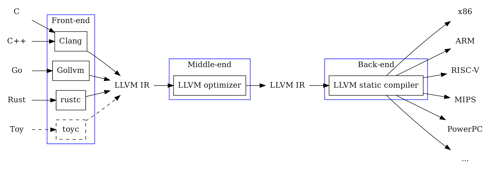

# Ein einfaches C Programm in WebAssembly
JavaScript macht nicht für jeden Anwendungsfall immer Sinn. Andere Sprachen können Vorteile in Performance, Sicherheit oder Einfachheit bieten. Zudem können eventuell bereits existierende Programme in anderen Sprachen einfach genutzt werden.

## Multiplizieren in C
Wie schon in den vorherigen Artikel wird eine Multiplikationsfunktion als Beispiel verwendet.

```c
#include <stdio.h>

int multiply(int a, int b) {
    return a * b;
}

int main() {
    int a = 2;
    int b = 21;
    int result = multiply(a, b);
    printf("%d * %d = %d\n", a, b, result);
    return 0;
}
```

## Kompilieren 

### Für das Hostsystem
Wenn man nur mit Programmiersprachen arbeitet, die direkt interpretiert werden, ist dieser Schritt nicht immer bekannt. Die Programmiersprache C muss zuerst in Maschinencode übersetzt werden, damit dieser ausgeführt werden kann. Hierzu gibt es diverse Compiler, welche dies übernehmen können. In diesem Beispiel verwenden wir den [Clang](https://clang.llvm.org/get_started.html) [LLVM Compiler](https://llvm.org), für welchen es diverse Versionen für unterschiedliche Betriebssysteme giebt.

Installieren unter Ubuntu `sudo apt install clang`.

> Auf Grund des Inputs von Frank Denis über Medium, erläutere ich einen alternativen Weg am Schluss des Artikels mit dem [zig cc Compiler](https://ziglang.org/) als [Ersatz für Clang](https://andrewkelley.me/post/zig-cc-powerful-drop-in-replacement-gcc-clang.html). Der aber zum aktuellen Zeitpunkt noch nicht genau gleich verwendet werden kann und daher empfehle ich für diesen Artikel Clang zu verwenden.

```bash

```bash
$ clang multiply.c

$ file a.out
a.out: ELF 64-bit LSB pie executable, x86-64, version 1 (SYSV), dynamically linked, interpreter /lib64/ld-linux-x86-64.so.2, BuildID[sha1]=882fbc40b313213c741a5fb85a55bed587acd699, for GNU/Linux 3.2.0, not stripped

$ ./a.out
2 * 21 = 42
```

> Es ist zu beachten, dass der Compiler normalerweise für das Hostsystem kompiliert. Somit kann das Programm nur auf diesem Hostsystem ausgeführt werden.

### Assembly Code
Wie es bei WebAssembly das WAT-Format gibt um die Maschinenbefehle für Menschen lesbar zu macht, gibt es auch für native Maschinenbefehle eine ähnliche Sprache. Diese wird als [Assembly Code](https://en.wikipedia.org/wiki/Assembly_language) bezeichnet. Dieser Code kann mit einem Disassembler aus dem Maschinencode generiert werden oder wie hier direkt aus der höheren Sprache per LLVM.

```bash
$ clang -S multiply.c

$ cat multiply.s
        .text
        .file   "multiply.c"
        .globl  multiply                        # -- Begin function multiply
        .p2align        4, 0x90
        .type   multiply,@function
multiply:                               # @multiply
        .cfi_startproc
# %bb.0:
        pushq   %rbp
        .cfi_def_cfa_offset 16
        .cfi_offset %rbp, -16
        movq    %rsp, %rbp
        .cfi_def_cfa_register %rbp
        movl    %edi, -4(%rbp)
        movl    %esi, -8(%rbp)
        movl    -4(%rbp), %eax
        imull   -8(%rbp), %eax
        popq    %rbp
        .cfi_def_cfa %rsp, 8
        retq
.Lfunc_end0:
        .size   multiply, .Lfunc_end0-multiply
        .cfi_endproc
                                        # -- End function
        .globl  main                            # -- Begin function main
        .p2align        4, 0x90
        .type   main,@function
main:                                   # @main
        .cfi_startproc
# %bb.0:
        pushq   %rbp
        .cfi_def_cfa_offset 16
        .cfi_offset %rbp, -16
        movq    %rsp, %rbp
        .cfi_def_cfa_register %rbp
        subq    $16, %rsp
        movl    $0, -4(%rbp)
        movl    $2, -8(%rbp)
        movl    $21, -12(%rbp)
        movl    -8(%rbp), %edi
        movl    -12(%rbp), %esi
        callq   multiply
        movl    %eax, -16(%rbp)
        movl    -8(%rbp), %esi
        movl    -12(%rbp), %edx
        movl    -16(%rbp), %ecx
        leaq    .L.str(%rip), %rdi
        movb    $0, %al
        callq   printf@PLT
        xorl    %eax, %eax
        addq    $16, %rsp
        popq    %rbp
        .cfi_def_cfa %rsp, 8
        retq
.Lfunc_end1:
        .size   main, .Lfunc_end1-main
        .cfi_endproc
                                        # -- End function
        .type   .L.str,@object                  # @.str
        .section        .rodata.str1.1,"aMS",@progbits,1
.L.str:
        .asciz  "%d * %d = %d\n"
        .size   .L.str, 14

        .ident  "Ubuntu clang version 14.0.0-1ubuntu1.1"
        .section        ".note.GNU-stack","",@progbits
        .addrsig
        .addrsig_sym multiply
        .addrsig_sym printf
```

### LLVM 
* [Wikipedia English](https://en.wikipedia.org/wiki/LLVM)
* [Wikipedia Deutsch](https://de.m.wikipedia.org/wiki/LLVM)

Die Idee hinter LLVM (früher Low Level Virtual Machine) ist ähnlich wie die von WebAssembly aufgebaut. Verschiedene Frontends für unterschiedliche höhere Sprachen übersetzen in eine LLVM-Zwischensprache. Diese Zwischensprache wird dann auf einer virtuellen Maschine ausgeführt und analysiert beziehungsweise optimiert. Zum Schluss kann dann von verschiedenen Backends in konkrete Maschinencodes übersetzt werden. 


Bild von [Gopher Academy Blog](https://blog.gopheracademy.com/advent-2018/llvm-ir-and-go/)

Dies kann nun genutzt werden um mit einem WebAssembly Backend mit LLVM WebAssembly Code zu generieren. 

Installieren unter Ubuntu `sudo apt install llvm`, `sudo apt install lld`.

```bash
$ llc --version
Ubuntu LLVM version 14.0.0
  
  Optimized build.
  Default target: x86_64-pc-linux-gnu
  Host CPU: skylake

  Registered Targets:
    aarch64    - AArch64 (little endian)
    aarch64_32 - AArch64 (little endian ILP32)
    aarch64_be - AArch64 (big endian)
    amdgcn     - AMD GCN GPUs
    arm        - ARM
    arm64      - ARM64 (little endian)
    arm64_32   - ARM64 (little endian ILP32)
    armeb      - ARM (big endian)
    avr        - Atmel AVR Microcontroller
    bpf        - BPF (host endian)
    bpfeb      - BPF (big endian)
    bpfel      - BPF (little endian)
    hexagon    - Hexagon
    lanai      - Lanai
    m68k       - Motorola 68000 family
    mips       - MIPS (32-bit big endian)
    mips64     - MIPS (64-bit big endian)
    mips64el   - MIPS (64-bit little endian)
    mipsel     - MIPS (32-bit little endian)
    msp430     - MSP430 [experimental]
    nvptx      - NVIDIA PTX 32-bit
    nvptx64    - NVIDIA PTX 64-bit
    ppc32      - PowerPC 32
    ppc32le    - PowerPC 32 LE
    ppc64      - PowerPC 64
    ppc64le    - PowerPC 64 LE
    r600       - AMD GPUs HD2XXX-HD6XXX
    riscv32    - 32-bit RISC-V
    riscv64    - 64-bit RISC-V
    sparc      - Sparc
    sparcel    - Sparc LE
    sparcv9    - Sparc V9
    systemz    - SystemZ
    thumb      - Thumb
    thumbeb    - Thumb (big endian)
    ve         - VE
    wasm32     - WebAssembly 32-bit
    wasm64     - WebAssembly 64-bit
    x86        - 32-bit X86: Pentium-Pro and above
    x86-64     - 64-bit X86: EM64T and AMD64
    xcore      - XCore

$ wasm-ld --version
Ubuntu LLD 14.0.0
```

### Für WebAssembly
Das einleitende Beispiel wird nun vereinfacht, damit die Multiplikationsfunktion direkt exportiert und in der Webanwendung verwendet werden kann.

```c
int multiply(int a, int b) {
    return a * b;
}
```

Kompilieren `clang --target=wasm32 -nostdlib -Wl,--no-entry -Wl,--export-all simple_multiply.c -o multiply.wasm`.

Erklärung zu den verwendeten Optionen:
* `--target=wasm32` gibt an, dass für 32-Bit WebAssembly kompiliert werden soll.
* `-nostdlib` gibt an, dass keine C-Standardbibliothek verwendet werden soll.
* `-Wl,--no-entry` gibt an, dass keine `main` Funktion vorhanden ist.
* `-Wl,--export-all` gibt an, dass alle Funktionen exportiert werden sollen.
* `-o multiply.wasm` gibt an, dass die Ausgabe in die `multiply.wasm` Datei geschrieben werden soll.

```bash
$ file multiply.wasm
multiply.wasm: WebAssembly (wasm) binary module version 0x1 (MVP)
```

Analysieren `wasm-objdump -x multiply.wasm`.

```bash
$ wasm-objdump -x multiply.wasm

multiply.wasm:  file format wasm 0x1

Section Details:

Type[2]:
 - type[0] () -> nil
 - type[1] (i32, i32) -> i32
Function[2]:
 - func[0] sig=0 <__wasm_call_ctors>
 - func[1] sig=1 <multiply>
Memory[1]:
 - memory[0] pages: initial=2
Global[7]:
 - global[0] i32 mutable=1 <__stack_pointer> - init i32=66560
 - global[1] i32 mutable=0 <__dso_handle> - init i32=1024
 - global[2] i32 mutable=0 <__data_end> - init i32=1024
 - global[3] i32 mutable=0 <__global_base> - init i32=1024
 - global[4] i32 mutable=0 <__heap_base> - init i32=66560
 - global[5] i32 mutable=0 <__memory_base> - init i32=0
 - global[6] i32 mutable=0 <__table_base> - init i32=1
Export[9]:
 - memory[0] -> "memory"
 - func[0] <__wasm_call_ctors> -> "__wasm_call_ctors"
 - func[1] <multiply> -> "multiply"
 - global[1] -> "__dso_handle"
 - global[2] -> "__data_end"
 - global[3] -> "__global_base"
 - global[4] -> "__heap_base"
 - global[5] -> "__memory_base"
 - global[6] -> "__table_base"
Code[2]:
 - func[0] size=2 <__wasm_call_ctors>
 - func[1] size=61 <multiply>
Custom:
 - name: "name"
 - func[0] <__wasm_call_ctors>
 - func[1] <multiply>
 - global[0] <__stack_pointer>
Custom:
 - name: "producers"
```

Die Details zu den einzelnen Sektionen sind in der [WebAssembly Spezifikation](https://webassembly.github.io/spec/core/binary/modules.html#sections) beschrieben und werden hier nicht weiter erläutert. Man bemerke die Zeile `func[1] <multiply> -> "multiply"` im Abschnitt `Export[9]`. Was uns ermöglicht die Funktion `multiply` in der Webanwendung aufzurufen.

#### Gebrauch in einer Webanwendung
```html
<!DOCTYPE html>
<html lang="en">

<head>
    <meta charset="utf-8" />
    <title>Simple C Program in WebAssembly</title>
</head>

<body>
    <form>
        <input type="number" name="a" value="3" />
        <input type="number" name="b" value ="14" />
        <button type="submit">Multiply</button>
        <output name="output">
    </form>
    <script>
        function fetchAndInstantiate(url, importObject) {
            return fetch(url)
                .then(response => response.arrayBuffer())
                .then(bytes => WebAssembly.instantiate(bytes, importObject))
                .then(results => results.instance);
        }

        document.addEventListener('DOMContentLoaded', function () {
            const form = document.querySelector('form');

            form.addEventListener('submit', function (event) {
                event.preventDefault();
                const formData = new FormData(form);

                const a = formData.get('a');
                const b = formData.get('b');

                fetchAndInstantiate('multiply.wasm')
                    .then(instance => {
                        const result = instance.exports.multiply(a, b);
                        form.output.value = result;
                    });
            });
        });
    </script>
</body>

</html>
```

Anwendung starten `python3 -m http.server`.

Analysieren im Browser `http://localhost:8000`.


## Alternativer Weg mit Zig CC Compiler
Der [zig cc Compiler](https://ziglang.org/) ist ein Drop-In Ersatz für Clang und GCC und besitzt noch keinen stabilen Release. Er ist in der [Zig Programmiersprache geschrieben](https://de.wikipedia.org/wiki/Zig_(Programmiersprache)). Ein Vorteil gegenüber Clang ist, dass er direkt mit SourceCode ausgeliefert wird und dieser erst bei Gebrauch für das Hostsystem gebuildet wird. 
Clang funktioniert auch auf allen gängigen Plattformen, jedoch wird man eventuell nicht immer die neueste Version für sein Betriebssystem kompiliert bekommen und die Optionen können unter Umständen anders benannt sein. Vielleicht für die Befehle im Artikel müssen clang, llvm oder der Linker (lld) ein Update erhalten damit die Befehle korrekt funktionieren.

Installieren unter Ubuntu `snap install zig --classic --beta` (0.11.0), für on the edge `snap install zig --classic --edge` (0.12.0-dev) oder selbst kompilieren. Die Details findet man hier [ziglang.org/download](https://ziglang.org/download/).

* Um das C-Progamm mit ZIG für das Hostsystem zu kompilieren `zig cc multiply.c`.
* Assembly Code generieren `zig cc -S multiply.c`.

Beim Kompilieren für die Webanwendung gibt es leider noch Probleme. Gemäss Dokumentation müsste `zig cc simple_multiply.c -target wasm32-freestanding -nostdlib -shared -rdynamic -o multiply.wasm` gleich funktionieren wie `clang simple_multiply.c --target=wasm32 -nostdlib -Wl,--no-entry -Wl,--export-all -o multiply.wasm`. Dabei steht `-shared` für keine main Funktion `-Wl,--no-entry` und `-rdynamic` für alle Funktionen exportieren `Wl,--export-all`. Leider funktioniert dies aber nicht und die `multiply` Funktion wird nicht exportiert. Ich denke aber, da zig cc noch in der Entwicklung ist, wird dies in Zukunft funktionieren.

Eine mögliche Lösung mit dem ZIG CC wäre in zwei Schritten zu kompilieren `zig cc simple_multiply.c -c -target wasm32-freestanding -nostdlib -o multiply.o`. Wobei `-c` in eine Objekt-Datei kompiliert ohne diese zu linken. Welche dann mit dem [WebAssembly Linker](https://lld.llvm.org/WebAssembly.html) in ein ausführbares WebAssembly gemäss unseren Anwendungsfall übersetzt werden kann `wasm-ld multiply.o --no-entry --export-all -o multiply.wasm`

Den Linker unter Ubuntu installieren `sudo apt install lld`.

---

Falls diese Webanwendung neu war oder noch mehr Interesse am Thema besteht, empfehle ich meine älteren Beiträge zu konsultieren:
* [Erste Erfahrungen mit WebAssembly](https://medium.com/webassembly/first-experiences-with-webassembly-dafb2cf2ab52) gibt eine Einführung und beschreibt den Werkzeugkasten für WebAssembly.
* [WebAssebmly Module](https://medium.com/webassembly/webassembly-module-146783e725d9) erklärt den Aufbau des WebAssembly Moduls.
* [JavaScript und Bytes](https://medium.com/@marcokuoni/javascript-and-bytes-44a70871986) zeigt wie man in JavaScript mit Bytes arbeiten kann (`ArrayBuffer`, `DataView`).
* [WebAssembly Memory](https://medium.com/webassembly/webassembly-memory-32bbe210112c) beschreibt den Umgang mit dem Speicher in WebAssembly.

---

## Weiterführend
* [Source Code](https://github.com/marcokuoni/public_doc/tree/main/essays/5_simple_c_programm_in_webassembly)
* [English Version](https://github.com/marcokuoni/public_doc/tree/main/essays/5_simple_c_programm_in_webassembly/README.md)

Ich bin gerne bereit den Beitrag noch zu präzisieren, erweitern oder zu korrigieren. Schreibt ein Feedback oder meldet euch direkt bei mir.

Erstellt von [Marco Kuoni, September 2023](https://marcokuoni.ch)