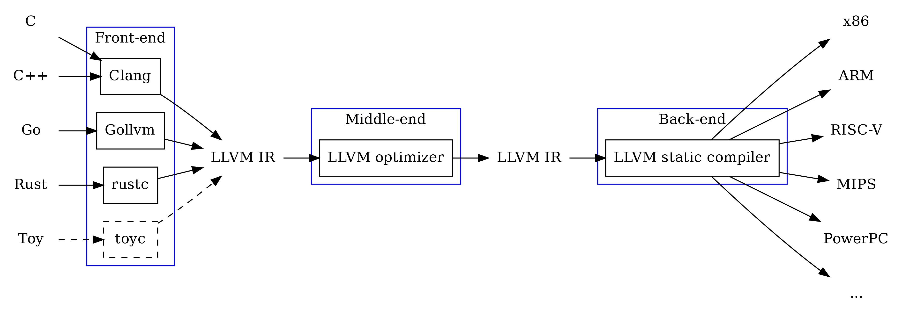
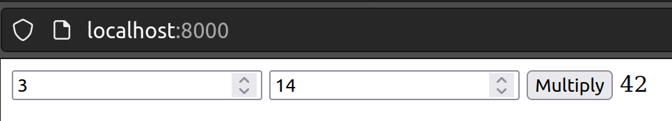

# Simple C Program in WebAssembly
JavaScript doesn't always make sense for every use case. Other languages can offer advantages in performance, security, or simplicity. Additionally, existing programs in other languages may potentially be used easily.

## Multiplying in C
As already mentioned in the previous article, a multiplication function is used as an example.

```c
#include <stdio.h>

int multiply(int a, int b) {
    return a * b;
}

int main() {
    int a = 2;
    int b = 21;
    int result = multiply(a, b);
    printf("%d * %d = %d\n", a, b, result);
    return 0;
}
```

## Compilation

### For the Host System
If you are working only with programming languages that are directly interpreted, this step may not always be familiar. The C programming language must first be translated into machine code before it can be executed. There are various compilers that can handle this task. In this example, we are using the [LLVM Compiler](https://llvm.org), for which there are various versions available for different operating systems.

To install it on Ubuntu, use the command `sudo apt install clang`.

```bash
$ clang multiply.c

$ file a.out
a.out: ELF 64-bit LSB pie executable, x86-64, version 1 (SYSV), dynamically linked, interpreter /lib64/ld-linux-x86-64.so.2, BuildID[sha1]=882fbc40b313213c741a5fb85a55bed587acd699, for GNU/Linux 3.2.0, not stripped

$ ./a.out
2 * 21 = 42
```

> It should be noted that the compiler typically compiles for the host system. Thus, the program can only be executed on this host system.

### Assembly Code
Just as there is the WAT format in WASM to make machine instructions human-readable, there is a similar language for C as well. This is referred to as [Assembly Code](https://en.wikipedia.org/wiki/Assembly_language). This code can be generated from machine code using a disassembler or, as shown here, directly from the higher-level language using LLVM.

```bash
$ clang -S multiply.c

$ cat multiply.s
        .text
        .file   "multiply.c"
        .globl  multiply                        # -- Begin function multiply
        .p2align        4, 0x90
        .type   multiply,@function
multiply:                               # @multiply
        .cfi_startproc
# %bb.0:
        pushq   %rbp
        .cfi_def_cfa_offset 16
        .cfi_offset %rbp, -16
        movq    %rsp, %rbp
        .cfi_def_cfa_register %rbp
        movl    %edi, -4(%rbp)
        movl    %esi, -8(%rbp)
        movl    -4(%rbp), %eax
        imull   -8(%rbp), %eax
        popq    %rbp
        .cfi_def_cfa %rsp, 8
        retq
.Lfunc_end0:
        .size   multiply, .Lfunc_end0-multiply
        .cfi_endproc
                                        # -- End function
        .globl  main                            # -- Begin function main
        .p2align        4, 0x90
        .type   main,@function
main:                                   # @main
        .cfi_startproc
# %bb.0:
        pushq   %rbp
        .cfi_def_cfa_offset 16
        .cfi_offset %rbp, -16
        movq    %rsp, %rbp
        .cfi_def_cfa_register %rbp
        subq    $16, %rsp
        movl    $0, -4(%rbp)
        movl    $2, -8(%rbp)
        movl    $21, -12(%rbp)
        movl    -8(%rbp), %edi
        movl    -12(%rbp), %esi
        callq   multiply
        movl    %eax, -16(%rbp)
        movl    -8(%rbp), %esi
        movl    -12(%rbp), %edx
        movl    -16(%rbp), %ecx
        leaq    .L.str(%rip), %rdi
        movb    $0, %al
        callq   printf@PLT
        xorl    %eax, %eax
        addq    $16, %rsp
        popq    %rbp
        .cfi_def_cfa %rsp, 8
        retq
.Lfunc_end1:
        .size   main, .Lfunc_end1-main
        .cfi_endproc
                                        # -- End function
        .type   .L.str,@object                  # @.str
        .section        .rodata.str1.1,"aMS",@progbits,1
.L.str:
        .asciz  "%d * %d = %d\n"
        .size   .L.str, 14

        .ident  "Ubuntu clang version 14.0.0-1ubuntu1.1"
        .section        ".note.GNU-stack","",@progbits
        .addrsig
        .addrsig_sym multiply
        .addrsig_sym printf
```

### LLVM 
* [Wikipedia](https://en.wikipedia.org/wiki/LLVM)

The idea behind LLVM (formerly Low Level Virtual Machine) is structured similarly to WebAssembly. Various frontends for different high-level languages translate into an LLVM intermediate language. This intermediate language is then executed and analyzed or optimized on a virtual machine. Finally, it can be translated into concrete machine code by various backends.


Image by [gopheracademy](https://blog.gopheracademy.com/advent-2018/llvm-ir-and-go/)

To install LLVM on Ubuntu, use the commands `sudo apt install llvm` and `sudo apt install lld`.

```bash
$ llc --version
Ubuntu LLVM version 14.0.0
  
  Optimized build.
  Default target: x86_64-pc-linux-gnu
  Host CPU: skylake

  Registered Targets:
    aarch64    - AArch64 (little endian)
    aarch64_32 - AArch64 (little endian ILP32)
    aarch64_be - AArch64 (big endian)
    amdgcn     - AMD GCN GPUs
    arm        - ARM
    arm64      - ARM64 (little endian)
    arm64_32   - ARM64 (little endian ILP32)
    armeb      - ARM (big endian)
    avr        - Atmel AVR Microcontroller
    bpf        - BPF (host endian)
    bpfeb      - BPF (big endian)
    bpfel      - BPF (little endian)
    hexagon    - Hexagon
    lanai      - Lanai
    m68k       - Motorola 68000 family
    mips       - MIPS (32-bit big endian)
    mips64     - MIPS (64-bit big endian)
    mips64el   - MIPS (64-bit little endian)
    mipsel     - MIPS (32-bit little endian)
    msp430     - MSP430 [experimental]
    nvptx      - NVIDIA PTX 32-bit
    nvptx64    - NVIDIA PTX 64-bit
    ppc32      - PowerPC 32
    ppc32le    - PowerPC 32 LE
    ppc64      - PowerPC 64
    ppc64le    - PowerPC 64 LE
    r600       - AMD GPUs HD2XXX-HD6XXX
    riscv32    - 32-bit RISC-V
    riscv64    - 64-bit RISC-V
    sparc      - Sparc
    sparcel    - Sparc LE
    sparcv9    - Sparc V9
    systemz    - SystemZ
    thumb      - Thumb
    thumbeb    - Thumb (big endian)
    ve         - VE
    wasm32     - WebAssembly 32-bit
    wasm64     - WebAssembly 64-bit
    x86        - 32-bit X86: Pentium-Pro and above
    x86-64     - 64-bit X86: EM64T and AMD64
    xcore      - XCore

$ wasm-ld --version
Ubuntu LLD 14.0.0
```

### For WebAssembly
The introductory example will now be simplified so that the multiplication function can be exported directly and used in the web application.

```c
int multiply(int a, int b) {
    return a * b;
}
```

Compiling `clang --target=wasm32 -nostdlib -Wl,--no-entry -Wl,--export-all simple_multiply.c -o multiply.wasm`

Explanation of the options used:
* `--target=wasm32` specifies that it should be compiled for 32-bit WebAssembly.
* `-nostdlib` indicates that no C standard library should be used.
* `-Wl,--no-entry` indicates that there is no main function.
* `-Wl,--export-all` indicates that all functions should be exported.
* `-o multiply.wasm` specifies that the output should be written to the `multiply.wasm` file.

```bash
$ file multiply.wasm
multiply.wasm: WebAssembly (wasm) binary module version 0x1 (MVP)
```

Analyzing `wasm-objdump -x multiply.wasm`

```bash
$ wasm-objdump -x multiply.wasm

multiply.wasm:  file format wasm 0x1

Section Details:

Type[2]:
 - type[0] () -> nil
 - type[1] (i32, i32) -> i32
Function[2]:
 - func[0] sig=0 <__wasm_call_ctors>
 - func[1] sig=1 <multiply>
Memory[1]:
 - memory[0] pages: initial=2
Global[7]:
 - global[0] i32 mutable=1 <__stack_pointer> - init i32=66560
 - global[1] i32 mutable=0 <__dso_handle> - init i32=1024
 - global[2] i32 mutable=0 <__data_end> - init i32=1024
 - global[3] i32 mutable=0 <__global_base> - init i32=1024
 - global[4] i32 mutable=0 <__heap_base> - init i32=66560
 - global[5] i32 mutable=0 <__memory_base> - init i32=0
 - global[6] i32 mutable=0 <__table_base> - init i32=1
Export[9]:
 - memory[0] -> "memory"
 - func[0] <__wasm_call_ctors> -> "__wasm_call_ctors"
 - func[1] <multiply> -> "multiply"
 - global[1] -> "__dso_handle"
 - global[2] -> "__data_end"
 - global[3] -> "__global_base"
 - global[4] -> "__heap_base"
 - global[5] -> "__memory_base"
 - global[6] -> "__table_base"
Code[2]:
 - func[0] size=2 <__wasm_call_ctors>
 - func[1] size=61 <multiply>
Custom:
 - name: "name"
 - func[0] <__wasm_call_ctors>
 - func[1] <multiply>
 - global[0] <__stack_pointer>
Custom:
 - name: "producers"
```

The details of the individual sections are described in the [WebAssembly Specification](https://webassembly.github.io/spec/core/binary/modules.html#sections) and are not further explained here.

### Usage in a Web Application
```html
<!DOCTYPE html>
<html lang="en">

<head>
    <meta charset="utf-8" />
    <title>Simple C Program in WebAssembly</title>
</head>

<body>
    <form>
        <input type="number" name="a" value="3" />
        <input type="number" name="b" value ="14" />
        <button type="submit">Multiply</button>
        <output name="output">
    </form>
    <script>
        function fetchAndInstantiate(url, importObject) {
            return fetch(url)
                .then(response => response.arrayBuffer())
                .then(bytes => WebAssembly.instantiate(bytes, importObject))
                .then(results => results.instance);
        }

        document.addEventListener('DOMContentLoaded', function () {
            const form = document.querySelector('form');

            form.addEventListener('submit', function (event) {
                event.preventDefault();
                const formData = new FormData(form);

                const a = formData.get('a');
                const b = formData.get('b');

                fetchAndInstantiate('multiply.wasm')
                    .then(instance => {
                        const result = instance.exports.multiply(a, b);
                        form.output.value = result;
                    });
            });
        });
    </script>
</body>

</html>
```

Running the Application `python3 -m http.server`

Analyzing in the Browser `http://localhost:8000`



---

If this web application is new or if there is more interest in the topic, I recommend consulting my older articles:
* [First Experiences with WebAssembly](https://medium.com/webassembly/first-experiences-with-webassembly-dafb2cf2ab52) provides an introduction and describes the toolkit for WebAssembly.
* [WebAssembly Module](https://medium.com/webassembly/webassembly-module-146783e725d9) explains the structure of the WebAssembly module.
* [JavaScript and Bytes](https://medium.com/@marcokuoni/javascript-and-bytes-44a70871986) shows how to work with bytes in JavaScript (`ArrayBuffer`, `DataView`).
* [WebAssembly Memory](https://medium.com/webassembly/webassembly-memory-32bbe210112c) Describes the handling of memory in WebAssembly.
  
---

## Further Resources
* [Source Code](https://github.com/marcokuoni/public_doc/tree/main/essays/5_simple_c_programm_in_webassembly)
* [Deutsche Version](https://github.com/marcokuoni/public_doc/tree/main/essays/5_simple_c_programm_in_webassembly/README.de.md)

I am open to refining, expanding, or correcting the article. Feel free to provide a feedback or get in touch with me.

Created by [Marco Kuoni, September 2023](https://marcokuoni.ch)
