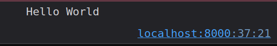

# "Hello World" C++ Programm
Ist ein einfaches C++ Programm, aber wie implementiert man es damit es in einer Webanwendung als WebAssembly verwendet werden kann? Dieser Artikel wird sich nicht um die Details über C++ und `clang` bzw. dem Kompilieren mit `Makefile` kümmern. Es geht vor allem darum, die Schlüsselstellen zu beleuchten um das Zusammenspiel von C++, WebAssebly und der Webanwendung zu verstehen. Aber wenn hier mehr Erklärung gewünscht ist, gerne einfach melden.

## Programm
Dies ist das `hello_world.cpp` Programm und ale weiteren Dateien können unter dem [GitHub](https://github.com/marcokuoni/public_doc/tree/main/essays/6_hello_world_cpp_programm) gefunden werden.
```cpp
#include "nanolibc/libc.h"

#define WASM_EXPORT __attribute__((visibility("default"))) extern "C"

WASM_EXPORT void helloWorld() {
  printf("Hello, World!\n");
}
```

Kurzbeschreibung:
* `#include` ist die Header Datei, welche die Funktionssignaturen von nanolibc zur Verfügung stellt. In diesem Beispiel wird die `printf` Funktion davon verwendet, welche von [Marco Paland](https://github.com/mpaland/printf/tree/master) stammt. Diese `printf` Funktion benutzt die `_putchar` Funktion innerhalb der `_out_char` Hilfsfunktion (`printf.cpp` Zeile 128). Die `_putchar` Funktion ist in der `putchar.cpp` Datei definiert und verwendet die `print_string` Funktion (Zeile 19). Die `print_string` Signatur kommt von der `libc_enviroment.h` Header-Datei und wird Dort als Extern definiert. Die Implementierung von `print_string` ist nirgends in C++ vorhanden. Diese Funktion dient als Schnittstelle zum Gästesystem und wird von diesem zur Verfügung gestellt. Diese Art der implementierung ist inspiriert vom Projekt von [Peter Strandmark](https://github.com/PetterS/clang-wasm/tree/master)
* `#define` definiert das `WASM_EXPORT` Makro. Welches verwendet wird um die Funktionen im WebAssembly zu exportieren, damit diese von der Webanwendung verwendet werden kann. Mehr dazu in der [WebAssembly Linker Dokumentation](https://lld.llvm.org/WebAssembly.html) unter `--export-dynamic`

### Compilieren
Mit dem Befehl `make` wird das Programm kompiliert. Wobei dieser das folgende `Makefile` verwendet.

```makefile
DEPS =
OBJ = hello_world.o
NANOLIBC_OBJ = $(patsubst %.cpp,%.o,$(wildcard nanolibc/*.cpp))
OUTPUT = hello_world.wasm

COMPILE_FLAGS = -Wall \
		--target=wasm32 \
		-Os \
		-nostdlib \
		-fvisibility=hidden \
		-std=c++14 \
		-ffunction-sections \
		-fdata-sections \
		-DPRINTF_DISABLE_SUPPORT_FLOAT=1 \
		-DPRINTF_DISABLE_SUPPORT_LONG_LONG=1 \
		-DPRINTF_DISABLE_SUPPORT_PTRDIFF_T=1

$(OUTPUT): $(OBJ) $(NANOLIBC_OBJ) Makefile
	wasm-ld \
		-o $(OUTPUT) \
		--no-entry \
		--strip-all \
		--export-dynamic \
		--allow-undefined \
		--initial-memory=131072 \
		-error-limit=0 \
		--lto-O3 \
		-O3 \
		--gc-sections \
		$(OBJ) \
		$(LIBCXX_OBJ) \
		$(NANOLIBC_OBJ)


%.o: %.cpp $(DEPS) Makefile nanolibc/libc.h nanolibc/libc_enviroment.h
	clang++ \
		-c \
		$(COMPILE_FLAGS) \
		-o $@ \
		$<

hello_world.wat: $(OUTPUT) Makefile
	wasm2wat -o hello_world.wat $(OUTPUT)

wat: hello_world.wat

clean:
	rm -f $(OBJ) $(NANOLIBC_OBJ) $(OUTPUT) hello_world.wat
```

Unter Ubuntu müssen folgende Pakete installiert sein `sudo apt install clang lld make`.

```bash
$ make
clang++ \
        -c \
        -Wall --target=wasm32 -Os -nostdlib -fvisibility=hidden -std=c++14 -ffunction-sections -fdata-sections -DPRINTF_DISABLE_SUPPORT_FLOAT=1 -DPRINTF_DISABLE_SUPPORT_LONG_LONG=1 -DPRINTF_DISABLE_SUPPORT_PTRDIFF_T=1 \
        -o hello_world.o \
        hello_world.cpp
clang++ \
        -c \
        -Wall --target=wasm32 -Os -nostdlib -fvisibility=hidden -std=c++14 -ffunction-sections -fdata-sections -DPRINTF_DISABLE_SUPPORT_FLOAT=1 -DPRINTF_DISABLE_SUPPORT_LONG_LONG=1 -DPRINTF_DISABLE_SUPPORT_PTRDIFF_T=1 \
        -o nanolibc/libc.o \
        nanolibc/libc.cpp
clang++ \
        -c \
        -Wall --target=wasm32 -Os -nostdlib -fvisibility=hidden -std=c++14 -ffunction-sections -fdata-sections -DPRINTF_DISABLE_SUPPORT_FLOAT=1 -DPRINTF_DISABLE_SUPPORT_LONG_LONG=1 -DPRINTF_DISABLE_SUPPORT_PTRDIFF_T=1 \
        -o nanolibc/memory.o \
        nanolibc/memory.cpp
clang++ \
        -c \
        -Wall --target=wasm32 -Os -nostdlib -fvisibility=hidden -std=c++14 -ffunction-sections -fdata-sections -DPRINTF_DISABLE_SUPPORT_FLOAT=1 -DPRINTF_DISABLE_SUPPORT_LONG_LONG=1 -DPRINTF_DISABLE_SUPPORT_PTRDIFF_T=1 \
        -o nanolibc/printf.o \
        nanolibc/printf.cpp
clang++ \
        -c \
        -Wall --target=wasm32 -Os -nostdlib -fvisibility=hidden -std=c++14 -ffunction-sections -fdata-sections -DPRINTF_DISABLE_SUPPORT_FLOAT=1 -DPRINTF_DISABLE_SUPPORT_LONG_LONG=1 -DPRINTF_DISABLE_SUPPORT_PTRDIFF_T=1 \
        -o nanolibc/putchar.o \
        nanolibc/putchar.cpp
wasm-ld \
        -o hello_world.wasm \
        --no-entry \
        --strip-all \
        --export-dynamic \
        --allow-undefined \
        --initial-memory=131072 \
        -error-limit=0 \
        --lto-O3 \
        -O3 \
        --gc-sections \
        hello_world.o \
         \
        nanolibc/libc.o nanolibc/memory.o nanolibc/printf.o nanolibc/putchar.o
```

Analysieren `wasm-objdump -x hello_world.wasm`.

```bash
$ wasm-objdump -x hello_world.wasm

hello_world.wasm:       file format wasm 0x1

Section Details:

Type[8]:
 - type[0] (i32, i32, i32, i32) -> nil
 - type[1] (i32) -> nil
 - type[2] () -> nil
 - type[3] (i32, i32, i32) -> i32
 - type[4] (i32) -> i32
 - type[5] (i32, i32) -> i32
 - type[6] (i32, i32, i32, i32, i32) -> i32
 - type[7] (i32, i32, i32, i32, i32, i32, i32, i32, i32, i32) -> i32
Import[1]:
 - func[0] sig=1 <env.print_string> <- env.print_string
Function[18]:
 - func[1] sig=2 <helloWorld>
 - func[2] sig=2
 - func[3] sig=3
 - func[4] sig=4
 - func[5] sig=4 <_Znwm>
 - func[6] sig=4
 - func[7] sig=2
 - func[8] sig=4
 - func[9] sig=4 <_Znam>
 - func[10] sig=1 <_ZdlPv>
 - func[11] sig=1
 - func[12] sig=1 <_ZdaPv>
 - func[13] sig=5
 - func[14] sig=0
 - func[15] sig=6
 - func[16] sig=0
 - func[17] sig=7
 - func[18] sig=1
Table[1]:
 - table[0] type=funcref initial=3 max=3
Memory[1]:
 - memory[0] pages: initial=2
Global[1]:
 - global[0] i32 mutable=1 - init i32=66976
Export[6]:
 - memory[0] -> "memory"
 - func[1] <helloWorld> -> "helloWorld"
 - func[5] <_Znwm> -> "_Znwm"
 - func[9] <_Znam> -> "_Znam"
 - func[10] <_ZdlPv> -> "_ZdlPv"
 - func[12] <_ZdaPv> -> "_ZdaPv"
Elem[1]:
 - segment[0] flags=0 table=0 count=2 - init i32=1
  - elem[1] = func[14]
  - elem[2] = func[16]
Code[18]:
 - func[1] size=15 <helloWorld>
 - func[2] size=3
 - func[3] size=44
 - func[4] size=12
 - func[5] size=10 <_Znwm>
 - func[6] size=569
 - func[7] size=355
 - func[8] size=100
 - func[9] size=10 <_Znam>
 - func[10] size=10 <_ZdlPv>
 - func[11] size=131
 - func[12] size=10 <_ZdaPv>
 - func[13] size=66
 - func[14] size=18
 - func[15] size=1924
 - func[16] size=2
 - func[17] size=789
 - func[18] size=176
Data[1]:
 - segment[0] memory=0 size=385 - init i32=1024
  - 0000400: 6e61 6e6f 6c69 6263 2f6d 656d 6f72 792e  nanolibc/memory.
  - 0000410: 6370 7000 4d65 6d6f 7279 2064 756d 7000  cpp.Memory dump.
  - 0000420: 6f6c 645f 7369 7a65 203d 3d20 6375 7272  old_size == curr
  - 0000430: 656e 742d 3e73 697a 6520 2b20 7369 7a65  ent->size + size
  - 0000440: 6f66 284d 656d 6f72 7942 6c6f 636b 2920  of(MemoryBlock)
  - 0000450: 2b20 6e65 7874 2d3e 7369 7a65 0048 656c  + next->size.Hel
  - 0000460: 6c6f 2057 6f72 6c64 0062 6c6f 636b 2d3e  lo World.block->
  - 0000470: 7374 6174 6520 3d3d 204d 656d 6f72 7942  state == MemoryB
  - 0000480: 6c6f 636b 3a3a 5374 6174 653a 3a46 5245  lock::State::FRE
  - 0000490: 4500 626c 6f63 6b2d 3e73 7461 7465 203d  E.block->state =
  - 00004a0: 3d20 4d65 6d6f 7279 426c 6f63 6b3a 3a53  = MemoryBlock::S
  - 00004b0: 7461 7465 3a3a 4652 4545 207c 7c20 626c  tate::FREE || bl
  - 00004c0: 6f63 6b2d 3e73 7461 7465 203d 3d20 4d65  ock->state == Me
  - 00004d0: 6d6f 7279 426c 6f63 6b3a 3a53 7461 7465  moryBlock::State
  - 00004e0: 3a3a 414c 4c4f 4341 5445 4400 2020 5065  ::ALLOCATED.  Pe
  - 00004f0: 616b 206d 656d 6f72 7920 7573 6167 653a  ak memory usage:
  - 0000500: 2025 3964 2062 7974 6573 2e0a 0020 2054   %9d bytes...  T
  - 0000510: 6f74 2e20 6d65 6d6f 7279 2075 7361 6765  ot. memory usage
  - 0000520: 3a20 2539 6420 6279 7465 732e 0a00 2020  : %9d bytes...
  - 0000530: 4375 722e 206d 656d 6f72 7920 7573 6167  Cur. memory usag
  - 0000540: 653a 2025 3964 2062 7974 6573 2e0a 004d  e: %9d bytes...M
  - 0000550: 656d 6f72 7920 6572 726f 7220 6174 2025  emory error at %
  - 0000560: 733a 2564 3a20 2573 2e0a 0020 2030 7825  s:%d: %s...  0x%
  - 0000570: 583a 2073 697a 6520 2564 2e20 2573 2e0a  X: size %d. %s..
  - 0000580: 00                                       .
```

Kurz ein paar Hinweise:
* `Import[1]` erwartet den Import der `env.print_string` Funktion.
* `Export[6]`: Neben `memory` wird auch die `helloWorld` Funktion exportiert.
* `Data[1]`: Der fixe String `Hello World` ist im Segment unter Adresszeile `0000450` und `0000460` zu finden.

> Mit der `--import-memory` Option beim Linken im `Makefile`, würde das WebAssembly kein Memory exportieren, sondern dieses vom Gästesystem erwarten und somit importieren. Siehe [WebAssembly Linker Dokumentation](https://lld.llvm.org/WebAssembly.html) unter `--import-memory` und auch die Kommentarzeilen im nächsten Kapitel dieses Artikels.

> Mit `make wat` kann zudem das WAT-Format erstellt und die Befehle für den Stackautomaten analysiert werden. Unter Ubuntu muss das Paket `sudo apt install wabt` installiert sein.

#### Gebrauch in einer Webanwendung
```html
<!DOCTYPE html>
<html lang="en">

<head>
    <meta charset="utf-8" />
    <title>"Hello Wolrd" C++ Program</title>
</head>

<body>
    <h1 id="hello-world"></h1>
    <script>
        let wasm;

        // If the Webassemby module had been linked with
        //   --import-memory
        //
        // its memory will be provided with
        //   const wasmMemory = new WebAssembly.Memory({initial:10, maximum:100});
        //   const memory = new Uint8Array(wasmMemory.buffer);
        //
        // But this module is providing its own memory and exporting it.
        function get_memory() {
            return new Uint8Array(wasm.instance.exports.memory.buffer);
        }

        const decoder = new TextDecoder("utf-8");

        function charPtrToString(str) {
            const memory = get_memory();
            let length = 0;
            for (; memory[str + length] !== 0; ++length) { }
            return decoder.decode(memory.subarray(str, str + length));
        }

        let printString = function (str) {
            console.log(str);
            document.getElementById("hello-world").innerHTML = str;
        };

        const importObject = {
            env: {
                print_string: function (str) {
                    printString(charPtrToString(str));
                }
            }
        };

        WebAssembly.instantiateStreaming(fetch('hello_world.wasm'), importObject)
            .then(function (obj) {
                wasm = obj;

                wasm.instance.exports.helloWorld();
            });
    </script>
</body>

</html>
```

Anwendung starten `python3 -m http.server`.

Analysieren im Browser `http://localhost:8000`.




---

Falls noch mehr Interesse am Thema besteht, empfehle ich meine älteren Beiträge zu konsultieren:
* [Erste Erfahrungen mit WebAssembly](https://medium.com/webassembly/first-experiences-with-webassembly-dafb2cf2ab52) gibt eine Einführung und beschreibt den Werkzeugkasten für WebAssembly.
* [WebAssebmly Module](https://medium.com/webassembly/webassembly-module-146783e725d9) erklärt den Aufbau des WebAssembly Moduls.
* [JavaScript und Bytes](https://medium.com/@marcokuoni/javascript-and-bytes-44a70871986) zeigt wie man in JavaScript mit Bytes arbeiten kann (`ArrayBuffer`, `DataView`).
* [WebAssembly Memory](https://medium.com/webassembly/webassembly-memory-32bbe210112c) beschreibt den Umgang mit dem Speicher in WebAssembly.
* [Ein einfaches C Programm in WebAssembly](https://medium.com/webassembly/simple-c-program-in-webassembly-1a7b148293c2) wie ein einfaches C-Programm als WebAssembly kompiliert und in einer Webanwendung verwendet werden kann.

---

## Weiterführend
* [Source Code](https://github.com/marcokuoni/public_doc/tree/main/essays/6_hello_world_cpp_programm)
* [English Version](https://github.com/marcokuoni/public_doc/tree/main/essays/6_hello_world_cpp_programm/README.md)

Ich bin gerne bereit den Beitrag noch zu präzisieren, erweitern oder zu korrigieren. Schreibt ein Feedback oder meldet euch direkt bei mir.

Erstellt von [Marco Kuoni, September 2023](https://marcokuoni.ch)
