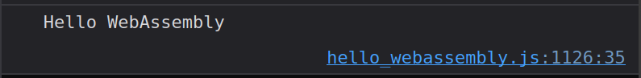
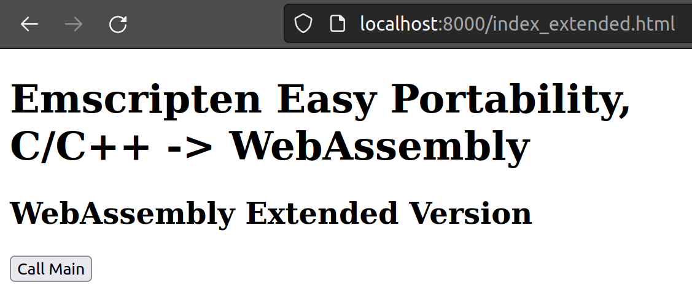

# Emscripten Simple Portability, C/C++ -> WebAssembly
Why does achieving simple portability of C/C++ programs to WebAssembly make sense?

There are several reasons for this, some of which are briefly listed here:

* There are already large libraries of existing C/C++ programs.
* There are problem-solving scenarios that cannot be optimally addressed in JavaScript.
* It does not require a separate runtime and gets delivered already compiled. This not only saves memory but also enhances performance on end-user devices.
* Multiple programing languages can be used in combination.
* Trustworthy code from trusted sources can be utilized. A good example of this is [libsodium](https://doc.libsodium.org), which brings the [Networking and Cryptography (NaCl)](https://nacl.cr.yp.to/) library directly from the source to WebAssembly.

[Emscripten](https://emscripten.org) lays the foundation to make this portability as easy as possible. Emscripten has been around for a long time and is developed by the two main contributors, [Alon Zakai](https://kripken.github.io/blog/about/) and [Luke Wagner](https://github.com/lukewagner), who have also been involved in asm.js and now WebAssembly to this day. This project also builds upon the LLVM platform, with the backend have been switched from an asm.js compiler to a WebAssembly compiler in the meantime.

Implementing such portability is not a straightforward task. For example, the fact that a browser is typically a single-threaded environment poses challenges. Additionally, there are various interfaces with the outside world that need to be connected. The Emscripten toolchain provides many useful tools to efficiently port native C/C++ code into a sandbox, which can then be executed as JavaScript on different systems.

---

If this is all new territory or if there is a desire to understand the details of porting, I recommend consulting my older articles:

* [A Simple C Program in WebAssembly](https://medium.com/webassembly/simple-c-program-in-webassembly-1a7b148293c2) details how a simple C program can be compiled as WebAssembly and used in a web application.
* ["Hello World" C++ Program](https://medium.com/webassembly/hello-world-c-program-4b85d3f8fbea) Is a simple C++ program, but how to implement it so that it can be used in a web application as WebAssembly?

---

## Hello WebAssembly

To introduce the concept, we will use a very simple C program that will be ported using Emscripten.

> In the next article, the idea is to port an existing small C/C++ project using Emscripten. Feel free to share suggestions for possible programs. The project will be ported and documented in the upcoming article.

To use the Emscripten toolchain, it must be installed first. Installation instructions can be found on the [Emscripten website](https://emscripten.org/docs/getting_started/downloads.html). There is also a [Docker version](https://hub.docker.com/r/emscripten/emsdk).

Here's what the example program looks like:

```c
#include <stdio.h>

int main() {
    printf("Hello WebAssembly\n");
    return 0;
}
```

Compiling the program with `emcc hello_webassembly.c -o hello_webassembly.js` generates two files: `hello_webassembly.js` and `hello_webassembly.wasm`.

The somewhat large JavaScript file loads, executes, and provides an interface (*runtime, sandbox) to the WebAssembly file. This can be used in various JavaScript environments, such as a server application in [Node](https://nodejs.org/de) or [Bun](https://bun.sh/):

```bash
$ node hello_webassembly.js
Hello WebAssembly
$ bun hello_webassembly.js
Hello WebAssembly
```

Or in a client application:

```html
<!DOCTYPE html>
<html lang="en">

<head>
    <meta charset="utf-8" />
    <title>Emscripten Easy Portability, C/C++ -> WebAssembly</title>
</head>

<body>
    <h1>Emscripten Easy Portability, C/C++ -> WebAssembly</h1>
    <script src="hello_webassembly.js"></script>
</body>

</html>
```

To start the application, run `python3 -m http.server`.

Analyze it in the browser by navigating to `http://localhost:8000`.



### Interpretation of the Result

Analyze the WebAssembly file using `wasm-objdump -x hello_webassembly.wasm`.

```bash
$ wasm-objdump -x hello_webassembly.wasm

hello_webassembly.wasm: file format wasm 0x1

Section Details:

Type[22]:
 - type[0] () -> i32
 - type[1] (i32, i32, i32) -> i32
 - type[2] (i32) -> i32
 - type[3] (i32) -> nil
 - type[4] () -> nil
 - type[5] (i32, i32) -> i32
 - type[6] (i32, i64, i32) -> i64
 - type[7] (i32, i32, i32) -> nil
 - type[8] (i32, i32, i32, i32, i32) -> i32
 - type[9] (i32, f64, i32, i32, i32, i32) -> i32
 - type[10] (i32, i32) -> nil
 - type[11] (i64, i32) -> i32
 - type[12] (i32, i64, i64, i32) -> nil
 - type[13] (i32, i32, i32, i32) -> i32
 - type[14] (f64, i32) -> f64
 - type[15] (i32, i32, i32, i32, i32, i32, i32) -> i32
 - type[16] (i32, i32, i32, i32) -> nil
 - type[17] (i64, i32, i32) -> i32
 - type[18] (i32, i32, i32, i32, i32) -> nil
 - type[19] (f64) -> i64
 - type[20] (i64, i64) -> f64
 - type[21] (i32, i32, i64, i32) -> i64
Import[2]:
 - func[0] sig=13 <wasi_snapshot_preview1.fd_write> <- wasi_snapshot_preview1.fd_write
 - func[1] sig=7 <env.emscripten_memcpy_js> <- env.emscripten_memcpy_js
Function[58]:
 - func[2] sig=4 <__wasm_call_ctors>
 - func[3] sig=0
 - func[4] sig=5 <main>
 - func[5] sig=5
 - func[6] sig=1
 - func[7] sig=2
 - func[8] sig=6
 - func[9] sig=1
 - func[10] sig=2
 - func[11] sig=3
 - func[12] sig=3
 - func[13] sig=3
 - func[14] sig=0
 - func[15] sig=4
 - func[16] sig=2
 - func[17] sig=2
 - func[18] sig=1
 - func[19] sig=5
 - func[20] sig=0 <__errno_location>
 - func[21] sig=14
 - func[22] sig=1
 - func[23] sig=1
 - func[24] sig=8
 - func[25] sig=15
 - func[26] sig=7
 - func[27] sig=2
 - func[28] sig=16
 - func[29] sig=17
 - func[30] sig=11
 - func[31] sig=11
 - func[32] sig=18
 - func[33] sig=1
 - func[34] sig=9
 - func[35] sig=10
 - func[36] sig=19
 - func[37] sig=2
 - func[38] sig=0
 - func[39] sig=0
 - func[40] sig=0
 - func[41] sig=4
 - func[42] sig=1
 - func[43] sig=5
 - func[44] sig=12
 - func[45] sig=12
 - func[46] sig=20
 - func[47] sig=3
 - func[48] sig=0
 - func[49] sig=4 <emscripten_stack_init>
 - func[50] sig=0 <emscripten_stack_get_free>
 - func[51] sig=0 <emscripten_stack_get_base>
 - func[52] sig=0 <emscripten_stack_get_end>
 - func[53] sig=2 <fflush>
 - func[54] sig=0 <stackSave>
 - func[55] sig=3 <stackRestore>
 - func[56] sig=2 <stackAlloc>
 - func[57] sig=0 <emscripten_stack_get_current>
 - func[58] sig=21
 - func[59] sig=8 <dynCall_jiji>
Table[1]:
 - table[0] type=funcref initial=6 max=6
Memory[1]:
 - memory[0] pages: initial=256 max=256
Global[4]:
 - global[0] i32 mutable=1 - init i32=65536
 - global[1] i32 mutable=1 - init i32=0
 - global[2] i32 mutable=1 - init i32=0
 - global[3] i32 mutable=1 - init i32=0
Export[15]:
 - memory[0] -> "memory"
 - func[2] <__wasm_call_ctors> -> "__wasm_call_ctors"
 - func[4] <main> -> "main"
 - table[0] -> "__indirect_function_table"
 - func[20] <__errno_location> -> "__errno_location"
 - func[53] <fflush> -> "fflush"
 - func[49] <emscripten_stack_init> -> "emscripten_stack_init"
 - func[50] <emscripten_stack_get_free> -> "emscripten_stack_get_free"
 - func[51] <emscripten_stack_get_base> -> "emscripten_stack_get_base"
 - func[52] <emscripten_stack_get_end> -> "emscripten_stack_get_end"
 - func[54] <stackSave> -> "stackSave"
 - func[55] <stackRestore> -> "stackRestore"
 - func[56] <stackAlloc> -> "stackAlloc"
 - func[57] <emscripten_stack_get_current> -> "emscripten_stack_get_current"
 - func[59] <dynCall_jiji> -> "dynCall_jiji"
Elem[1]:
 - segment[0] flags=0 table=0 count=5 - init i32=1
  - elem[1] = func[7]
  - elem[2] = func[6]
  - elem[3] = func[8]
  - elem[4] = func[34]
  - elem[5] = func[35]
Code[58]:
 - func[2] size=6 <__wasm_call_ctors>
 - func[3] size=73
 - func[4] size=11 <main>
 - func[5] size=41
 - func[6] size=355
 - func[7] size=4
 - func[8] size=4
 - func[9] size=370
 - func[10] size=4
 - func[11] size=2
 - func[12] size=2
 - func[13] size=2
 - func[14] size=12
 - func[15] size=8
 - func[16] size=92
 - func[17] size=10
 - func[18] size=229
 - func[19] size=22
 - func[20] size=6 <__errno_location>
 - func[21] size=142
 - func[22] size=526
 - func[23] size=204
 - func[24] size=363
 - func[25] size=2449
 - func[26] size=24
 - func[27] size=114
 - func[28] size=566
 - func[29] size=62
 - func[30] size=54
 - func[31] size=136
 - func[32] size=112
 - func[33] size=14
 - func[34] size=3203
 - func[35] size=45
 - func[36] size=5
 - func[37] size=21
 - func[38] size=4
 - func[39] size=4
 - func[40] size=6
 - func[41] size=22
 - func[42] size=288
 - func[43] size=20
 - func[44] size=83
 - func[45] size=83
 - func[46] size=482
 - func[47] size=6
 - func[48] size=4
 - func[49] size=18 <emscripten_stack_init>
 - func[50] size=7 <emscripten_stack_get_free>
 - func[51] size=4 <emscripten_stack_get_base>
 - func[52] size=4 <emscripten_stack_get_end>
 - func[53] size=314 <fflush>
 - func[54] size=4 <stackSave>
 - func[55] size=6 <stackRestore>
 - func[56] size=18 <stackAlloc>
 - func[57] size=4 <emscripten_stack_get_current>
 - func[58] size=13
 - func[59] size=35 <dynCall_jiji>
Data[2]:
 - segment[0] memory=0 size=560 - init i32=65536
  - 0010000: 2d2b 2020 2030 5830 7800 2d30 582b 3058  -+   0X0x.-0X+0X
  - 0010010: 2030 582d 3078 2b30 7820 3078 006e 616e   0X-0x+0x 0x.nan
  - 0010020: 0069 6e66 004e 414e 0049 4e46 002e 0028  .inf.NAN.INF...(
  - 0010030: 6e75 6c6c 2900 4865 6c6c 6f20 5765 6241  null).Hello WebA
  - 0010040: 7373 656d 626c 790a 0000 0000 0000 0000  ssembly.........
  - 0010050: 1900 0a00 1919 1900 0000 0005 0000 0000  ................
  - 0010060: 0000 0900 0000 000b 0000 0000 0000 0000  ................
  - 0010070: 1900 110a 1919 1903 0a07 0001 0009 0b18  ................
  - 0010080: 0000 0906 0b00 000b 0006 1900 0000 1919  ................
  - 0010090: 1900 0000 0000 0000 0000 0000 0000 0000  ................
  - 00100a0: 000e 0000 0000 0000 0000 1900 0a0d 1919  ................
  - 00100b0: 1900 0d00 0002 0009 0e00 0000 0900 0e00  ................
  - 00100c0: 000e 0000 0000 0000 0000 0000 0000 0000  ................
  - 00100d0: 0000 0000 0000 0000 0000 000c 0000 0000  ................
  - 00100e0: 0000 0000 0000 0013 0000 0000 1300 0000  ................
  - 00100f0: 0009 0c00 0000 0000 0c00 000c 0000 0000  ................
  - 0010100: 0000 0000 0000 0000 0000 0000 0000 0000  ................
  - 0010110: 0000 0000 0010 0000 0000 0000 0000 0000  ................
  - 0010120: 000f 0000 0004 0f00 0000 0009 1000 0000  ................
  - 0010130: 0000 1000 0010 0000 0000 0000 0000 0000  ................
  - 0010140: 0000 0000 0000 0000 0000 0000 0000 0012  ................
  - 0010150: 0000 0000 0000 0000 0000 0011 0000 0000  ................
  - 0010160: 1100 0000 0009 1200 0000 0000 1200 0012  ................
  - 0010170: 0000 1a00 0000 1a1a 1a00 0000 0000 0000  ................
  - 0010180: 0000 0000 0000 0000 0000 0000 0000 0000  ................
  - 0010190: 0000 1a00 0000 1a1a 1a00 0000 0000 0009  ................
  - 00101a0: 0000 0000 0000 0000 0000 0000 0000 0000  ................
  - 00101b0: 0000 0000 0000 0000 0000 0000 0000 0000  ................
  - 00101c0: 0000 0014 0000 0000 0000 0000 0000 0017  ................
  - 00101d0: 0000 0000 1700 0000 0009 1400 0000 0000  ................
  - 00101e0: 1400 0014 0000 0000 0000 0000 0000 0000  ................
  - 00101f0: 0000 0000 0000 0000 0000 0000 0016 0000  ................
  - 0010200: 0000 0000 0000 0000 0015 0000 0000 1500  ................
  - 0010210: 0000 0009 1600 0000 0000 1600 0016 0000  ................
  - 0010220: 3031 3233 3435 3637 3839 4142 4344 4546  0123456789ABCDEF
 - segment[1] memory=0 size=148 - init i32=66096
  - 0010230: 0500 0000 0000 0000 0000 0000 0100 0000  ................
  - 0010240: 0000 0000 0000 0000 0000 0000 0000 0000  ................
  - 0010250: 0000 0000 0200 0000 0300 0000 d802 0100  ................
  - 0010260: 0004 0000 0000 0000 0000 0000 0100 0000  ................
  - 0010270: 0000 0000 0000 0000 0000 0000 ffff ffff  ................
  - 0010280: 0a00 0000 0000 0000 0000 0000 0000 0000  ................
  - 0010290: 0000 0000 0000 0000 0000 0000 0000 0000  ................
  - 00102a0: 0000 0000 0000 0000 0000 0000 0000 0000  ................
  - 00102b0: 0000 0000 0000 0000 0000 0000 0000 0000  ................
  - 00102c0: 3002 0100                                0...
  ```

In comparison to my other articles, the WebAssembly file has now become considerably larger. However, it's interesting to shed light on certain sections. In the `Export` section, you can find a `main` function, which is used as the entry point as customary in C/C++. This function is located at position 4 in the `func[4]` array. If you want to analyze the script, you can use this function as a starting point and go further with converting the WebAssembly to the WAT format.

To translate you can use the following command: `wasm2wat hello_webassembly.wasm -o hello_webassembly.wat`.

```wat
...
  (func (;4;) (type 5) (param i32 i32) (result i32)
    (local i32)
    call 3
    local.set 2
    local.get 2
    return)
... 
```

Here, we won't delve further into the details. However, it's impressive to see how the entire functionality looks in stack machine instructions. More details can also be found in my older articles.

On the other hand, in the `Import` section, you'll find the function `wasi_snapshot_preview1.fd_write`, which must be provided by the host system.

Excerpt from `hello_webassembly.js`:

```js
...
  var _fd_write = (fd, iov, iovcnt, pnum) => {
      // hack to support printf in SYSCALLS_REQUIRE_FILESYSTEM=0
      var num = 0;
      for (var i = 0; i < iovcnt; i++) {
        var ptr = HEAPU32[((iov)>>2)];
        var len = HEAPU32[(((iov)+(4))>>2)];
        iov += 8;
        for (var j = 0; j < len; j++) {
          printChar(fd, HEAPU8[ptr+j]);
        }
        num += len;
      }
      HEAPU32[((pnum)>>2)] = num;
      return 0;
    };
...
```

As described in my previous [article](https://medium.com/webassembly/hello-world-c-program-4b85d3f8fbea), this is how communication with the outside world takes place, serving as an interface.

It's important to note that this is an abstraction (sandbox). The `printf` function from the C program is not called on the operating system in the traditional sense. Instead, it invokes the `_fd_write` function provided by JavaScript and imported by WebAssembly, which then offers the respective implementation of the `printf` function.

In Ecmascript, this behavior depends on the specific JavaScript interpreter making the call. The `printChar` function from the `_fd_write` function ultimately relies on the following output declaration: `var out = Module['print'] || console.log.bind(console);`. 
Here, it's evident that the interface (*runtime, sandbox) to WebAssembly in the JavaScript file is abstracted and provided through a global variable called `Module`. This `Module` serves as the interface between WebAssembly and the rest of the JavaScript program.

Moreover, you can replace the `print` function with another function using this approach. This would result in the replacement function being called instead of the fallback version with `console.log`.

> \* Personal Opinion: Regarding the JavaScript file and the `Module` variable, it indeed functions as an interface or abstraction. It provides an unified interface from the JavaScript environment (interacting with the `Module` variable) to the `WebAssembly` API (the actual runtime), sandboxing (import/export in the WebAssembly file), and potentially used extensions (see the next article). However, this file or variable is often referred to as the runtime or sandbox. In my view, these terms may not be optimally chosen. In Ecmascript, this terminology might stem from legacy practices of the asm.js era when it truly represented a runtime.

### Extension
Ecmascript offers various compilation options that can be utilized, for example, to trigger the `main` function via a button click.

* [Documentation](https://emscripten.org/docs/tools_reference/emcc.html#emccdoc)
* [Underlying settings.js](https://github.com/emscripten-core/emscripten/blob/main/src/settings.js)

As an example, you can prevent the direct startup call of the `main` function (`INVOKE_RUN=0`) and make this method available as `_main` from the `Module` (`EXPORTED_FUNCTIONS=_main`).

Compilation: `emcc hello_webassembly.c -s INVOKE_RUN=0 -s EXPORTED_FUNCTIONS=_main -o hello_webassembly_extended.js`

> Using the `EXPORTED_FUNCTIONS` option, you can also export additional functions directly from WebAssembly, separated by commas. By convention, an underscore should be prepended to the function name so that the `Module` can correctly link its internal naming to the WebAssembly function. In this specific case, the `main` function is already implicitly present in the list, so the command can be shortened to `emcc hello_webassembly.c -s INVOKE_RUN=0 -o hello_webassembly_extended.js`.

> The `EXPORTED_RUNTIME_METHODS` option serves a different purpose and should not be confused with the `EXPORTED_FUNCTIONS` option. The `EXPORTED_RUNTIME_METHODS` option is used to export methods from the JavaScript interface (*runtime, sandbox), from the `Module` itself (not from WebAssembly). For example, the [ccall function](https://emscripten.org/docs/api_reference/preamble.js.html#calling-compiled-c-functions-from-javascript): `emcc hello_webassembly.c -s INVOKE_RUN=0 -s EXPORTED_RUNTIME_METHODS=ccall -o hello_webassembly_extended.js`, which allows calling compiled C functions indirectly like `Module.ccall("main", "number", [], []);` (see the comment in the following HTML file).

> It is also recommended to consult the [FAQ](https://emscripten.org/docs/getting_started/FAQ.html) of Emscripten when facing challenges or questions.

```html
<!DOCTYPE html>
<html lang="en">

<head>
    <meta charset="utf-8" />
    <title>Emscripten Easy Portability, C/C++ -> WebAssembly</title>
</head>

<body>
    <h1>Emscripten Easy Portability, C/C++ -> WebAssembly</h1>
    <h2>WebAssembly Extended Version</h2>
    <button id="call-main-button">Call Main</button>
    <script src="hello_webassembly_extended.js"></script>
    <script>
        const callMainButton = document.getElementById("call-main-button");
        callMainButton.addEventListener("click", function () {
            // Module.ccall("main", "number", [], []); // When you used EXPORTED_RUNTIME_METHODS=ccall you can call the main function it like this
            Module._main();
        });
    </script>
</body>

</html>
```

To start the application, run `python3 -m http.server`.

Analyze it in the browser by navigating to `http://localhost:8000/index_extended.html`.




## Further Resources
* [Source Code](https://github.com/marcokuoni/public_doc/tree/main/essays/7_emscripten_simple_portability)
* [Deutsche Version](https://github.com/marcokuoni/public_doc/tree/main/essays/7_emscripten_simple_portability/README.de.md)

I am open to refining, expanding, or correcting the article. Feel free to provide a feedback or get in touch with me.

Created by [Marco Kuoni, September 2023](https://marcokuoni.ch)
