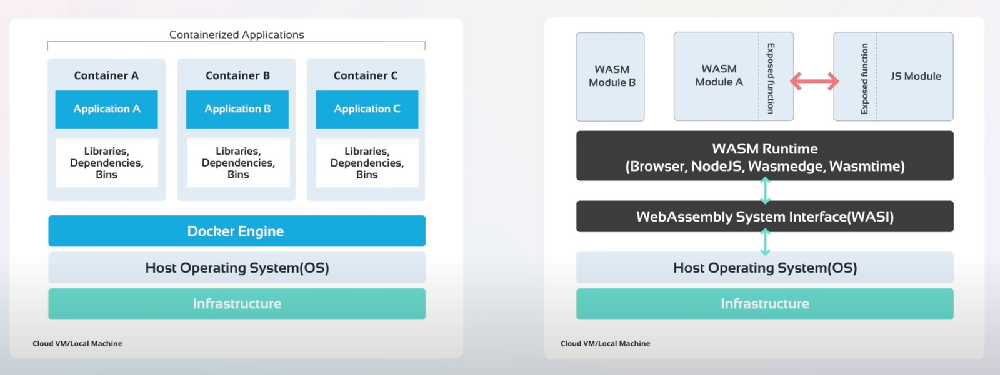
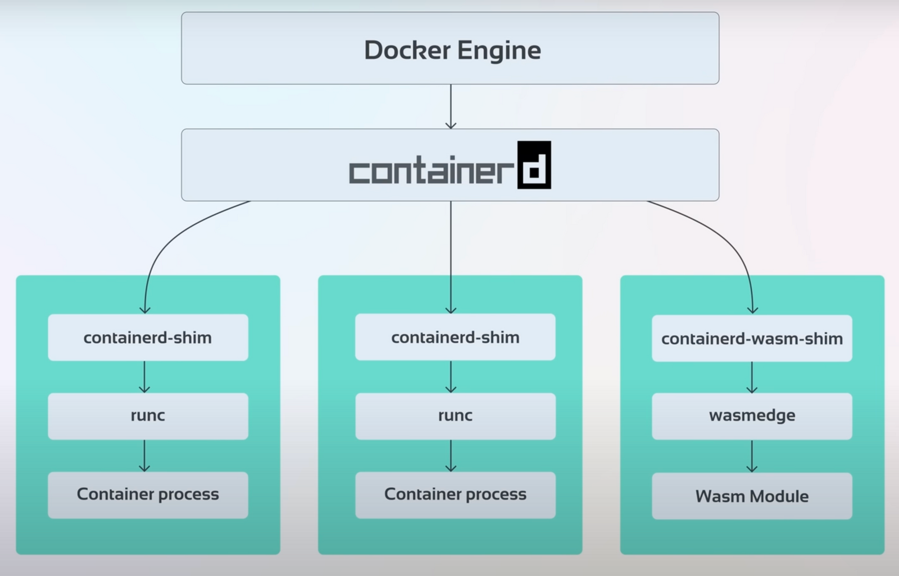
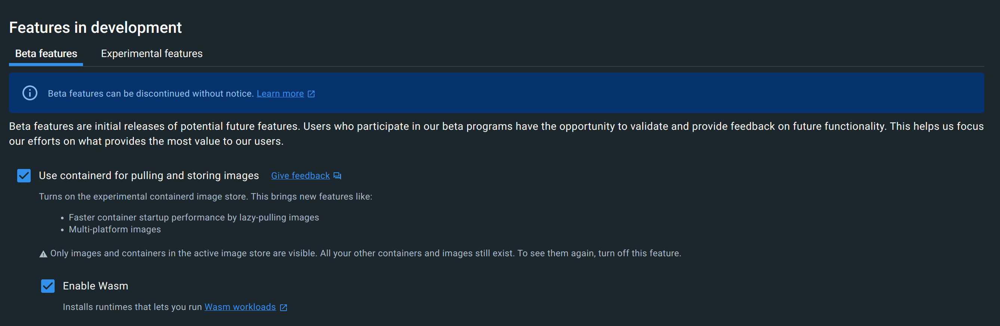
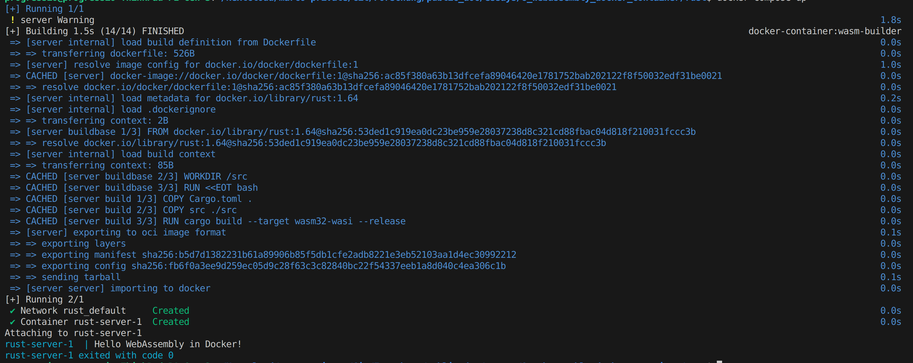

# WebAssembly Docker Container
**Inhalt:** [Theorie: Warum?](#warum) | [Theorie: Wie?](#wie) | [Docker Desktop Setup](#docker-desktop-setup) | [Docker Build](#docker-build) | [Docker Run](#docker-run) | [Docker Compose](#docker-compose) | [Weiterführend](#weiterführend)

## Warum?
Das berühmte Zitat von einem der Erfinder von Docker, Solomon Hykes: «If WASM+WASI existed in 2008, we wouldn’t have needed to created Docker» - «Wenn WASM+WASI 2008 existiert hätte, hätten wir Docker nicht erfinden müssen».


Es gibt einen fortsetzenden Tweet in dem Solomon davon Spricht, dass Docker dadurch nicht verschwinden wird. Vielmehr werden Windows, Linux und WebAssembly Container zusammen und nebeneinander auf Docker zum Einsatz kommen.


Bild von [Kode Kloud](https://kodekloud.com/blog/webassembly-vs-docker/)

Klassische Docker-Container beziehungsweise deren Inhalt sind für für eine bestimmte Zielarchitektur (arm, x86, usw.) kompiliert und beinhalten verschiedene Betriebssystemkomponenten. 

Wenn nun eine WebAssembly-Runtime zur Verfügung steht, können diese Punkte an die Runtime abgeben werden. Als Resultat erhält man einen Container, mit folgenden zusätzlichen Vorteilen:
* Beinhaltet nur Applikationscode was zu kleineren (Speicher) und sicheren (Angriffsfläche) Containern mit schnelleren Startzeiten führt.
* Kompatibilität über verschiedene Architekturen und Betriebssystemen hinweg.

Inklusive den bekannten Vorteilen von WebAssembly selbst:
* Sicherheit: WebAssembly Programme laufen in einer Sandbox. Es ist nicht direkt möglich auf das Hostsystem oder andere Container zuzugreifen.
* Performance: WebAssembly kommt kompiliert als Maschinen-Code daher.
* Und Weiteren, siehe in meinem letzten [Artikel](https://medium.com/webassembly/emscripten-simple-portability-9d3238d99294)

| Aspekt                        | Klassische                            | WebAssembly Container                                                                             |
| ----------------------------- | ------------------------------------ | ------------------------------------------------------------------------------------------------- |
| Grösse                        | 10 bis 100 Fache an MB               | Einige MB                                                                                         |
| Startzeiten ([Performance](#performance))                  | Sekunden                             | [Millisekunden](https://www.docker.com/blog/why-containers-and-webassembly-work-well-together/)   |
| Performance Geschwindigkeit   | Weit Weg von Native                  | Nahe an Native                                                                                    |
| Läuft in Webbrowser           | Nein                                 | Ja                                                                                                |
| Cross Platform / Portabilität | Nein                                 | Ja                                                                                                |
| Standards                     | [OCI](https://opencontainers.org/)   | [W3C](https://www.w3.org/community/webassembly/) und OCI                                          |
| System Interaktionen          | Beinhaltet Betriebs- und Dateisystem | Benutzt [WASI](https://wasi.dev/) um aufs Hostsystem zuzugreifen |

Zusammengefasst erhält man mit Docker + WebAssembly
* Gebündelten Code (Package)
* Potentiell näher bei nativer Performance
* Hohe Sicherheit
* Hohe Portabilität
* Runtime Isolation
* Potentiell schnellere Startzeit

## Wie?

Bild von [Kode Kloud](https://kodekloud.com/blog/webassembly-vs-docker/)

Nachfolgend werden die einzelnen Schichten und deren Funktionalität beziehungsweise Aufgaben kurz erklärt. Dank der breiten Akzeptanz der Standardisierungen und des Open-Source Gedanken rund um Container über [Open Container Initiative](https://opencontainers.org/) und der [Container Runtime containerd](https://containerd.io/) können verschiedene Anwendungen einfach auf verschiedenen Plattformen ausgeführt werden. 

Auf der einen Seite bieten standardisierte Schnittstellen für containerd, dass dieser auf diversen Plattformen zum Einsatz kommt. Auf der anderen Seite ermöglichen die standardisierten Schnittstellen für die Container das Implementieren und Ausführen von unterschiedliche Anwendungen.

### Container Engine 
Dient als Schnittstelle zwischen den Administratoren und dem Container Manager und bietet weitere higher Level plattformspezifische Funktionalitäten.

Bekannte Container Engines sind Docker, Kubernetes, Podman, CRI-O, usw.

### Container Manager
Umfasst das Verwalten von Images (Upload, Download) und von Containern (Erstellen, Starten, Stoppen, usw.). Im Grunde alles was man braucht, um eine Container-Plattform aufzubauen, ohne sich mit den Details des zugrunde liegenden Betriebssystems befassen zu müssen. 

Bekanntester Container Manager ist containerd unterstützt durch [Cloud Native Computing Foundation](https://www.cncf.io/). Containerd ist ein Open-Source Container Manager (ursprünglich Docker), der in Go programmiert ist. Anstatt direkt von Entwicklern verwendet zu werden, ist er so konzipiert, dass er in Systeme wie Docker, Kubernetes und Weiteren eingebettet werden kann.

### Shim
Ein Shim ist eine Software, die zwischen einem Container Manager (containerd, cri-o, podman, usw.) und einer Container Runtime (runc, crun, wasmedge, usw.) angesiedelt ist und das Integrationsproblem (als Schnittstelle) dieser Gegenstücke löst.

Bekanntester Shim ist die containerd-shim. Sie wird dazu verwendet um den jeweiligen Container über eine standardisierte Schnittstelle zu verwalten und zu überwachen.

### Runtime
Umfasst das Verwalten von Containerprozessen (Erstellen, Starten, Stoppen, usw.) und stellt dazu die Low-Level-Funktionalität bereit.
[Runc](https://github.com/opencontainers/runc) als Beispiel einer Runtime für Linux interagiert mit bestehenden Low-Level-Linux-Funktionen, wie Namespaces und Control Groups. Dabei folgt er dem [OCI-Standard](https://opencontainers.org/) und enthält [libcontainer](https://github.com/opencontainers/runc/tree/main/libcontainer), eine Go-Bibliothek zur Erstellung von Containern.
Alternativen:
  * [crun](https://github.com/containers/crun) für Linux
  * [gVisor](https://gvisor.dev/) für Linux
  * [firecracker](https://github.com/firecracker-microvm/firecracker-containerd) für microVMs
  * [wasmedge](https://wasmedge.org/) für WebAssembly in Docker vorhanden und durch [Cloud Native Computing Foundation](https://www.cncf.io/) unterstützt
  * [slight](https://github.com/deislabs/spiderlightning) für WebAssembly in Docker vorhanden
  * [spin](https://github.com/fermyon/spin) für WebAssembly in Docker vorhanden
  * [wasmtime](https://wasmtime.dev/) für WebAssembly in Docker vorhanden und erstellt durch [Bytecode Alliance](https://bytecodealliance.org/)

#### WebAssemlby
Weil die bestehenden Shim-Implementierungen auf Artefakten von Betriebssystemen beruht, können diese nicht im gleichen Sinn direkt für WebAssembly Runtimes verwendet werden. Deshalb kommen WebAssembly Runtimes gebündelt mit eigenen Shims daher.
Für wasmedge, wasmtime und wasmer gibt es hierzu [runwasi](https://github.com/containerd/runwasi). 

Runwasi implementiert dabei zwei Modis:
* Normal: Ein Shim Prozess pro Container
* Shared: Ein Manager Service (Container) verwaltet alle Shims im Prozess

## Docker Desktop Setup
Zwei Bemerkungen im Vorfeld:
* Mit Docker Desktop lässt sich auf einfache Art in verschiedenen Betriebssystemen ein WebAssembly Image builden und als Container starten. Jedoch kann dies auch mit einer standard Docker Installation umgesetzt werden. Weiter Infos unter [alternative Runtimes](https://docs.docker.com/engine/alternative-runtimes/#wasmtime)
* Weil die Docker Implementierung eher neu ist, können Herausforderungen auftreten. Daher gibt es eine Liste von bekannten [Known Issues](https://docs.docker.com/desktop/wasm/#known-issues) und einen [Issue Tracker](https://github.com/docker/roadmap/issues/426).

Als erstens muss [Docker Desktop](https://www.docker.com/products/docker-desktop) heruntergeladen werden. Dieser wird unter Ubuntu wie folgt installiert: 

```bash
sudo chmod +x ./docker-desktop-4.24.0-amd64.deb
sudo apt install ./docker-desktop-4.24.0-amd64.deb
```

Hier gilt es zu beachten, dass die aktuellste Docker Version verwendet wird > 4.24.0

Nach der Installation muss die WASM Runtime aktiviert werden. Was mit folgenden Schritten erreicht wird:

1. Öffnen von Docker Desktop.
2. Navigieren zu `Settings`.
3. `Features in development` auswählen.
4. Und folgende Optionen aktivieren:
   * `Use containerd for pulling and storing images`
   * `Enable Wasm`



---

**Hinweis:** Gemäss Dokumentation, müsste der Build bereits funktionieren. Jedoch war dies bei mir nicht der Fall. Meine installierten Builder hatten keine Unterstützung für die WASM/WASI Plattform.

```bash
$ docker buildx ls
NAME/NODE       DRIVER/ENDPOINT STATUS  BUILDKIT             PLATFORMS
default         docker                                       
  default       default         running v0.11.6+616c3f613b54 linux/amd64, linux/amd64/v2, linux/amd64/v3, linux/386
desktop-linux * docker                                       
  desktop-linux desktop-linux   running v0.12.2              linux/amd64, linux/amd64/v2, linux/amd64/v3, linux/arm64, linux/riscv64, linux/ppc64le, linux/s390x, linux/mips64le, linux/mips64
```

Daher habe ich mit folgendem Befehl einen neuen Builder erstellt: 

```bash
docker buildx create --name wasm-builder --platform wasi/wasm
docker buildx use wasm-builder
```

```bash
$ docker buildx ls
NAME/NODE       DRIVER/ENDPOINT  STATUS   BUILDKIT             PLATFORMS
wasm-builder *  docker-container                               
  wasm-builder0 desktop-linux    inactive                      wasi/wasm*
default         docker                                         
  default       default          running  v0.11.6+616c3f613b54 linux/amd64, linux/amd64/v2, linux/amd64/v3, linux/386
desktop-linux   docker                                         
  desktop-linux desktop-linux    running  v0.12.2              linux/amd64, linux/amd64/v2, linux/amd64/v3, linux/arm64, linux/riscv64, linux/ppc64le, linux/s390x, linux/mips64le, linux/mips64
```

---

## Docker Build
Nachfolgend als Demonstration ein einfaches Rust Programm `main.rs`:

```rust
fn main() {
  let s : &str = "Hello WebAssembly in Docker!";
  println!("{}", s);
}

```

Dies zusammen mit folgendem `Cargo.toml`:

```toml
[package]
name = "hello"
version = "0.1.0"
authors = ["Marco Kuoni"]
edition = "2021"

[[bin]]
name = "hello"
path = "src/main.rs"

[dependencies]
```

Und folgendem `Dockerfile`:

```dockerfile
# syntax=docker/dockerfile:1

FROM --platform=$BUILDPLATFORM rust:1.64 AS buildbase
WORKDIR /src
RUN <<EOT bash
    set -ex
    apt-get update
    apt-get install -y \
        git \
        clang
    rustup target add wasm32-wasi
EOT

FROM buildbase AS build
COPY Cargo.toml .
COPY src ./src 
# Build the Wasm binary
RUN cargo build --target wasm32-wasi --release

FROM scratch
ENTRYPOINT [ "/hello.wasm" ]
COPY --link --from=build /src/target/wasm32-wasi/release/hello.wasm /hello.wasm
```

Bis auf die letzten drei Zeilen, werden die Befehle nur dazu verwendet um das Rust Programm im Docker Container zu WebAssembly zu kompilieren. Die letzten drei Zeilen sind für das WebAssembly Image verantwortlich. In dem es das kompilierte Programm in den Container kopiert und den Entrypoint definiert.

Der effektive Buildprozess wird mit dem folgendem Befehl gestartet: `docker buildx build --load --platform wasi/wasm -t demo/rust_hello .`.

----

**Hinweis:** Ich musste unter `Features in development` die `Builds View` ausschalten, damit das Image erschien.


----


Damit wurde nun ein Image für die Plattform WASM erstellt mit einer Grösse von 2.52 MB.

## Docker Run
Nun kann das Image mit folgendem Befehl gestartet werden:

```bash
$ docker run --rm --runtime=io.containerd.wasmedge.v1 --platform=wasi/wasm demo/rust_hello
Hello WebAssembly in Docker!
```

## Docker Compose
WebAssembly Container können auch zusammen mit anderen Container wie gewohnt mit Docker Compose verwendet werden und im Verbund agieren.

Beispielhaft für unser kleines Programm ein `docker-compose.yml`:

```
services:
  server:
    image: demo/rust_hello_compose
    build:
      context: .
    runtime: io.containerd.wasmedge.v1
```

Welches über `docker compose up` gestartet wird.



## Performance
Ich möchte mich an dieser Stelle bei [Thomas Bocek](https://youtu.be/0uo37PAondM?feature=shared&t=178) bedanken für die Erwähnung dieses Artikels. Im spezielen auch die Erwähnung seiner Bedenken bezüglich der Performance von WebAssembly in Docker. Ich möchte daher hier kurz auf die drei erwähnten Punkte eingehen:
* Startzeit
* Image Grösse
* Portabilität

Zum aktuellen Zeitpunkt und gemäss meinem aktuellen Wissen, gebe ich Thomas Bocek in allen drei Punkten gerne recht. Wir haben erst gerade in den letzten drei Tagen am [CG Hybrid Meeting](https://github.com/WebAssembly/meetings/blob/main/main/2023/CG-10.md) diverse Beispiele und Banchmarks gesehen. Was ausser Frage steht ist Portabilität und Sicherheit. Ganz klar Sicherheit wird und ist immer ein Thema, aber das Level ist hoch. Um das Thema nur ganz kurz anzuschneiden, hier zwei zufällige Beispiele vom [Reasearch Day](https://www.cs.cmu.edu/~wasm/wasm-research-day-2023.html) am letzten Freitag:
* [Shravan Ravi Narayan](https://shravanrn.com/) sprach über die Einschränkung von [Spectre Attacke](https://en.wikipedia.org/wiki/Spectre_(security_vulnerability)) bei WebAssembly. 
* [Arjun Ramesh](https://users.ece.cmu.edu/~arjunr2/) und [Tianshu Huang](https://tianshu.io/) über plattformübergreifende Instrumentierung, die einzigartige Einblicke in das Programmverhalten liefern kann.

Die Aussage über Image Grösse und Startup kommt als Konsequenz einer [Lightweight Virtualisierung (FaaS)](https://en.wikipedia.org/wiki/Function_as_a_service), welche den Fokus hat jeglicher Overhead von klassischen Containern zu vermeiden. Hierzu empfehle ich folgendes Video zu [WebAssembly und Containers](https://www.youtube.com/watch?v=OGcm3rHg630), welches die WebAssembly Runtime Spin benutzt. Jedoch ist es natürlich ganz klar ein unfairer Vergleich, einzelne kleine Services in WebAssembly 1:1 mit komplexeren Containern zu vergleichen.

Trotzdem konnte ich es nicht lassen und wollte ganz kurz Vergleichswerte kreieren. Dabei habe ich zweimal das gleiche `fibonacci.rs` Programm klassisch und als WebAssembly Container gebildet. 

```rust
fn fibonacci(n: u64) -> u64 {
    if n == 0 {
        return 0;
    } else if n == 1 {
        return 1;
    } else {
        return fibonacci(n - 1) + fibonacci(n - 2);
    }
}

fn main() {
    println!("Starting");
    let n = 35; // Change this to the desired Fibonacci number you want to compute
    let result = fibonacci(n);
    println!("Fibonacci({}) = {}", n, result);
    println!("Stopped");
}
```

Und dies mit folgdenem Code ausgewertet:

```bash
#!/bin/bash

if [ $# -lt 2 ]; then
    echo "Usage: $0 <command> <num_runs>"
    exit 1
fi

command_to_measure="$1"
num_runs=$2

total_execution_time=0
total_startup_time=0
total_runtime_time=0
total_shutdown_time=0

for ((i=1; i<=$num_runs; i++)); do
    start_time=$(date +%s.%N)
    started_time=$(date +%s.%N)
    stopped_time=$(date +%s.%N)

    $command_to_measure  | while IFS= read -r line; do 
            case "$line" in
                "Starting")
                    started_time=$(date +%s.%N)                
                ;;
                "Stopped")
                    stopped_time=$(date +%s.%N)                
                ;;
                *)
                # echo "$line"
                ;;
            esac
        done
    end_time=$(date +%s.%N)

    execution_time=$(echo "$end_time - $start_time" | bc -l)
    startup_time=$(echo "$started_time - $start_time" | bc -l)
    runtime_time=$(echo "$stopped_time - $started_time" | bc -l)
    shutdown_time=$(echo "$end_time - $stopped_time" | bc -l)
    total_execution_time=$(echo "$total_execution_time + $execution_time" | bc -l)
    total_startup_time=$(echo "$total_startup_time + $startup_time" | bc -l)
    total_runtime_time=$(echo "$total_runtime_time + $runtime_time" | bc -l)
    total_shutdown_time=$(echo "$total_shutdown_time + $shutdown_time" | bc -l)
done

avg_total_execution_time=$(echo "$total_execution_time / $num_runs" | bc -l)
avg_total_startup_time=$(echo "$total_startup_time / $num_runs" | bc -l)
avg_total_runtime_time=$(echo "$total_runtime_time / $num_runs" | bc -l)
avg_total_shutdown_time=$(echo "$total_shutdown_time / $num_runs" | bc -l)
echo "Average execution time over $num_runs runs: $avg_total_execution_time seconds"
echo "Average startup time over $num_runs runs: $avg_total_startup_time seconds"
echo "Average run time over $num_runs runs: $avg_total_runtime_time seconds"
echo "Average shutdown time over $num_runs runs: $avg_total_shutdown_time seconds"

```

Gemäss meinen Analysen, verwenden beide von mir verwendeten Runtimes (JIT)[https://en.wikipedia.org/wiki/Just-in-time_compilation] theoretisch müsste aber (AOT)[https://en.wikipedia.org/wiki/Ahead-of-time_compilation] gemäss [Ablaufdiagramm](https://wasmedge.org/docs/contribute/internal) von zum Beispiel WasmEdge ebenfalls möglich sein. 

> Leider konnte ich die Runtimes Spin und Slight wie auch eine Wastime Vorkompilierung hier nicht berücksichtigen, weil `println` damit aus dem Stand noch nicht unterstützt wird.

### Build
Hier fällt vorneweg ganz klar auf, dass der Build von klassischen Containern deutlich langsamer ist.
`docker buildx build --load -f DockerfileClassic -t demo/fibonacci_classic .`
`docker buildx build --load --platform wasi/wasm -t demo/fibonacci_webassembly .`
`docker buildx build --load -f DockerfileCompile -t demo/fibonacci_webassembly_compile .`


Das Image `demo/fibonacci_webassembly_compile` ist hierbei ein Wasmtime AOT Image. Was selbstverständlich ein Teil der Portablilität in dieser Art der Umsetzung zu nichte macht. Jedoch auf Grund der Grösse zum Beispiel bei einem [Embedded Anwendungsfall](https://de.wikipedia.org/wiki/Embedded_Software_Engineering) (IoT) durchaus Sinn machen könnte.

### Run
```bash
$ ./measureAvgTime.sh "docker run --rm --runtime=io.containerd.wasmtime.v1 --platform=wasi/wasm demo/fibonacci_webassembly" 1
Average execution time over 1 runs: .92003518600000000000 seconds
Average startup time over 1 runs: .00223248300000000000 seconds
Average run time over 1 runs: .00182017000000000000 seconds
Average shutdown time over 1 runs: .91598253300000000000 seconds
```

```bash
$ ./measureAvgTime.sh "docker run --rm --runtime=io.containerd.wasmtime.v1 --platform=wasi/wasm demo/fibonacci_webassembly" 50
Average execution time over 50 runs: .79499581630000000000 seconds
Average startup time over 50 runs: .00152502634000000000 seconds
Average run time over 50 runs: .00146761514000000000 seconds
Average shutdown time over 50 runs: .79200317482000000000 seconds
```

```bash
$ ./measureAvgTime.sh "docker run --rm --runtime=io.containerd.wasmedge.v1 --platform=wasi/wasm demo/fibonacci_webassembly" 1
Average execution time over 1 runs: 9.29828315900000000000 seconds
Average startup time over 1 runs: .00253460300000000000 seconds
Average run time over 1 runs: .00334101000000000000 seconds
Average shutdown time over 1 runs: 9.29240754600000000000 seconds
```

```bash
$ ./measureAvgTime.sh "docker run --rm --runtime=io.containerd.wasmedge.v1 --platform=wasi/wasm demo/fibonacci_webassembly" 50
Average execution time over 50 runs: 9.19518831752000000000 seconds
Average startup time over 50 runs: .00185933672000000000 seconds
Average run time over 50 runs: .00179162598000000000 seconds
Average shutdown time over 50 runs: 9.19153735482000000000 seconds
```

```bash
$ ./measureAvgTime.sh "docker run --rm demo/fibonacci_classic" 1
Average execution time over 1 runs: .65099649100000000000 seconds
Average startup time over 1 runs: .00220626700000000000 seconds
Average run time over 1 runs: .00316228900000000000 seconds
Average shutdown time over 1 runs: .64562793500000000000 seconds
```

```bash
$ ./measureAvgTime.sh "docker run --rm demo/fibonacci_classic" 50
Average execution time over 50 runs: .57311583626000000000 seconds
Average startup time over 50 runs: .00151897690000000000 seconds
Average run time over 50 runs: .00152541990000000000 seconds
Average shutdown time over 50 runs: .57007143946000000000 seconds
```

Dies ergibt für Wasmtime verglichen mit der klassichen Variante im Mittel über 50 Messungen:
* Execution: 38% langsamer
* Startup: 0.4% langsamer
* Runtime: 3.8% schneller
* Shutdown: 38 % langsamer

Und für WasmEdge:
* Execution: 1504% langsamer
* Startup: 22% langsamer
* Runtime: 17% langsamer
* Shutdown: 1512% langsamer

### Fazit
Dies soll keine Wissenschaftliche Abhandlung darstellen, jedoch einwenig ein Gefühl dafür vermitteln. 

Was für mich auffällig ist:
* Das Image ist deutlich kleiner
* Wasmtime im Vergleich zur klassischen Variante ist nur minimal langsamer. Hier fällt auf, dass nach mehrfacher Wiederholung das WebAssembly für den Fibonacci-Algo sogar immer etwas schneller.
* Die WebAssembly Runtimes haben noch grosse Unterschiede in der Performance

Zeit ist aktuell etwas knapp, jedoch werde ich versuchen diesem Thema noch mehr Aufmerksamkeit zu schenken. Gerne bin ich auch offen für weitere Inputs oder Fragen.

## Weiterführend
* [Source Code](https://github.com/marcokuoni/public_doc/tree/main/essays/8_webassembly_docker_container)
* [English Version](https://github.com/marcokuoni/public_doc/tree/main/essays/8_webassembly_docker_container/README.md)

Als Grundlage für diesen Artikel dienten diverse Quellen. Eine Liste der Quellen findet sich nachfolgend, wo man auch weitere Beispiele findet:
* [Docker Blog: Build, Share, and Run WebAssembly Apps Using Docker](https://www.docker.com/blog/build-share-run-webassembly-apps-docker/)
* [Docker Blog: Why Containers and WebAssembly Work Well Together](https://www.docker.com/blog/why-containers-and-webassembly-work-well-together/)
* [Docker Blog: Introducing the Docker+Wasm Technical Preview](https://www.docker.com/blog/docker-wasm-technical-preview/)
* [Docker Desktop Dokumentation: Wasm](https://docs.docker.com/desktop/wasm/)
* [Docker Dokumentation: Alternative Runtimes](https://docs.docker.com/engine/alternative-runtimes/#wasmtime)
* [Medium: Docker + WebAssembly: a quick intro](https://medium.com/@guglielmino/docker-webassembly-a-quick-intro-730c38e8390c)
* [KodeKloud: WebAssembly vs Docker: Exploring their Connection and Potential](https://kodekloud.com/blog/webassembly-vs-docker/)
* [GitHub: Runwasi](https://github.com/second-state/runwasi)
* [GitHub: Issues - Docker+Wasm Integration](https://github.com/docker/roadmap/issues/426)
* [Wasm Labs: WebAssembly - Docker without containers!](https://wasmlabs.dev/articles/docker-without-containers/)

Ich bin gerne bereit den Artikel zu präzisieren, erweitern oder zu korrigieren. Schreibt ein Feedback oder meldet euch direkt bei mir.

Erstellt von [Marco Kuoni, Oktober 2023](https://marcokuoni.ch)