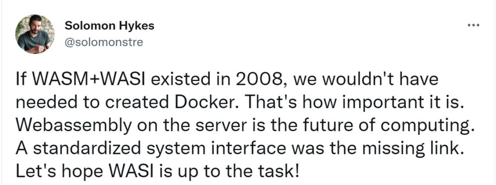

# WebAssembly Docker Container

## Why?
The famous quote from one of the inventors of Docker, Solomon Hykes: "If WASM+WASI existed in 2008, we wouldn’t have needed to created Docker."



There is a follow-up tweet in which Solomon talks about Docker not disappearing as a result. Instead, Windows, Linux, and WebAssembly containers will be used together and side by side with Docker.


Image by [Kode Kloud](https://kodekloud.com/blog/webassembly-vs-docker/)

Classic Docker containers or their contents are compiled for a specific target architecture (arm, x86, etc.) and include various operating system components.

Now, when a WebAssembly runtime is available, these points can be handed over to the runtime. As a result, you get a container with the following additional advantages:
* Includes only application code, leading to smaller (memory) and more secure (attack surface) containers with faster startup times.
* Compatibility across different architectures and operating systems.

Including the well-known advantages of WebAssembly itself:
* Security: WebAssembly programs run in a sandbox. It is not directly possible to access the host system or other containers.
* Performance: WebAssembly is compiled to machine code.
* And more, as seen in my latest [article](https://medium.com/webassembly/emscripten-simple-portability-9d3238d99294).

| Aspect                       | Classic                               | WebAssembly Container                                                                              |
| ---------------------------- | ------------------------------------- | ------------------------------------------------------------------------------------------------- |
| Size                         | A factor of 10 to 100 MBs             | A few MB                                                                                          |
| Startup Times                | Seconds                               | [Milliseconds](https://www.docker.com/blog/why-containers-and-webassembly-work-well-together/)   |
| Performance Speed            | Far from Native                       | Close to Native                                                                                   |
| Runs in Web Browser          | No                                    | Yes                                                                                               |
| Cross Platform / Portability | No                                    | Yes                                                                                               |
| Standards                    | [OCI](https://opencontainers.org/)    | [W3C](https://www.w3.org/community/webassembly/) and OCI                                          |
| System Interactions          | Includes OS and file system           | Uses [WASI](https://wasi.dev/) to access the host system                                           |

In summary, with Docker + WebAssembly, you get:
- Bundled code (Package)
- Near-native performance
- High security
- High portability
- Runtime isolation
- Fast startup time

## How?

Image by [Kode Kloud](https://kodekloud.com/blog/webassembly-vs-docker/)

Below the individual layers will be briefly explained and their functionality or tasks. Thanks to the widespread acceptance of standardizations and the open-source mindset around containers through the [Open Container Initiative](https://opencontainers.org/) and the [Container Runtime containerd](https://containerd.io/), various applications can easily run on different platforms.

On one side, standardized interfaces for containerd allow it to be used on various platforms. And on the other End, standardized interfaces for containers enable the implementation and execution of different applications.

### Container Engine
Serves as an interface between administrators and the container manager, providing additional higher-level platform-specific functionalities.

Well-known container engines include Docker, Kubernetes, Podman, CRI-O, and more.

### Container Manager
Involves the management of images (upload, download) and containers (creation, start, stop, etc.). Essentially, it provides everything needed to build a container platform without having to deal with the details of the underlying operating system.

The most well-known container manager is containerd, supported by the [Cloud Native Computing Foundation](https://www.cncf.io/). Containerd is an open-source container manager (originally Docker) programmed in Go. Instead of being used directly by developers, it is designed to be embedded in systems like Docker and Kubernetes.

#### Shim
A shim is a software positioned between a container manager (containerd, cri-o, podman, etc.) and a container runtime (runc, crun, wasmedge, etc.) that solves the integration problem (as an interface) between these counterparts.

The most well-known shim is containerd-shim. It is used to manage and monitor the respective container via a standardized interface.

### Runtime
Involves managing container processes (creation, start, stop, etc.) and provides low-level functionality for this purpose.
As an example of a runtime for Linux, [Runc](https://github.com/opencontainers/runc) interacts with existing low-level Linux features such as namespaces and control groups. It follows the [OCI standard](https://opencontainers.org/) and includes libcontainer, a Go library for creating containers.
Alternatives:
  * [crun](https://github.com/containers/crun) for Linux
  * [gVisor](https://gvisor.dev/) for Linux
  * [firecracker](https://github.com/firecracker-microvm/firecracker-containerd) for microVMs
  * [wasmedge](https://wasmedge.org/) for WebAssembly available in Docker, supported by the [Cloud Native Computing Foundation](https://www.cncf.io/)
  * [slight](https://github.com/deislabs/spiderlightning) for WebAssembly available in Docker
  * [spin](https://github.com/fermyon/spin) for WebAssembly available in Docker
  * [wasmtime](https://wasmtime.dev/) for WebAssembly available in Docker, created by the [Bytecode Alliance](https://bytecodealliance.org/)

#### WebAssembly
Because existing shim implementations are based on artifacts of operating systems, they cannot be directly used in the same sense for WebAssembly runtimes. Therefore, WebAssembly runtimes come bundled with their own shims.
For wasmedge, wasmtime, and wasmer, there is [runwasi](https://github.com/containerd/runwasi) for this purpose.

Runwasi implements two modes:
* Normal: One shim process per container
* Shared: One manager service (container) manages all shims in the process

## Docker Desktop Setup
Two preliminary notes:
* Docker Desktop allows for easy building of a WebAssembly image and running it as a container in various operating systems. However, this can also be achieved with a standard Docker installation. Further information is available under [alternative Runtimes](https://docs.docker.com/engine/alternative-runtimes/#wasmtime).
* Because the Docker implementation is relatively new, challenges may arise. Therefore, there is a list of [Known Issues](https://docs.docker.com/desktop/wasm/#known-issues) and an [Issue Tracker](https://github.com/docker/roadmap/issues/426).

First, you need to download [Docker Desktop](https://www.docker.com/products/docker-desktop). To install it on Ubuntu, these steps are required:

```bash
sudo chmod +x ./docker-desktop-4.24.0-amd64.deb
sudo apt install ./docker-desktop-4.24.0-amd64.deb
```

After installation, please ensure that you are using the latest Docker version, which should be greater than 4.24.0.

Once Docker Desktop is installed, you need to activate the WASM Runtime. This can be done by following these steps:

1. Open Docker Desktop.
2. Navigate to `Settings`.
3. Select `Features in development`.
4. Enable the following options:
   - `Use containerd for pulling and storing images`
   - `Enable Wasm`


---

**Note:** According to the documentation, the build should already work. However, this was not the case for me. My installed builders did not have support for the WASM/WASI platform.

```bash
$ docker buildx ls
NAME/NODE       DRIVER/ENDPOINT STATUS  BUILDKIT             PLATFORMS
default         docker                                       
  default       default         running v0.11.6+616c3f613b54 linux/amd64, linux/amd64/v2, linux/amd64/v3, linux/386
desktop-linux * docker                                       
  desktop-linux desktop-linux   running v0.12.2              linux/amd64, linux/amd64/v2, linux/amd64/v3, linux/arm64, linux/riscv64, linux/ppc64le, linux/s390x, linux/mips64le, linux/mips64
```

Therefore, I created a new builder with the following command:

```bash
docker buildx create --name wasm-builder --platform wasi/wasm
docker buildx use wasm-builder
```

```bash
$ docker buildx ls
NAME/NODE       DRIVER/ENDPOINT  STATUS   BUILDKIT             PLATFORMS
wasm-builder *  docker-container                               
  wasm-builder0 desktop-linux    inactive                      wasi/wasm*
default         docker                                         
  default       default          running  v0.11.6+616c3f613b54 linux/amd64, linux/amd64/v2, linux/amd64/v3, linux/386
desktop-linux   docker                                         
  desktop-linux desktop-linux    running  v0.12.2              linux/amd64, linux/amd64/v2, linux/amd64/v3, linux/arm64, linux/riscv64, linux/ppc64le, linux/s390x, linux/mips64le, linux/mips64
```

---

## Docker Build
Below is a simple Rust program, `main.rs`, provided as a demonstration:

```rust
fn main() {
  let s : &str = "Hello WebAssembly in Docker!";
  println!("{}", s);
}

```

This, along with the following `Cargo.toml` file:

```toml
[package]
name = "hello"
version = "0.1.0"
authors = ["Marco Kuoni"]
edition = "2021"

[[bin]]
name = "hello"
path = "src/main.rs"

[dependencies]
```

And the following `Dockerfile`:

```dockerfile
# syntax=docker/dockerfile:1

FROM --platform=$BUILDPLATFORM rust:1.64 AS buildbase
WORKDIR /src
RUN <<EOT bash
    set -ex
    apt-get update
    apt-get install -y \
        git \
        clang
    rustup target add wasm32-wasi
EOT

FROM buildbase AS build
COPY Cargo.toml .
COPY src ./src 
# Build the Wasm binary
RUN cargo build --target wasm32-wasi --release

FROM scratch
ENTRYPOINT [ "/hello.wasm" ]
COPY --link --from=build /src/target/wasm32-wasi/release/hello.wasm /hello.wasm
```

Apart from the last three lines, the commands are used solely to compile the Rust program into WebAssembly within a Docker container. The final three lines are responsible for creating the WebAssembly image by copying the compiled program into the container and defining the entry point.

The actual build process is initiated with the following command: `docker buildx build --load --platform wasi/wasm -t demo/hello_webassembly .`.

---

**Note:** I had to disable the 'Builds View' under 'Features in development' for the image to appear.


---


With that, an image for the WASM platform has now been created, with a size of 2.52 MB.

## Docker Run
Now, the image can be started with the following command:

```bash
$ docker run --rm --runtime=io.containerd.wasmedge.v1 --platform=wasi/wasm demo/rust_hello
Hello WebAssembly in Docker!
```

## Docker Compose
WebAssembly containers can also be used together with other containers as usual with Docker Compose, and they can interact within the composition.

For our small program, here an example `docker-compose.yml`:

```
services:
  server:
    image: demo/rust_hello_compose
    build:
      context: .
    runtime: io.containerd.wasmedge.v1
```

Which can be started with `docker compose up`.


## Further Resources
* [Source Code](https://github.com/marcokuoni/public_doc/tree/main/essays/8_webassembly_docker_container)
* [Deutsche Version](https://github.com/marcokuoni/public_doc/tree/main/essays/8_webassembly_docker_container/README.de.md)

This article is based on various sources. A list of these sources can be found below, where you can also find more examples:
* [Docker Blog: Build, Share, and Run WebAssembly Apps Using Docker](https://www.docker.com/blog/build-share-run-webassembly-apps-docker/)
* [Docker Blog: Why Containers and WebAssembly Work Well Together](https://www.docker.com/blog/why-containers-and-webassembly-work-well-together/)
* [Docker Blog: Introducing the Docker+Wasm Technical Preview](https://www.docker.com/blog/introducing-the-dockerwasm-technical-preview/)
* [Docker Desktop Documentation: Wasm](https://docs.docker.com/desktop/wasm/)
* [Docker Documentation: Alternative Runtimes](https://docs.docker.com/engine/alternative-runtimes/#wasmtime)
* [Medium: Docker + WebAssembly: a quick intro](https://medium.com/@guglielmino/docker-webassembly-a-quick-intro-730c38e8390c)
* [KodeKloud: WebAssembly vs Docker: Exploring their Connection and Potential](https://kodekloud.com/blog/webassembly-vs-docker/)
* [GitHub: Runwasi](https://github.com/second-state/runwasi)
* [GitHub: Issues - Docker+Wasm Integration](https://github.com/docker/roadmap/issues/426)
* [Wasm Labs: WebAssembly - Docker without containers!](https://wasmlabs.dev/articles/docker-without-containers/)

I am open to refining, expanding, or correcting the article. Feel free to provide a feedback or get in touch with me.

Created by [Marco Kuoni, October 2023](https://marcokuoni.ch)
