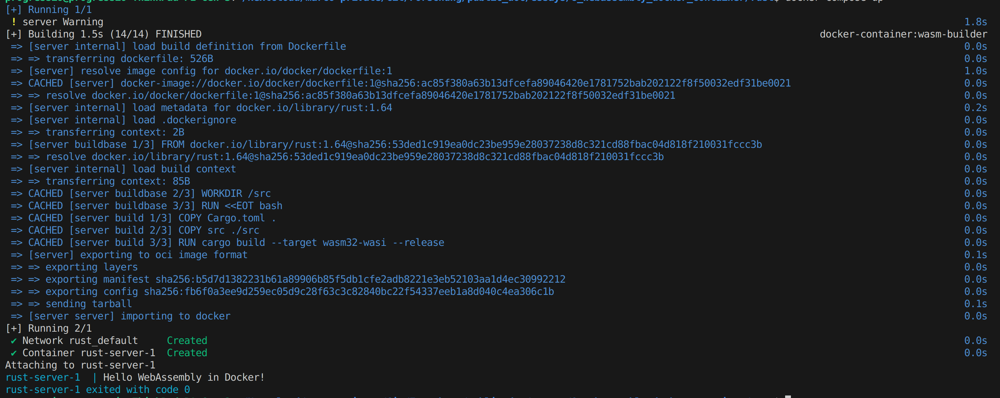

# WebAssembly Docker Container
**Content:** [Theory: Why?](#why) | [Theory: How?](#how) | [Docker Desktop Setup](#docker-desktop-setup) | [Docker Build](#docker-build) | [Docker Run](#docker-run) | [Docker Compose](#docker-compose) | [Performance](#performance) | [Further Resources](#further-resources)

## Why?
The famous quote from one of the inventors of Docker, Solomon Hykes: "If WASM+WASI existed in 2008, we wouldn’t have needed to created Docker."


There is a follow-up tweet in which Solomon talks about Docker not disappearing as a result. Instead, Windows, Linux, and WebAssembly containers will be used together and side by side with Docker.


Image by [Kode Kloud](https://kodekloud.com/blog/webassembly-vs-docker/)

Classic Docker containers or their contents are compiled for a specific target architecture (arm, x86, etc.) and include various operating system components.

Now, when a WebAssembly runtime is available, these points can be handed over to the runtime. As a result, you get a container with the following additional advantages:
* Includes only application code, leading to smaller (memory) and more secure (attack surface) containers with faster startup times.
* Compatibility across different architectures and operating systems.

Including the well-known advantages of WebAssembly itself:
* Security: WebAssembly programs run in a sandbox. It is not directly possible to access the host system or other containers.
* Performance: WebAssembly is compiled to WebAssembly machine code.
* And more, as seen in my latest [article](https://medium.com/webassembly/emscripten-simple-portability-9d3238d99294).

| Aspect                       | Classic                               | WebAssembly Containers                                                                              |
| ---------------------------- | ------------------------------------- | ------------------------------------------------------------------------------------------------- |
| Size                         | A factor of 10 to 100 MBs             | A few MB                                                                                          |
| Startup Times ([Performance](#performance))               | Seconds                               | [Milliseconds](https://www.docker.com/blog/why-containers-and-webassembly-work-well-together/)   |
| Performance Speed            | Far from Native                       | Close to Native                                                                                   |
| Runs in Web Browser          | No                                    | Yes                                                                                               |
| Cross Platform / Portability | No                                    | Yes                                                                                               |
| Standards                    | [OCI](https://opencontainers.org/)    | [W3C](https://www.w3.org/community/webassembly/) and OCI                                          |
| System Interactions          | Includes OS and file system           | Uses [WASI](https://wasi.dev/) to access the host system                                           |

In summary, with Docker + WebAssembly, you get:
* Bundled code (Package)
* Potential closer to native performance
* High security
* High portability
* Runtime isolation
* Potential faster startup time

## How?

Image by [Kode Kloud](https://kodekloud.com/blog/webassembly-vs-docker/)

Below the individual layers will be briefly explained and their functionality or tasks. Thanks to the widespread acceptance of standardizations and the open-source mindset around containers through the [Open Container Initiative](https://opencontainers.org/) and the [Container Runtime containerd](https://containerd.io/), various applications can easily run on different platforms.

On one side, standardized interfaces for containerd allows it to be used on various platforms. And on the other End, standardized interfaces for containers enable the implementation and execution of different applications.

### Container Engine
Serves as an interface between administrators and the container manager. It also provides additional higher-level platform-specific functionalities.

Well-known container engines include Docker, Kubernetes, Podman, CRI-O, and more.

### Container Manager
Involves the management of images (upload, download) and containers (creation, start, stop, etc.). Essentially, it provides everything needed to build a container platform without having to deal with the details of the underlying operating system.

The most well-known container manager is containerd, supported by the [Cloud Native Computing Foundation](https://www.cncf.io/). Containerd is an open-source container manager (originally Docker) programmed in Go. Instead of being used directly by developers, it is designed to be embedded in systems like Docker, Kubernetes and so on.

### Shim
A shim is a software positioned between a container manager (containerd, cri-o, podman, etc.) and a container runtime (runc, crun, wasmedge, etc.) that solves the integration problem (as an interface) between these counterparts.

The most well-known shim is containerd-shim. It is used to manage and monitor the respective container via a standardized interface.

### Runtime
Involves managing container processes (creation, start, stop, etc.) and provides low-level functionality for this purpose.
As an example of a runtime for Linux, [Runc](https://github.com/opencontainers/runc) interacts with existing low-level Linux features such as namespaces and control groups. It follows the [OCI standard](https://opencontainers.org/) and includes [libcontainer](https://github.com/opencontainers/runc/tree/main/libcontainer), a Go library for creating containers.
Alternatives:
  * [crun](https://github.com/containers/crun) for Linux
  * [gVisor](https://gvisor.dev/) for Linux
  * [firecracker](https://github.com/firecracker-microvm/firecracker-containerd) for microVMs
  * [wasmedge](https://wasmedge.org/) for WebAssembly available in Docker, supported by the [Cloud Native Computing Foundation](https://www.cncf.io/)
  * [slight](https://github.com/deislabs/spiderlightning) for WebAssembly available in Docker
  * [spin](https://github.com/fermyon/spin) for WebAssembly available in Docker
  * [wasmtime](https://wasmtime.dev/) for WebAssembly available in Docker, created by the [Bytecode Alliance](https://bytecodealliance.org/)

#### WebAssembly
Because existing shim implementations are based on artifacts of operating systems, they cannot be directly used in the same sense for WebAssembly runtimes. Therefore, WebAssembly runtimes come bundled with their own shims.
For wasmedge, wasmtime, and wasmer, there is [runwasi](https://github.com/containerd/runwasi) for this purpose.

Runwasi implements two modes:
* Normal: One shim process per container
* Shared: One manager service (container) manages all shims in the process

## Docker Desktop Setup
Two preliminary notes:
* Docker Desktop allows for easy building of a WebAssembly image and running it as a container in various operating systems. However, this can also be achieved with a standard Docker installation. Further information is available under [alternative Runtimes](https://docs.docker.com/engine/alternative-runtimes/#wasmtime).
* Because the Docker implementation is relatively new, challenges may arise. Therefore, there is a list of [Known Issues](https://docs.docker.com/desktop/wasm/#known-issues) and an [Issue Tracker](https://github.com/docker/roadmap/issues/426).

First, you need to download [Docker Desktop](https://www.docker.com/products/docker-desktop). To install it on Ubuntu, these steps are required:

```bash
sudo chmod +x ./docker-desktop-4.24.0-amd64.deb
sudo apt install ./docker-desktop-4.24.0-amd64.deb
```

After installation, please ensure that you are using the latest Docker version, which should be greater than 4.24.0.

Once Docker Desktop is installed, you need to activate the WASM Runtime. This can be done by following these steps:

1. Open Docker Desktop.
2. Navigate to `Settings`.
3. Select `Features in development`.
4. Enable the following options:
   - `Use containerd for pulling and storing images`
   - `Enable Wasm`


---

**Note:** According to the documentation, the build should already work. However, this was not the case for me. My installed builders did not have support for the WASM/WASI platform.

```bash
$ docker buildx ls
NAME/NODE       DRIVER/ENDPOINT STATUS  BUILDKIT             PLATFORMS
default         docker                                       
  default       default         running v0.11.6+616c3f613b54 linux/amd64, linux/amd64/v2, linux/amd64/v3, linux/386
desktop-linux * docker                                       
  desktop-linux desktop-linux   running v0.12.2              linux/amd64, linux/amd64/v2, linux/amd64/v3, linux/arm64, linux/riscv64, linux/ppc64le, linux/s390x, linux/mips64le, linux/mips64
```

Therefore, I created a new builder with the following command:

```bash
docker buildx create --name wasm-builder --platform wasi/wasm
docker buildx use wasm-builder
```

```bash
$ docker buildx ls
NAME/NODE       DRIVER/ENDPOINT  STATUS   BUILDKIT             PLATFORMS
wasm-builder *  docker-container                               
  wasm-builder0 desktop-linux    inactive                      wasi/wasm*
default         docker                                         
  default       default          running  v0.11.6+616c3f613b54 linux/amd64, linux/amd64/v2, linux/amd64/v3, linux/386
desktop-linux   docker                                         
  desktop-linux desktop-linux    running  v0.12.2              linux/amd64, linux/amd64/v2, linux/amd64/v3, linux/arm64, linux/riscv64, linux/ppc64le, linux/s390x, linux/mips64le, linux/mips64
```

---

## Docker Build
Below is a simple Rust program, `main.rs`, provided as a demonstration:

```rust
fn main() {
  let s : &str = "Hello WebAssembly in Docker!";
  println!("{}", s);
}

```

This, along with the following `Cargo.toml` file:

```toml
[package]
name = "hello"
version = "0.1.0"
authors = ["Marco Kuoni"]
edition = "2021"

[[bin]]
name = "hello"
path = "src/main.rs"

[dependencies]
```

And the following `Dockerfile`:

```dockerfile
# syntax=docker/dockerfile:1

FROM --platform=$BUILDPLATFORM rust:1.64 AS buildbase
WORKDIR /src
RUN <<EOT bash
    set -ex
    apt-get update
    apt-get install -y \
        git \
        clang
    rustup target add wasm32-wasi
EOT

FROM buildbase AS build
COPY Cargo.toml .
COPY src ./src 
# Build the Wasm binary
RUN cargo build --target wasm32-wasi --release

FROM scratch
ENTRYPOINT [ "/hello.wasm" ]
COPY --link --from=build /src/target/wasm32-wasi/release/hello.wasm /hello.wasm
```

Apart from the last three lines, the commands are used solely to compile the Rust program into WebAssembly within a Docker container. The final three lines are responsible for creating the WebAssembly image by copying the compiled program into the container and defining the entry point.

The actual build process is initiated with the following command: `docker buildx build --load --platform wasi/wasm -t demo/rust_hello .`.

---

**Note:** I had to disable the 'Builds View' under 'Features in development' for the image to appear.


---


With that, an image for the WASM platform has now been created, with a size of 2.52 MB.

## Docker Run
Now, the image can be started with the following command:

```bash
$ docker run --rm --runtime=io.containerd.wasmedge.v1 --platform=wasi/wasm demo/rust_hello
Hello WebAssembly in Docker!
```

## Docker Compose
WebAssembly containers can also be used together with other containers as usual with Docker Compose, and they can interact within the composition.

For our small program, here an example `docker-compose.yml`:

```
services:
  server:
    image: demo/rust_hello_compose
    build:
      context: .
    runtime: io.containerd.wasmedge.v1
```

Which can be started with `docker compose up`.



## Performance
I would like to take this opportunity to thank [Thomas Bocek](https://youtu.be/0uo37PAondM?feature=shared&t=178) for mentioning this article, specifically for addressing his concerns regarding the performance of WebAssembly in Docker. Therefore, I will briefly discuss the three points mentioned:
* Startup time
* Image size
* Portability

As of my current knowledge, I wholeheartedly agree with Thomas Bocek on all three points. In the past three days during the [CG Hybrid Meeting](https://github.com/WebAssembly/meetings/blob/main/main/2023/CG-10.md), we have seen various examples and benchmarks. What is beyond dispute is portability and security. Security is, of course, always a concern, but the level is already quite high. To touch on the topic briefly, here are two random examples from the [Research Day](https://www.cs.cmu.edu/~wasm/wasm-research-day-2023.html) after the CG Meeting:

* [Shravan Ravi Narayan](https://shravanrn.com/) discussed the resistance of [Spectre Attacks](https://en.wikipedia.org/wiki/Spectre_(security_vulnerability)) in WebAssembly on modern CPUs.
* [Arjun Ramesh](https://users.ece.cmu.edu/~arjunr2/) and [Tianshu Huang](https://tianshu.io/) presented cross-platform instrumentation that can provide unique insights into program behavior.

The statements regarding image size and startup time are a consequence of [Lightweight Virtualization (FaaS)](https://en.wikipedia.org/wiki/Function_as_a_service), which aims to eliminate any overhead from traditional containers. This involves virtualizing the application at a higher level, breaking down the traditional container into smaller functional units per container. Additionally, the WebAssembly Container allows for the removal of the inner container Linux environment. I recommend watching the following video on [WebAssembly and Containers](https://www.youtube.com/watch?v=OGcm3rHg630), which uses the WebAssembly Runtime Spin and demonstrates the idea. However, it's important to note that it's an unfair comparison to directly equate smaller WebAssembly service containers with more complex application containers. Based solely on size and the code contained within, it should be possible to achieve faster startup times for WebAssembly containers compared to traditional containers.

I come from the embedded systems field, where a common discussion revolves around which real-time system is faster. Similar discussions arise in the context of WebAssembly versus native implementations. Let's take the example of Docker. In a WebAssembly container, WebAssembly machine code is delivered in the container, which is then converted into machine code for the hardware machine by the WebAssembly Runtime. However, compromises need to be made at each step to achieve this. Nonetheless, efforts are being made to eliminate these compromises as much as possible, even down to the hardware level, to provide WebAssembly with native support and achieve faster native performance.

I couldn't resist and quickly created some comparison data. I built the same `fibonacci.rs` program twice, once traditionally and once as a WebAssembly container.

```rust
fn fibonacci(n: u64) -> u64 {
    if n == 0 {
        return 0;
    } else if n == 1 {
        return 1;
    } else {
        return fibonacci(n - 1) + fibonacci(n - 2);
    }
}

fn main() {
    println!("Starting");
    let n = 35;
    let result = fibonacci(n);
    println!("Fibonacci({}) = {}", n, result);
    println!("Stopped");
}
```

And analyzed with the following code:

```bash
#!/bin/bash

if [ $# -lt 2 ]; then
    echo "Usage: $0 <command> <num_runs>"
    exit 1
fi

command_to_measure="$1"
num_runs=$2

total_execution_time=0
total_startup_time=0
total_runtime_time=0
total_shutdown_time=0

for ((i=1; i<=$num_runs; i++)); do
    start_time=$(date +%s.%N)
    started_time=$(date +%s.%N)
    stopped_time=$(date +%s.%N)

    $command_to_measure  | while IFS= read -r line; do 
            case "$line" in
                "Starting")
                    started_time=$(date +%s.%N)                
                ;;
                "Stopped")
                    stopped_time=$(date +%s.%N)                
                ;;
                *)
                # echo "$line"
                ;;
            esac
        done
    end_time=$(date +%s.%N)

    execution_time=$(echo "$end_time - $start_time" | bc -l)
    startup_time=$(echo "$started_time - $start_time" | bc -l)
    runtime_time=$(echo "$stopped_time - $started_time" | bc -l)
    shutdown_time=$(echo "$end_time - $stopped_time" | bc -l)
    total_execution_time=$(echo "$total_execution_time + $execution_time" | bc -l)
    total_startup_time=$(echo "$total_startup_time + $startup_time" | bc -l)
    total_runtime_time=$(echo "$total_runtime_time + $runtime_time" | bc -l)
    total_shutdown_time=$(echo "$total_shutdown_time + $shutdown_time" | bc -l)
done

avg_total_execution_time=$(echo "$total_execution_time / $num_runs" | bc -l)
avg_total_startup_time=$(echo "$total_startup_time / $num_runs" | bc -l)
avg_total_runtime_time=$(echo "$total_runtime_time / $num_runs" | bc -l)
avg_total_shutdown_time=$(echo "$total_shutdown_time / $num_runs" | bc -l)
echo "Average execution time over $num_runs runs: $avg_total_execution_time seconds"
echo "Average startup time over $num_runs runs: $avg_total_startup_time seconds"
echo "Average run time over $num_runs runs: $avg_total_runtime_time seconds"
echo "Average shutdown time over $num_runs runs: $avg_total_shutdown_time seconds"

```

The WebAssembly runtimes used employ [Just-in-time (JIT)](https://en.wikipedia.org/wiki/Just-in-time_compilation) compilation, but theoretically, according to the [workflow diagram](https://wasmedge.org/docs/contribute/internal) of WasmEdge, [Ahead-of-time (AOT)](https://en.wikipedia.org/wiki/Ahead-of-time_compilation) compilation should also be possible.

> Unfortunately, I couldn't take into account the Runtimes Spin and Slight, as well as precompilation with Wastime, because `println` didn't work out of the box with them.

### Build
* `docker buildx build --load -f DockerfileClassic -t demo/fibonacci_classic .`
* `docker buildx build --load --platform wasi/wasm -t demo/fibonacci_webassembly .`
* `docker buildx build --load -f DockerfileCompile -t demo/fibonacci_webassembly_compile .`


The image `demo/fibonacci_webassembly_compile` is a Wasmtime AOT Image, which leads to limitations in portability. However, due to its size, it could make sense in certain scenarios, such as an [Embedded Application](https://en.wikipedia.org/wiki/Embedded_Software_Engineering) (IoT) use case.

### Run
```bash
$ ./measureAvgTime.sh "docker run --rm --runtime=io.containerd.wasmtime.v1 --platform=wasi/wasm demo/fibonacci_webassembly" 1
Average execution time over 1 runs: .92003518600000000000 seconds
Average startup time over 1 runs: .00223248300000000000 seconds
Average run time over 1 runs: .00182017000000000000 seconds
Average shutdown time over 1 runs: .91598253300000000000 seconds
```

```bash
$ ./measureAvgTime.sh "docker run --rm --runtime=io.containerd.wasmtime.v1 --platform=wasi/wasm demo/fibonacci_webassembly" 50
Average execution time over 50 runs: .79499581630000000000 seconds
Average startup time over 50 runs: .00152502634000000000 seconds
Average run time over 50 runs: .00146761514000000000 seconds
Average shutdown time over 50 runs: .79200317482000000000 seconds
```

```bash
$ ./measureAvgTime.sh "docker run --rm --runtime=io.containerd.wasmtime.v1 --platform=wasi/wasm demo/fibonacci_webassembly" 5000

Average execution time over 5000 runs: .86158419502540000000 seconds
Average startup time over 5000 runs: .00110639370920000000 seconds
Average run time over 5000 runs: .00110670086200000000 seconds
Average shutdown time over 5000 runs: .85937110045420000000 seconds
```


```bash
$ ./measureAvgTime.sh "docker run --rm --runtime=io.containerd.wasmedge.v1 --platform=wasi/wasm demo/fibonacci_webassembly" 1
Average execution time over 1 runs: 9.29828315900000000000 seconds
Average startup time over 1 runs: .00253460300000000000 seconds
Average run time over 1 runs: .00334101000000000000 seconds
Average shutdown time over 1 runs: 9.29240754600000000000 seconds
```

```bash
$ ./measureAvgTime.sh "docker run --rm --runtime=io.containerd.wasmedge.v1 --platform=wasi/wasm demo/fibonacci_webassembly" 50
Average execution time over 50 runs: 9.19518831752000000000 seconds
Average startup time over 50 runs: .00185933672000000000 seconds
Average run time over 50 runs: .00179162598000000000 seconds
Average shutdown time over 50 runs: 9.19153735482000000000 seconds
```

```bash
$ ./measureAvgTime.sh "docker run --rm demo/fibonacci_classic" 1
Average execution time over 1 runs: .65099649100000000000 seconds
Average startup time over 1 runs: .00220626700000000000 seconds
Average run time over 1 runs: .00316228900000000000 seconds
Average shutdown time over 1 runs: .64562793500000000000 seconds
```

```bash
$ ./measureAvgTime.sh "docker run --rm demo/fibonacci_classic" 50
Average execution time over 50 runs: .57311583626000000000 seconds
Average startup time over 50 runs: .00151897690000000000 seconds
Average run time over 50 runs: .00152541990000000000 seconds
Average shutdown time over 50 runs: .57007143946000000000 seconds
```

```bash
$ ./measureAvgTime.sh "docker run --rm demo/fibonacci_classic" 5000
Average execution time over 5000 runs: .59495869612380000000 seconds
Average startup time over 5000 runs: .00135375017460000000 seconds
Average run time over 5000 runs: .00132145809240000000 seconds
Average shutdown time over 5000 runs: .59228348785680000000 seconds
```

This results in the following performance comparison between the classic variant, based on an average of over 50 measurements:

**Wasmtime 50:**
* Execution: 38% slower
* Startup: 0.4% slower
* Runtime: 3.8% faster
* Shutdown: 38% slower

**WasmEdge 50:**
* Execution: 1504% slower
* Startup: 22% slower
* Runtime: 17% slower
* Shutdown: 1512% slower

**Wasmtime 5000:**
* Execution: 45% slower
* Startup: 18% faster
* Runtime: 16% faster
* Shutdown: 45% slower
  
### Conclusion
This is not intended to be a scientific dissertation but rather to provide a sense of the differences. What stands out to me is:

* The WebAssembly image is significantly smaller.
* Wasmtime is only marginally slower compared to the classic variant. Interestingly, a clear difference is especially noticeable when exiting the `main` function.
* WebAssembly runtimes still exhibit significant differences in performance.

Time is currently a bit limited, but I will try to give more attention to this topic. I'm also open to further inputs or questions. As mentioned at the beginning, I see a strong push for benchmarks in the community, so we will likely receive better tools and analyses in the near future.

## Further Resources
* [Source Code](https://github.com/marcokuoni/public_doc/tree/main/essays/8_webassembly_docker_container)
* [Deutsche Version](https://github.com/marcokuoni/public_doc/tree/main/essays/8_webassembly_docker_container/README.de.md)

This article is based on various sources. A list of these sources can be found below, where you can also find more examples:
* [Docker Blog: Build, Share, and Run WebAssembly Apps Using Docker](https://www.docker.com/blog/build-share-run-webassembly-apps-docker/)
* [Docker Blog: Why Containers and WebAssembly Work Well Together](https://www.docker.com/blog/why-containers-and-webassembly-work-well-together/)
* [Docker Blog: Introducing the Docker+Wasm Technical Preview](https://www.docker.com/blog/docker-wasm-technical-preview/)
* [Docker Desktop Documentation: Wasm](https://docs.docker.com/desktop/wasm/)
* [Docker Documentation: Alternative Runtimes](https://docs.docker.com/engine/alternative-runtimes/#wasmtime)
* [Medium: Docker + WebAssembly: a quick intro](https://medium.com/@guglielmino/docker-webassembly-a-quick-intro-730c38e8390c)
* [KodeKloud: WebAssembly vs Docker: Exploring their Connection and Potential](https://kodekloud.com/blog/webassembly-vs-docker/)
* [GitHub: Runwasi](https://github.com/second-state/runwasi)
* [GitHub: Issues - Docker+Wasm Integration](https://github.com/docker/roadmap/issues/426)
* [Wasm Labs: WebAssembly - Docker without containers!](https://wasmlabs.dev/articles/docker-without-containers/)

I am open to refining, expanding, or correcting the article. Feel free to provide a feedback or get in touch with me.

Created by [Marco Kuoni, October 2023](https://marcokuoni.ch)
