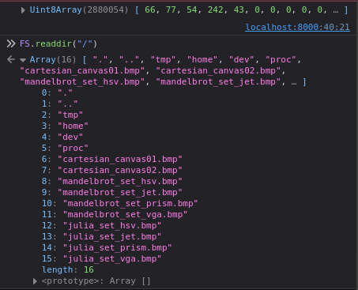

# Porting Third Party to WebAssembly
Die Idee dieses Artikels ist, dass wir eine komplexere Applikation (wie sie in einer C++ Bibliothek bestehen könnte) nehmen und diese in WebAssembly portieren. Dabei werden wir die Applikation zuerst in nativen Maschinencode kompilierten und direkt auf dem Betriebsystem austesten. Danach in einem zweiten Schritt werden wir die gleiche Applikation in WebAssembly kompilieren und in einer Webanwendung verwenden.

## Bitmap Applikation
Die Applikation benutzt die `bitmap_image.hpp` von [Arash Partow](http://partow.net/programming/bitmap/index.html), welche dazu verwendet wird um Bitmaps zu erzeugen.

```cpp
#include <cmath>
#include <cstdio>
#include <cstdlib>
#include <iostream>
#include <string>

#include "bitmap_image.hpp"

void cartesian()
{
    ...
}

void fractal()
{
    ...
}

extern "C"
void build_bitmap(int choosen)
{
   switch(choosen) {
      case 1:
         cartesian();
         break;
      case 2:
         fractal();
         break;
      default:
         break;
   }
}

int main(int argc, char **argv)
{
   int choosen = 0;
   if(argc > 1)
   {
      choosen = std::atoi(argv[1]);
   }

   build_bitmap(choosen);
   
   return 0;
}

```

Bevor dies nun aber gemacht werden kann muss das Programm kompiliert werden. Dazu wird folgendes Makefile verwendet.

```Makefile
COMPILER      = -c++
OPTIONS       = -ansi -pedantic-errors -Wall -Wall -Werror -Wextra -o
LINKER_OPT    = -L/usr/lib -lstdc++ -lm

all: bitmap

bitmap: bitmap.cpp bitmap_image.hpp
	$(COMPILER) $(OPTIONS) bitmap bitmap.cpp $(LINKER_OPT)

valgrind_check:
	valgrind --leak-check=full --show-reachable=yes --track-origins=yes -v ./bitmap

clean:
	rm -f core *.o *.bak *stackdump *~
```

Welches über `make` ausgeführt werden kann. Die dadurch entstandene Datei `bitmap` kann nun ausgeführt werden.

```bash
./bitmap 1
./bitmap 2
```

Was dann die jeweiligen Bitmap-Bilder erzeugt.


### WebAssembly
Nun kann das Makefile angepasst werden, damit es den Emscripten Compiler verwendet.

```Makefile
COMPILER      = -em++
OPTIONS       = -ansi -pedantic-errors -Wall -Wall -Werror -Wextra -o
LINKER_OPT    = -L/usr/lib -lstdc++ -lm -s FORCE_FILESYSTEM=1 -s ALLOW_MEMORY_GROWTH=1 -s INVOKE_RUN=0 -s EXPORTED_RUNTIME_METHODS="cwrap, callMain" -s EXPORTED_FUNCTIONS="_main, _build_bitmap"

all: bitmap

bitmap: bitmap.cpp bitmap_image.hpp
	$(COMPILER) $(OPTIONS) bitmap.js bitmap.cpp $(LINKER_OPT)

valgrind_check:
	valgrind --leak-check=full --show-reachable=yes --track-origins=yes -v ./bitmap

clean:
	rm -f core *.o *.bak *stackdump *~
```

---
emscripten nicht installiert, lese auch meinen [anderen Artikel](https://medium.com/webassembly/emscripten-simple-portability-9d3238d99294) oder folge der Anweisung
https://emscripten.org/docs/getting_started/downloads.html 
Unter Ubuntu `sudo apt intall emscripten`

----

Welches über `make -f MakefileWasm` ausgeführt werden kann. Die dadurch entstandene Datei `bitmap.js` und `bitmap.wasm` kann später für die Webanwendung gebraucht werden.

Zuerst jedoch kurz die Unterschiede zwischen den beiden Makefiles. An erster Stelle fällt auf, dass ein anderer Compiler verwendet wird, anstatt `c++` wird `em++` eingesetzt. Danach folgt die neue Benennung des Resultat von `bitmap` zu `bitmap.js` und zu guter letzt die einzelnen Optionen für den Linker ([Dokumentation](https://github.com/emscripten-core/emscripten/blob/main/src/settings.js)):

* `-s FORCE_FILESYSTEM=1`: Damit das Dateisystem in der Webanwendung verwendet werden kann ([Dokumentation](https://emscripten.org/docs/api_reference/Filesystem-API.html)).
* `-s ALLOW_MEMORY_GROWTH=1`: Damit der Speicher dynamisch wachsen kann. 
* `-s INVOKE_RUN=0`: Damit die `main` Funktion nicht automatisch ausgeführt wird. 
* `-s EXPORTED_RUNTIME_METHODS="cwrap, callMain"`: Damit die `cwrap` Funktion exportiert wird ([Dokumentation](https://emscripten.org/docs/api_reference/preamble.js.html?highlight=cwrap#cwrap)). 
* `-s EXPORTED_FUNCTIONS="_main, _build_bitmap"`: Damit die `main` Funktion eigenständig exportiert wird (Dies wäre eigentlich nicht nötig, da `main` standardmässig exportiert wird). Jedoch kann dank dieser Option auch die `build_bitmap` Funktion eigenständig exportiert werden. Damit der Name der Funktion vom C++ Compiler nicht verändert wird, muss die Funktion mit `extern "C"` deklariert werden ([C++ name mangling](https://en.wikipedia.org/wiki/Name_mangling)).

### Webanwendung

```html
<!DOCTYPE html>
<html lang="en">

<head>
    <meta charset="utf-8" />
    <title>Porting Third Party to WebAssembly</title>
</head>

<body>
    <h1>Porting Third Party to WebAssembly</h1>
    <button id="create">Create Bitmaps</button>
    <canvas id="output"></canvas>
    <script src="bitmap.js"></script>
    <script src="bitmap_image.js"></script>
    <script>
        const callMainButton = document.getElementById("create");
        callMainButton.addEventListener("click", function () {
            // call build_bitmap with cwrap
            const build_bitmap = Module.cwrap("build_bitmap", "number", ["number"]);
            build_bitmap(1);

            // or the exported build_bitmap
            Module._build_bitmap(2);

            // or the main function
            // Module.callMain(["1"]);

            const canvas = document.getElementById("output");
            const ctx = canvas.getContext("2d");

            const image = FS.readFile("./mandelbrot_set_vga.bmp");
            const bmp = getBMP(image.buffer);
            const imageData = convertToImageData(bmp);

            canvas.width = bmp.infoHeader.biWidth;
            canvas.height = bmp.infoHeader.biHeight;

            ctx.putImageData(imageData, 0, 0);

            console.log(image)
        });
    </script>
</body>

</html>
```
Anwendung starten `python3 -m http.server`.

Analysieren im Browser `http://localhost:8000`.




Das Ausführen des Scripts benötigt einiges an Rechenkapazität und kann zu einer Meldung vom Browser führen, dass die Webanwendung den Browser verlangsamt. Diese kann jedoch ignoriert werden. 

Ein paar Kurzkommentare zum Code:
* `bitmap_image.js` ist eine Hilfsdatei, welche ähnlich der `bitmap_image.hpp` dazu dient die Bitmaps einfacher zu verarbeiten. Einerseits wird die Datei dadurch gelesen und andererseits in das Canvas gezeichnet.
* Die `build_bitmap` Funktion kann gemäss Linker Optionen auf drei Wegen aufgerufen werden. Entweder über die `cwrap` Funktion, über die exportierte `build_bitmap` Funktion oder über die `main` Funktion.
* `FS.readFile("./mandelbrot_set_vga.bmp")` liest die Datei aus dem Dateisystem. Dies ist nur möglich, weil wir die Option `-s FORCE_FILESYSTEM=1` gesetzt haben und somit die [File System API](https://emscripten.org/docs/api_reference/Filesystem-API.html) eingebunden haben. Intressant sind auch weitere Befehle wie `FS.readdir("/")` siehe Screenshot vom Konsolen Output. 

## Weiterführend
* [Source Code](https://github.com/marcokuoni/public_doc/tree/main/essays/9_porting_third_party_to_webassembly)
* [English Version](https://github.com/marcokuoni/public_doc/tree/main/essays/9_porting_third_party_to_webassembly/README.md)
* [Level Up with Webassembly, C/C++ to Web](https://www.levelupwasm.com/)

Ich bin gerne bereit den Artikel zu präzisieren, erweitern oder zu korrigieren. Schreibt ein Feedback oder meldet euch direkt bei mir.

Erstellt von [Marco Kuoni, Oktober 2023](https://marcokuoni.ch)