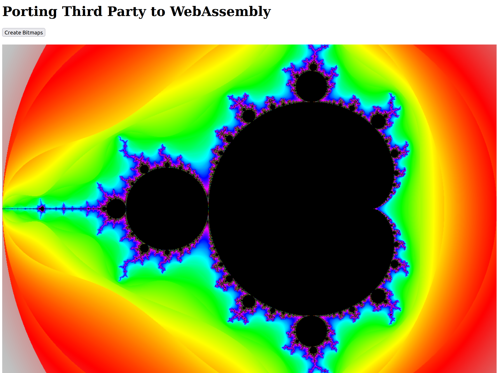
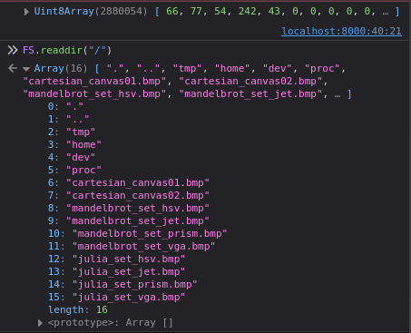

# Porting Third Party to WebAssembly
The idea of this article is to take a more complex application (as it could exist in a C++ library) and port it to WebAssembly. In this process, the application is first compiled into native machine code and executed directly on the operating system. Then, in a second step, the same application is compiled into WebAssembly and used in a web application.

## Bitmap Application
The application uses the `bitmap_image.hpp` by [Arash Partow](http://partow.net/programming/bitmap/index.html), which is used to work with bitmaps in C++.

```cpp
#include <cmath>
#include <cstdio>
#include <cstdlib>
#include <iostream>
#include <string>

#include "bitmap_image.hpp"

void cartesian()
{
    ...
}

void fractal()
{
    ...
}

extern "C"
void build_bitmap(int choosen)
{
   switch(choosen) {
      case 1:
         cartesian();
         break;
      case 2:
         fractal();
         break;
      default:
         break;
   }
}

int main(int argc, char **argv)
{
   int choosen = 0;
   if(argc > 1)
   {
      choosen = std::atoi(argv[1]);
   }

   build_bitmap(choosen);

   return 0;
}

```

The application consists of two functions, `cartesian` and `fractal`, which generate different bitmaps. You can choose the respective function using the `1` or `2` as a parameter in the `main` function.

Before you can proceed, the program needs to be compiled. To do that, the following Makefile is used:

```Makefile
COMPILER      = -c++
OPTIONS       = -ansi -pedantic-errors -Wall -Wall -Werror -Wextra -o
LINKER_OPT    = -L/usr/lib -lstdc++ -lm

all: bitmap

bitmap: bitmap.cpp bitmap_image.hpp
	$(COMPILER) $(OPTIONS) bitmap bitmap.cpp $(LINKER_OPT)

valgrind_check:
	valgrind --leak-check=full --show-reachable=yes --track-origins=yes -v ./bitmap

clean:
	rm -f core *.o *.bak *stackdump *~
```

Which can be executed using the `make` command. The resulting executable file, `bitmap`, can now be called.

```bash
./bitmap 1
./bitmap 2
```

This will then generate the respective bitmap images.


### WebAssembly
Now, the Makefile can be easily modified to use the Emscripten compiler and compile into WebAssembly.

```Makefile
COMPILER      = -em++
OPTIONS       = -ansi -pedantic-errors -Wall -Wall -Werror -Wextra -o
LINKER_OPT    = -L/usr/lib -lstdc++ -lm -s FORCE_FILESYSTEM=1 -s ALLOW_MEMORY_GROWTH=1 -s INVOKE_RUN=0 -s EXPORTED_RUNTIME_METHODS="cwrap, callMain" -s EXPORTED_FUNCTIONS="_main, _build_bitmap"

all: bitmap

bitmap: bitmap.cpp bitmap_image.hpp
	$(COMPILER) $(OPTIONS) bitmap.js bitmap.cpp $(LINKER_OPT)

valgrind_check:
	valgrind --leak-check=full --show-reachable=yes --track-origins=yes -v ./bitmap

clean:
	rm -f core *.o *.bak *stackdump *~
```

---

If Emscripten is not installed, please refer to my [other article](https://medium.com/webassembly/emscripten-simple-portability-9d3238d99294) or follow the instructions at [Emscripten Documentation](https://emscripten.org/docs/getting_started/downloads.html). For Ubuntu, you can install Emscripten with the command: `sudo apt install emscripten`.

---

This can be done using the command `make -f MakefileWasm` (Explicit Makefile). The resulting files `bitmap.js` and `bitmap.wasm` can be used later for the web application.

First, let's briefly discuss the differences between the two Makefiles. The primary change is the use of a different compiler, replacing `c++` with `em++`. Next, the output is renamed from `bitmap` to `bitmap.js`, and finally, there are various linker options ([Documentation](https://github.com/emscripten-core/emscripten/blob/main/src/settings.js)):

* `-s FORCE_FILESYSTEM=1`: To enable the use of a virtualized file system in the web application ([Documentation](https://emscripten.org/docs/api_reference/Filesystem-API.html)).
* `-s ALLOW_MEMORY_GROWTH=1`: Allowing dynamic memory growth.
* `-s INVOKE_RUN=0`: Preventing automatic execution of the `main` function.
* `-s EXPORTED_RUNTIME_METHODS="cwrap, callMain"`: Exporting the `cwrap` and `callMain` functions ([Documentation](https://emscripten.org/docs/api_reference/preamble.js.html?highlight=cwrap#cwrap)).
* `-s EXPORTED_FUNCTIONS="_main, _build_bitmap"`: Independently exporting the `main` function (which is not necessary by default) and enabling the standalone export of the `build_bitmap` function. To prevent the C++ compiler from altering the function name, it must be declared in C++ with `extern "C"` (as shown in the source code above, [C++ name mangling](https://en.wikipedia.org/wiki/Name_mangling)).

### Web Application

```html
<!DOCTYPE html>
<html lang="en">

<head>
    <meta charset="utf-8" />
    <title>Porting Third Party to WebAssembly</title>
</head>

<body>
    <h1>Porting Third Party to WebAssembly</h1>
    <button id="create">Create Bitmaps</button>
    <canvas id="output"></canvas>
    <script src="bitmap.js"></script>
    <script src="bitmap_image.js"></script>
    <script>
        const callMainButton = document.getElementById("create");
        callMainButton.addEventListener("click", function () {
            // call build_bitmap with cwrap
            const build_bitmap = Module.cwrap("build_bitmap", "number", ["number"]);
            build_bitmap(1);

            // or the exported build_bitmap
            Module._build_bitmap(2);

            // or the main function
            // Module.callMain(["1"]);

            const canvas = document.getElementById("output");
            const ctx = canvas.getContext("2d");

            const image = FS.readFile("./mandelbrot_set_vga.bmp");
            const bmp = getBMP(image.buffer);
            const imageData = convertToImageData(bmp);

            canvas.width = bmp.infoHeader.biWidth;
            canvas.height = bmp.infoHeader.biHeight;

            ctx.putImageData(imageData, 0, 0);

            console.log(image)
        });
    </script>
</body>

</html>
```

To start the application, use `python3 -m http.server`.

Analyze it in your browser at `http://localhost:8000`.





Running the script requires a significant amount of computing power and may result in a browser warning that the web application is slowing down the browser. For this example, you can safely ignore the warning.

Here are some brief comments on the code:
* `bitmap_image.js` is a helper file similar to `bitmap_image.hpp` that makes it easier to work with bitmaps. It assists in reading the bitmap file and later drawing it on the canvas.
* The `build_bitmap` function can be called in three different ways, depending on the linker options: through the `cwrap` function, the exported `build_bitmap` function, or the `main` function.
* `FS.readFile("./mandelbrot_set_vga.bmp")` reads the file from the virtualized file system. This is possible because the `-s FORCE_FILESYSTEM=1` option is set, enabling the use of the [File System API](https://emscripten.org/docs/api_reference/Filesystem-API.html). Other commands like `FS.readdir("/")` are also interesting; you can see them in the console output screenshot.

## Further Resources
* [Source Code](https://github.com/marcokuoni/public_doc/tree/main/essays/9_porting_third_party_to_webassembly)
* [Deutsche Version](https://github.com/marcokuoni/public_doc/tree/main/essays/9_porting_third_party_to_webassembly/README.de.md)
* [Level Up with Webassembly, C/C++ to Web](https://www.levelupwasm.com/)

I am open to refining, expanding, or correcting the article. Feel free to provide a feedback or get in touch with me.

Created by [Marco Kuoni, November 2023](https://marcokuoni.ch)
