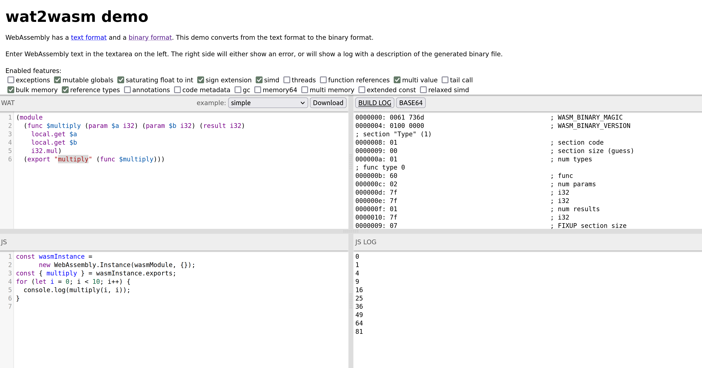

# Erste Erfahrungen mit WebAssembly

## Grundsätzliche Idee
1. Wir haben eine beliebig existierende Programmiersprache (z. Bsp.: Rust, C, C++ usw.). 
2. Welche in ein binäres Format übersetzt wird (*.wasm). 
3. Dieses binäre Format wird auf einem standardisierten Stackautomaten ausgeführt. 
4. Die Implementierung des Stackautomaten gibt es für verschiedene Zielsystem.

Diese Idee abstrahiert die Programmiersprache von der Zielplattform. Das ist aber nur ein Vorteil der diese Lösung beinhaltet. Unter anderem erlaubt dies verschiedene Programmiersprachen zu kombinieren, die Sicherheit und Effizienz zu erhöhen und vieles mehr.

> Gedankenexperiment: Du startest einen Browser, der lädt eine Applikation. Diese Applikation is wieder ein Browser, der lädt darin eine weitere Applikation. Diese Applikation ist eine Shell, in dieser Shell läuft ein Betriebssystem. Im Betriebssystem...

Der Entwicklungs-Prozess für WebAssembly wird über eine Community Group der W3C geführt.
* [WebAssembly Official](https://webassembly.org/)
* [WebAssembly Community Group](https://www.w3.org/community/webassembly/)
* [WebAssembly Design](https://github.com/WebAssembly/design/tree/main)
* [WebAssembly Dpecification](https://webassembly.github.io/spec/core/)
* [WebAssembly Proposal](https://github.com/WebAssembly/proposals)

## WebAssembly Text Format (WAT, *.wat)
* [WebAssembly Text Format (WAT) Specification](https://webassembly.github.io/spec/core/text/index.html)
* [WebAssembly Text Format (WAT)](https://developer.mozilla.org/en-US/docs/WebAssembly/Understanding_the_text_format)

Das binäre Format *.wasm ist für die Maschine optimiert. Es existiert eine direkte Übersetzung in ein Textformat *.wat, welches für Menschen lesbar ist.

Das Format besteht aus Modulen, die wiederum aus Funktionen bestehen. Eine Funktion ist eine Zusammenfassung von Instruktionen für den Stackautomaten. Die Instruktionen sind in der [WebAssembly Specification](https://webassembly.github.io/spec/core/binary/instructions.html) definiert.

Hier ein Beispiel für eine Funktion, die zwei Zahlen multipliziert:
```wat
(module
  (func $multiply (param $a i32) (param $b i32) (result i32)
    local.get $a
    local.get $b
    i32.mul)
  (export "multiply" (func $multiply)))
```

> Erklärung: Interne Funktionen starten mit `$`. Die Eingabewerte werden jeweils auf den Stack gelegt um sie zu verarbeiten `local.get`. Die Funktion `i32.mul` multipliziert die obersten zwei Elemente des Stacks und legt das Ergebnis wieder auf den Stack.

Aktuell vorhandene Typen in der Spezifikation sind:
* `i32` 32-bit signed integer
* `i64` 64-bit signed integer
* `f32` 32-bit floating point number
* `f64` 64-bit floating point number

## WebAssembly Binary Format (WASM, *.wasm)
* [WebAssembly Binary Format (WASM) Specification](https://webassembly.github.io/spec/core/binary/index.html)

Um vom Textformat in das binäre Format zu kompilieren können verschiedene Werkzeuge verwendet werden. Die bekanntesten sind:

Der online [wat2wasm](https://webassembly.github.io/wabt/demo/wat2wasm/) Compiler, er zeigt in vier Bereichen folgende Informationen an:
* WAT: Der eingegebene WAT-Code
* Build Log: Das Build Log des Compilers (Hex Dump)
* JavaScript: Der JavaScript-Code, der den WASM-Code ausführt
* JS Log: Das Resultat vom JavaScript-Code



Oder das WebAssembly Binary Toolkit (WABT, ausgesprochen wabbit), welches zusätzlich noch weitere Tools anbietet. Zur Übersetzung wird `wat2wasm multiply.wat` im Terminal eingegeben. Das Resultat konnte damit von 155 Byte (WAT) auf 46 Byte (WASM) reduziert werden (29.67% vom WAT). 

## Stackautomat
wasm3 wäre ein möglicher Interpreter für WASM, der in C geschrieben ist und auf vielen Plattformen läuft. Damit kann der WASM-Code im Repl-Stil in der Kommandozeile ausgeführt werden. 
```bash
> wasm3 --repl hello.wasm
wasm3> multiply 3 14
Result: 42
wasm3> ^C
```

## Implementierung im Web
Aus dem WAT-Code wurde folgender WASM-Code (Build Log) generiert und in der Datei `multiply.wasm` gespeichert:
```wasm
0000000: 0061 736d                                 ; WASM_BINARY_MAGIC
0000004: 0100 0000                                 ; WASM_BINARY_VERSION
; section "Type" (1)
0000008: 01                                        ; section code
0000009: 00                                        ; section size (guess)
000000a: 01                                        ; num types
; func type 0
000000b: 60                                        ; func
000000c: 02                                        ; num params
000000d: 7f                                        ; i32
000000e: 7f                                        ; i32
000000f: 01                                        ; num results
0000010: 7f                                        ; i32
0000009: 07                                        ; FIXUP section size
; section "Function" (3)
0000011: 03                                        ; section code
0000012: 00                                        ; section size (guess)
0000013: 01                                        ; num functions
0000014: 00                                        ; function 0 signature index
0000012: 02                                        ; FIXUP section size
; section "Export" (7)
0000015: 07                                        ; section code
0000016: 00                                        ; section size (guess)
0000017: 01                                        ; num exports
0000018: 08                                        ; string length
0000019: 6d75 6c74 6970 6c79                      multiply  ; export name
0000021: 00                                        ; export kind
0000022: 00                                        ; export func index
0000016: 0c                                        ; FIXUP section size
; section "Code" (10)
0000023: 0a                                        ; section code
0000024: 00                                        ; section size (guess)
0000025: 01                                        ; num functions
; function body 0
0000026: 00                                        ; func body size (guess)
0000027: 00                                        ; local decl count
0000028: 20                                        ; local.get
0000029: 00                                        ; local index
000002a: 20                                        ; local.get
000002b: 01                                        ; local index
000002c: 6c                                        ; i32.mul
000002d: 0b                                        ; end
0000026: 07                                        ; FIXUP func body size
0000024: 09                                        ; FIXUP section size
; section "name"
000002e: 00                                        ; section code
000002f: 00                                        ; section size (guess)
0000030: 04                                        ; string length
0000031: 6e61 6d65                                name  ; custom section name
0000035: 01                                        ; name subsection type
0000036: 00                                        ; subsection size (guess)
0000037: 01                                        ; num names
0000038: 00                                        ; elem index
0000039: 08                                        ; string length
000003a: 6d75 6c74 6970 6c79                      multiply  ; elem name 0
0000036: 0b                                        ; FIXUP subsection size
0000042: 02                                        ; local name type
0000043: 00                                        ; subsection size (guess)
0000044: 01                                        ; num functions
0000045: 00                                        ; function index
0000046: 02                                        ; num locals
0000047: 00                                        ; local index
0000048: 01                                        ; string length
0000049: 61                                       a  ; local name 0
000004a: 01                                        ; local index
000004b: 01                                        ; string length
000004c: 62                                       b  ; local name 1
0000043: 09                                        ; FIXUP subsection size
000002f: 1d                                        ; FIXUP section size
```

Diese kann nun mit einem fetch im JavaScript geladen, instanziiert und ausgeführt werden:

```html
<!DOCTYPE html>
<html lang="en">

<head>
    <meta charset="utf-8" />
    <title>First experiences with WebAssembly</title>
</head>

<body>
    <form>
        <input type="number" name="a" value="3" />
        <input type="number" name="b" value ="14" />
        <button type="submit">Multiply</button>
        <output name="output">
    </form>
    <script>
        function fetchAndInstantiate(url, importObject) {
            return fetch(url)
                .then(response => response.arrayBuffer())
                .then(bytes => WebAssembly.instantiate(bytes, importObject))
                .then(results => results.instance);
        }

        document.addEventListener('DOMContentLoaded', function () {
            const form = document.querySelector('form');

            form.addEventListener('submit', function (event) {
                event.preventDefault();
                const formData = new FormData(form);

                const a = formData.get('a');
                const b = formData.get('b');

                fetchAndInstantiate('multiply.wasm')
                    .then(instance => {
                        const result = instance.exports.multiply(a, b);
                        form.output.value = result;
                    });
            });
        });
    </script>
</body>

</html>
```
> Achtung: Dies ist nicht der bevorzugte Weg WASM zu laden, insofern der Browser die [instantiate streaming Funktion](https://developer.mozilla.org/en-US/docs/WebAssembly/JavaScript_interface/instantiateStreaming) unterstützt.

Damit die WASM Datei per fetch geladen werden kann muss ein Webserver gestartet werden. Dies kann zum Beispiel mit dem Python Modul `http.server` realisiert werden `python3 -m http.server`. Das Beispiel kann nun unter `http://localhost:8000` auf dem Browser aufgerufen werden.


## Weiterführend
* [Source Code](https://github.com/marcokuoni/public_doc/tree/main/essays/first_experiences_with_webassembly)
* [English Version](https://github.com/marcokuoni/public_doc/tree/main/essays/first_experiences_with_webassembly/README.md)


Ich bin gerne bereit den Beitrag noch zu präzisieren, erweitern oder zu korrigieren. Schreibt Feedback oder meldet euch bei mir.

Erstellt von [Marco Kuoni, August 2023](https://marcokuoni.ch)